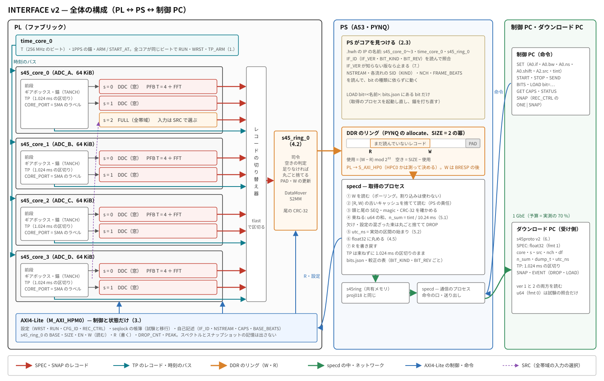
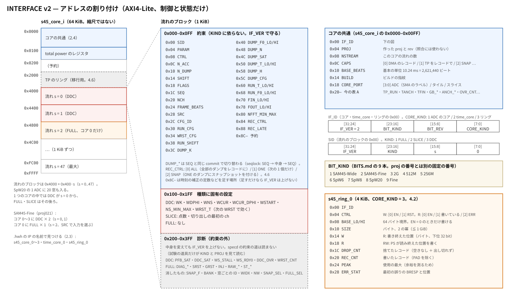
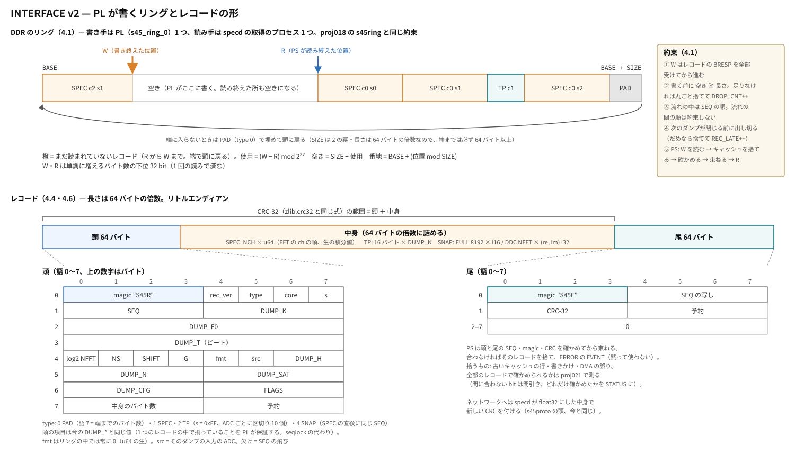
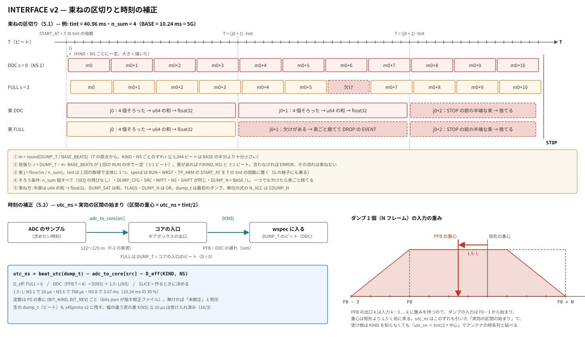

# PL ↔ PS ↔ 制御 PC のインターフェース（v2）

状態: **約束は決定**（2026-10-08。2.〜5. の各節に決定と理由。番地の細部と道具は proj021 で確定、測って決めることは 8. と 9. に）
見直しの順（2026-10-08）: ① 流れの単位（2.・3.）→ ② DMA で PS から見えるもの → ③ 値の形 → ④ 束ねの区切りと時刻の補正
関係: [`BITS.md`](BITS.md)（9 本の bit の仕様）・proj017（時刻の格子）・proj018（specd・s45proto）・proj019（単位）・proj020（SAM45-Fine rev2）

## 目的

**9 本の bit を同じ PS のソフト（specd）と同じ受け側で扱えるように、bit によらない約束を先に固定する。**
点数・窓の数・積分時間が bit ごとに変わっても、PS と制御 PC のソフトは「bit が自分を説明するレジスタ」を読んで動く。

（図は `docs/interface_figs.py` で描いた。この文書を変えたら図も直す: `cd docs && python3 interface_figs.py`）

## 層と、何を固定するか

| 層 | 今（proj020） | 9 本で使い回せるか | 方針 |
|---|---|---|---|
| ① 制御の約束（PL ↔ PS） | RUN・ARM・WRST・CFG_ID・時刻の格子・DUMP_T / DUMP_H・seqlock・time_core・TP のリング | **使える**（点数・dt に依らない） | **このまま固定**（下の 1.） |
| ② アドレスの割り付け・読み出し（PL ↔ PS） | 窓ごと 128 KiB・スペクトル 4096 × 64 bit・1 ADC に窓 ≦ 4・AXI4-Lite で全部読む | **足りない**（下の表） | **作り直す**（2.〜4.） |
| ③ 制御 PC ↔ specd | 命令（SET・START …）・s45proto v1（SPEC は 4096 ch 固定） | 点数が変わると壊れる | **v2 に**（5.〜6.） |

### ② が足りない理由（64 bit の生の値で全部読む見積もり）

| bit | 構成の最大 | 1 フレーム（最も狭い窓） | PL → PS（基本の単位 10.24 ms で） | ネットワーク（BITS.md の dt で） |
|---|---|---|---|---|
| SAM45-Wide | 4 ADC × 2 × 4096 | 8 µs | 25.6 MB/s | 6.4 MB/s（40.96 ms） |
| SAM45-Fine | 4 × 2 × 4096 | 512 µs | 25.6 | 6.4（40.96） |
| 2G | 1 × 131072 / 2 × 65536 / 4 × 32768 | 64 µs | 102.4 | 102.4（10.24） |
| 512M | 4 × 2 × 16384 | 32 µs | 102.4 | 102.4 |
| 256M | 4 × 1 × 65536 など | 256 µs | **204.8** | **204.8** |
| SpW6 | 4 × 6 × 8192 | 1.024 ms | **153.6** | **153.6** |
| SpW8 | 4 × 8 × 4096 | 512 µs | 102.4 | 102.4 |
| SpW20 | 2 × 20 × 4096 | 512 µs | **128.0** | **128.0** |
| Fine | 4 × 2 × 16384 / 4 × 1 × 32768 | 2.048 / **4.096 ms** | 102.4 / 51.2（基本の単位 20.48 ms） | 25.6（40.96） |

- AXI4-Lite の実効は 15 MB/s 前後（proj020 の F-4: SAM45-Fine の 6.4 MB/s で 1 周の最大 35.9 ms / 40.96 ms）。**Fine より上は DMA が要る**
- アドレス: スペクトル領域が 4096 ch ぶん（Fine・256M・2G が入らない）、窓は 1 ADC に 4 つまで（SpW6・8・20 が入らない）
- 1 GbE（実効 ≒ 110 MB/s、未測定）を 64 bit の生の値で越えるのは 256M・SpW6・SpW20 → 4.5 で決定（ネットワークはいつも float32、それでも入らない構成はネットワークの tint を延ばす）

## 1. 制御の約束（固定する。今の意味のまま）

| 約束 | 出どころ | 中身 |
|---|---|---|
| 時刻 | proj016・017 | time_core の T（256 MHz のビート）・1PPS の錨・ARM / START_AT で全コアが同じビートに RUN（RUN_T = START_AT + 1） |
| 格子 | proj017・BITS.md | G = 524,288 ビート（2.048 ms）。WRST・RUN・TP_ARM の START_AT は G の倍数。wspec の F0 は格子に寄せる。**v2 では specd がさらに tint の倍数に置く（5.1）**（PL の約束は G のまま） |
| 設定の取り込み | proj016 | 窓の設定（WK・WDPHI・WNS）は WRST で、N_ACC・N_DUMP・SHIFT・CFG_ID は RUN で取り込む |
| ダンプの帳簿 | proj014・016 | SEQ・DUMP_K・DUMP_F0・DUMP_N・DUMP_SAT・DUMP_T・DUMP_H・DUMP_CFG は同じ commit で切り替わる（seqlock: SEQ → 中身 → SEQ） |
| 健全性 | proj016・017 | DUMP_H の [0..15]・窓の FLAGS（[5] は proj020 の PFB の飽和）・TP の FLAGS[4] |
| 単位 | proj019 | abs = (Σp/N_ACC − 2/3)·4^SHIFT·4^(4−G)/2³¹（14 bit の LSB²）。窓の和 = TP |
| 窓の区切り | proj017・020 | DUMP_T − D(NS) − X(NS) が幅の違う窓で揃う。PFB（T = 4）の重心は 1.5·L 前（proj020。v2 では utc_ns に含める、5.2） |

**v2 でもレジスタの名前と意味は変えない。** 番地は流れのブロック（2.5）にそろえ直す（今は spec_core と win_core で同じ意味のレジスタの番地が違う）。変えるのは番地と読み出しの道だけ。

## 2. 流れ（stream）と自己記述（決定、2026-10-08）

状態: **決定**（2026-10-08。見直しの 1 番目）。2.4・2.5 の番地は案で、proj021 の RTL で確定する
- **決定**: 全帯域コアと窓を「流れ」という同じ枠で扱い、違いは KIND だけにする
  **理由**: SAM45-Wide・2G・512M は全帯域側がデータの本体。窓だけの枠では足りず、SAM45-Wide の作り方（DDC か切り出しか）もまだ決まっていない
- **決定**: SAM45-Fine の全帯域（今の spec_core_0）は ADC_A のコアの流れ（s = 2、KIND FULL）として置き、入力は SRC で選ぶ
  **見送った案**: 別の共有コア s45_core_4（コアの種類が 2 つに増える）
- **決定**: PS は .hwh の IP の名前（`s45_core_i`・`time_core_0`）でコアを見つける
  **見送った案**: 目録のレジスタ（PYNQ はすでに .hwh を読み、番地の重なりは build.tcl が確かめている）
- **決定**: 診断のレジスタ（0x200〜）は約束の外。中身を変えても IF_VER を上げない
  **理由**: 試験のために足すたびに版を上げずに済む。specd の約束の道は読まない

### 2.1 なぜ「窓」ではなく「流れ」か

proj020 にはスペクトルを出すコアが 2 種類あり、**約束のレジスタの番地がそろっていない**:

| | spec_core（全帯域） | win_core の窓 |
|---|---|---|
| CFG_ID / DUMP_T / DUMP_H / DUMP_CFG / RUN_T | 0xC0 / 0xC8 / 0xD0 / 0xD4 / 0xD8 | 0x94 / 0xA0 / 0xA8 / 0xAC / 0xB0 |
| DUMP_T が指す点 | 入力のフレームの最初のビート | 最初の z が wspec に入ったビート |
| 入力 | axis_sel4 で 4 ADC から選ぶ（選ぶのは win_core_0 の FULL_SEL） | 自分の ADC |
| ADC の共通（ギアボックス・TP） | 自分で持つ（0x84〜0xB4・0x0100〜・0x2000〜） | win_core の 0x80000〜（表 A） |

9 本のうち SAM45-Wide・2G・512M は全帯域の FFT（またはその切り出し）がデータの本体なので、**窓だけの枠では足りない**。
SAM45-Wide の「1024 MHz × 2」が DDC か全帯域の切り出しかはまだ決まっていないので、**作り方に依らない枠**にする。

**流れ** = 1 本のスペクトルの列。自分の帳簿（SEQ・DUMP_*）と設定（RUN・WRST・CFG_ID）を持ち、PS と受け側からは作り方に依らず同じに見える。
1 つの流れは (コア c, 流れの番号 s) で決まる。窓・全帯域・全帯域の切り出しは、流れの**種類**（KIND）の違いでしかない。

| KIND | 名前 | 作り方 | 種類に固有の設定 |
|---|---|---|---|
| 1 | FULL | 全帯域の FFT（今の spec_core） | （なし） |
| 2 | SLICE | 全帯域の FFT の連続した ch の切り出し（SAM45-Wide・512M の候補） | 点数・切り出しの最初の ch |
| 3 | DDC | DDC ＋ PFB ＋ FFT（今の窓） | WK・WDPHI・WNS（・点数） |

PS は KIND から「ch → IF の対応の式」と「種類に固有の設定のキー」を選ぶ。それ以外（帳簿・時刻・健全性・単位・束ね）は KIND に依らない。

**KIND は 1 つの bit の間で変わらない**（2026-10-09、proj022 から）。モード（点数）を実行時に切り替える bit でも、流れの KIND・SID・NSTREAM は Overlay の間一定にする。
PS は Overlay の直後に 1 回だけ流れの表を作れば足りる。
- SAM45-Wide は 3 つのモード（全帯域 8192 点・1 GHz 16384 点・512 MHz 32768 点）とも **SLICE**。全帯域モードは「s0 = 0・N = 8192 の切り出し」（NCH 4096 で全部）
- FULL は SAM45-Fine の全帯域（SRC を書き換えられる 1 本、2.2）のように、切り出しを持たない作りに使う
- モードによって出すものの無い流れ（SAM45-Wide の全帯域モードの流れ 1）は消さずに**空の流れ**にする（2.5 の NCH = 0）

SLICE の ch → IF: 流れの ch i（0 ≦ i < NCH）は全帯域の FFT の ch S0 + i（S0 = 2.5 の S0_CUR）。周波数は (S0 + i)·fs / N（N = 2^PARAM[7:0]、全帯域の FFT の ch と同じ向き）。
**N と S0 はダンプごとにレコードの頭にも入る**（4.4 の語 4 の log2 NFFT・語 7 の上位）ので、モードを切り替えた前後のレコードもそれだけで読める。

### 2.2 コア

**コア = ADC 1 本ぶんの前段（ギアボックス・TP・時刻の錨）＋ そこにぶら下がる流れ**。PL の中で 64 KiB の番地を 1 つ持つ。

- 流れには**入力の ADC**（SRC）があり、レジスタで読める。たいていは固定（そのコアの ADC）
- SAM45-Fine の全帯域（今の spec_core_0）は**ADC_A のコアの流れの 1 つ**として置き、SRC だけ書き換えられる（今の FULL_SEL の後継）
- レコード（4.）の adc は**そのダンプの SRC**（コアの番号ではない）。流れの名前は (c, s)

### 2.3 PS がコアを見つける方法

**.hwh の IP の名前を約束にする**: `s45_core_0`〜`s45_core_3`（コア）・`time_core_0`・データの道（4. で決める）。
PS は ip_dict を名前で引き、各コアの IF_ID・CORE_PORT を読んで照合する（PORT の重複・IF_VER の不一致で止まる）。
目録のレジスタは置かない（PYNQ がすでに .hwh を読んでいる。番地の重なりは build.tcl が見ている）。

### 2.4 コアの共通部（コアの 0x0000〜0x00FF）

| オフセット | 名前 | 中身 |
|---|---|---|
| 0x00 | IF_ID | [31:24] IF_VER（= 2）/ [23:16] BIT_KIND（下の表）/ [15:8] BIT_REV / [7:0] CORE_KIND（1 = ADC のコア） |
| 0x04 | PROJ | 作った proj と rev（例 0x0021_0100）。**照合には使わない**（追跡のためだけ） |
| 0x08 | NSTREAM | このコアの流れの数 |
| 0x0C | CAPS | [0] DMA のレコード / [1] TP をレコードで / [2] SNAP をレコードで / … |
| 0x10 | BASE_BEATS | 基本の単位（ダンプの長さ）のビート数。10.24 ms = 2,621,440 |
| 0x14 | BUILD | ビルドの指紋（今と同じ） |
| 0x18 | CORE_PORT | [3:0] このコアの ADC（0..3 = ADC_A..D、**SMA のラベル**）/ [11:8] タイル / [15:12] スライス（build.tcl が VERSIONS.md の実測から与える） |
| 0x20〜0x7F | 今の表 A の中身（CTRL の TP_RUN・TP_ARM・TANCH、TFIN、GB_K、GB_STAT、ADC_STAT、ANCH_*、TP_RUN_T、OVR_CNT、GAP_CNT） | 意味は変えない。並びは proj021 で決めた（表 A を +0x10、0x20〜0x5F） |
| 0x80 | FFT_N | **SLICE の流れを持つコアだけ**（2026-10-09、proj022 から）。そのコアの全帯域の FFT の点数（コアの SLICE の流れで共通）。W: [7:0] log2 N（次の WRST で効く）/ R: [7:0] 今効いている log2 N・[15:8] 書いた値。NFFT_MIN_MAX（2.5）の範囲の外は効かせない。SLICE の無いコアでは 0 |
| 0x84〜0xFF | （予約） | |

BIT_KIND（BITS.md の 9 本。proj の番号とは別の固定の番号）:

| 1 | 2 | 3 | 4 | 5 | 6 | 7 | 8 | 9 |
|---|---|---|---|---|---|---|---|---|
| SAM45-Wide | SAM45-Fine | 2G | 512M | 256M | SpW6 | SpW8 | SpW20 | Fine |

### 2.5 流れのブロック（1 KiB）

**0x000〜0x0FF は KIND に依らない約束**（IF_VER で守る）。0x100〜は種類に固有、0x200〜は診断で、**約束の外**（中身を変えても IF_VER は上げない。PS の約束の道は読まない）。

| オフセット | 名前 | 中身（意味は今の win_core・spec_core と同じ。番地だけそろえる） |
|---|---|---|
| 0x00 | SID | [31:24] IF_VER / [23:16] KIND / [15:8] 流れの番号 s / [7:0] 0 |
| 0x04 | PARAM | [7:0] 今の log2 NFFT / [23:16] 積分値の幅 / [31:24] 値の形（0 = u64 生、…） |
| 0x08 | CTRL | W: [0] RUN / [1] STOP / [2] ARM_RUN / [3] 予約の取り消し / [8] FLAGS を消す / [12] WRST / [13] ARM_WRST。R: 今の win_core と同じ |
| 0x0C | N_ACC | RUN で取り込む |
| 0x10 | N_DUMP | RUN で取り込む |
| 0x14 | SHIFT | RUN で取り込む |
| 0x18 | FLAGS | 粘着。ビットの意味は KIND ごと（PS は KIND で名前を引く） |
| 0x1C | SEQ | 閉じたダンプの通し番号 |
| 0x20 | NCH | 出力の ch 数（FULL の 8192 点なら 4096）。**0 = 空の流れ**（今の設定では出すものが無い。SEQ は進まず、REC_CTRL を書いてもレコードを出さない。2.1） |
| 0x24 | FRAME_BEATS | 今の 1 フレームのビート数（L。束ねと格子の検算に使う） |
| 0x28 | SRC | [3:0] 入力の ADC（今効いている値）/ [31] 書き換えられる流れ。書けば次の WRST で効く |
| 0x2C | CFG_ID | WRST と RUN で取り込む |
| 0x30 | RUN_CFG | |
| 0x34 | WRST_CFG | |
| 0x38 | RUN_SHIFT | |
| 0x3C | DUMP_K | |
| 0x40 / 0x44 | DUMP_F0_LO / HI | |
| 0x48 | DUMP_N | |
| 0x4C | DUMP_SAT | |
| 0x50 / 0x54 | DUMP_T_LO / HI | 指す点は KIND ごとに違う（今のまま）。**ADC の時刻への換算は 4. の未決（時刻の補正）で決める** |
| 0x58 | DUMP_H | |
| 0x5C | DUMP_CFG | |
| 0x60 / 0x64 | RUN_T_LO / HI | |
| 0x68 / 0x6C | RUN_F0_LO / HI | |
| 0x70 / 0x74 | FIN_LO / HI | LO を読むと HI を固定 |
| 0x78 / 0x7C | FOUT_LO / HI | 同上 |
| 0x80 | NFFT_MIN_MAX | 取れる log2 NFFT の範囲（256M のように同じ bit で点数を選ぶもの） |
| 0x84 | REC_CTRL | [0] ALL / [1] ONE / [2] SNAP（4.6） |
| 0x88 | REC_LATE | 出し切れずに捨てたダンプの数（4.1） |
| 0x8C〜0xFF | （予約） | 時刻の補正の定数（見直しの 4 番目）などを足す場所 |
| 0x100〜0x1FF | 種類に固有の設定 | DDC: WK・WDPHI・WNS・WCUR・WCUR_DPHI・WSTART・NS_MIN_MAX・WRST_T。SLICE: 下の表（点数はコアの FFT_N、2.4）。FULL: なし |
| 0x200〜0x3FF | 診断（約束の外） | DDC: PFB_SAT・DDC_SAT・WS_STALL・WS_RDY0・DDC_OVR・WRST_CNT。FULL: DIAG_*・SRST・GRST・INJ・RAW_*・ST_* |

SLICE の種類に固有の設定（0x100〜。2026-10-09、proj022 から。DDC の WK → WCUR と同じ「書いた値」と「今効いている値」の形）:

| オフセット | 名前 | 中身 |
|---|---|---|
| 0x100 | S0 | W: 切り出しの最初の ch（次の WRST で効く）。0 ≦ S0 ≦ N/2 − 4096 の外は効かせない |
| 0x104 | S0_CUR | R: 今効いている最初の ch |
| 0x108 | S0_STEP | R: 最初の ch の刻み（1 = どの ch からでも。作りの制約があれば 2 の冪） |

- **点数 N の切り替えはコアの FFT を作り直す**ので、FFT_N（2.4）はそのコアの SLICE の流れの**どれかの WRST** で効き、そのとき**コアの全部の SLICE の流れが WRST される**（PS は ARM_WRST を全部の流れに打って同じ発火に揃える。5.1 の格子が崩れないように）
- 各 SLICE の流れの PARAM の [7:0]・NCH・FRAME_BEATS は、今効いている N を映す（書けない）

- **SEQ → 中身 → SEQ の seqlock は残す**（DMA の前でも AXI4-Lite で帳簿を読めるように。試験と移行に使う）
- 消すもの: SNAP_F・BANK（AXI4-Lite のスペクトル・スナップショットの記憶を出さないので意味がなくなる）・窓ごとの ID（SID に）・WIDX（SID の s に）・表 A の NW（NSTREAM に）・SNAP_SEL・FULL_SEL（SNAP の扱いと SRC に。SNAP は 8. の 3 で）
- DUMP_T が指す点がそろっていないことは、ここでは直さない（作り方で決まる遅れなので、4. の未決で補正の置き場所と一緒に決める）

## 3. アドレスの割り付け v2（決定、2026-10-08。番地の細部は proj021 で確定）

AXI4-Lite は**制御と状態だけ**（スペクトル・スナップショットの記憶を AXI4-Lite の窓に出さない。下の 4. で DMA）。

| 範囲（コアごと 64 KiB） | 中身 |
|---|---|
| 0x0000–0x00FF | コアの共通（2.4） |
| 0x0100–0x01FF | total power のレジスタ（今と同じ並び） |
| 0x0200–0x1FFF | （予約） |
| 0x2000–0x3FFF | TP のリング（移行用。proj021 ではレコードと両方を持ち、bit 単位の一致を確かめる。4.6） |
| 0x4000 + 0x400·s | 流れ s のブロック（2.5）。**s = 0..47**（SpW20 の 20 は 1 コアに入る） |

- time_core は今のまま（ID だけ 2.4 の IF_ID の形に。CORE_KIND = 2）
- 64 KiB をコアの並び（`s45_core_i`）の番地に置く。build.tcl は今と同じく読み返して重なりを見る

### 流れの並びの約束

- 1 つのコアの中で、**DDC の流れが s = 0 から**、FULL・SLICE はその後ろ（窓の番号 = s を今の `A0`・`A1` のまま保つ）
- SAM45-Fine（proj021）: コア 0〜3 に DDC × 2（s = 0, 1）、コア 0 に FULL × 1（s = 2、SRC を書き換えられる）

## 4. データの道: PL が書くリング（決定、2026-10-08）

状態: **決定**（2026-10-08。見直しの 2 番目）。4.1 は約束、4.2 の番地は proj021 で確定、4.3 の道具は約束の外
- **決定**: PL が書き手になるリングにする（proj018 の s45ring と同じ約束: 単調な W・R、端は PAD、空きがなければ丸ごと捨てて数える）
  **理由**: 溢れを PL が数えられるのはこの形だけ。PS の止まりを DDR のリングで吸収できる
  **見送った案**: AXI DMA を 1 件ずつ（256M で PL に 10 MB の溜めが要る）／AXI DMA の SG の環（溢れると読んでいる最中に上書き）
- **決定**: リングは全部のコア・流れで 1 本
  **見送った案**: コアごとに 1 本（DataMover と司令がコアの数だけ要り、PS は W を 4 つ見る）

PL は閉じたダンプを**レコード**にして、PS の DDR に置いたリングへ書く。
AXI4-Lite で 4096 語を読む今の形をやめ、**読み出しの手間を点数・流れの数に依らせない**。

### 4.1 PS から見える約束

**proj018 の溜まり（`s45ring.py`）と同じ約束を、書き手を PL に替えて使う。**

| 項目 | 約束 |
|---|---|
| 場所 | PS の DDR の連続領域（PYNQ の allocate）。PS が BASE・SIZE を書く。SIZE は 2 の冪（≦ 1 GiB） |
| 本数 | **全部のコア・流れで 1 本**。書き手は PL（1 つ）、読み手は specd の取得のプロセス（1 つ） |
| 位置 | W（書いた）・R（読み終えた）は**単調に増えるバイト数**の下位 32 bit。使用 = (W − R) mod 2³²、空き = SIZE − 使用。番地 = BASE + (位置 mod SIZE) |
| 書き終わりの合図 | **W はレコードの書き込みの応答（BRESP）を全部受けてから進む**。PS が W を読んだら、W までの中身は DDR にある |
| 知らせ方 | **PS が W を読みに行く**（割り込みは約束に入れない） |
| 溢れ | PL は**書き始める前に**空き ≧ レコードの長さを確かめ、足りなければ**丸ごと捨てて** DROP_CNT を 1 増やす。書きかけで止まることはない。流れの側では SEQ の飛びとして見える（今と同じ見張り） |
| 端 | レコードの長さ（頭 ＋ 中身 ＋ 尾）は 64 バイトの倍数。端までに入らないときは PAD（type 0、語 7 に端までのバイト数）で埋めて頭に戻る。SIZE が 64 の倍数なので、端までは必ず 64 バイト以上ある |
| 順序 | 1 つの流れの中では SEQ の順。**流れの間の順は約束しない**（区切りが格子で揃うので、同じ時刻のレコードがまとまって来る） |
| 出し切り | PL はダンプを**次のダンプが閉じる前に**出し切る（積分の面を上書きする前）。間に合わなければそのダンプを捨て、流れの REC_LATE と DROP_CNT を増やす |
| 流れごとの出す・出さない | 流れのブロックの REC_CTRL（4.6）。ALL が 0 の流れは運転のレコードを出さない（帳簿は AXI4-Lite の seqlock で読める） |
| キャッシュ | **PS の責任**: W を読んだ後、[R, W) を読む前に古いキャッシュの行を捨てる（invalidate）か、HPC の一方向のコヒーレンシで不要にする。どちらかは proj021 で読み出しの速さを測って決める（約束は変わらない） |
| バスの誤り | BRESP が OKAY でなければ書き手は止まり ERR を立てる。PS は EN を落とし、RST からやり直す（黙って続けない） |

- **リングの大きさの目安**: PS（Python）の止まりを 1 s 以上吸収する。SAM45-Fine（10.24 ms で 25.6 MB/s）は 32 MiB、256M（205 MB/s）は 256 MiB。ボードの CMA の大きさを確かめる（`grep Cma /proc/meminfo`）
- **W の読みが 1 回で済むように 32 bit にした**（`s45ring.py` は 64 bit だが、意味は同じ）

### 4.2 リングのコア（`s45_ring_0`、CORE_KIND = 3、4 KiB）

| オフセット | 名前 | 中身 |
|---|---|---|
| 0x00 | IF_ID | 2.4 と同じ形 |
| 0x04 | CTRL | W: [0] EN / [1] RST（EN = 0 のときだけ。W・R・数えを 0 に）。R: [0] EN / [1] 書いている最中 / [2] ERR（粘着） |
| 0x08 / 0x0C | BASE_LO / HI | 64 バイト境界。EN = 0 のときだけ書ける |
| 0x10 | SIZE | バイト。2 の冪。EN = 0 のときだけ書ける |
| 0x14 | W | R。書き終えた位置 |
| 0x18 | R | RW。PS が読み終えた位置を書く |
| 0x1C | DROP_CNT | 捨てたレコードの数（空きなし ＋ 出し切れず。飽和） |
| 0x20 | REC_CNT | 書いたレコードの数（PAD を除く） |
| 0x24 | PEAK | 使用の最大（バイト。RST で 0）。**余裕を測るため** |
| 0x28 | ERR_STAT | 最初の誤りの BRESP と、そのときの位置 |

流れのブロック（2.5）に足すもの: **0x84 REC_CTRL**（4.6）・**0x88 REC_LATE**（この流れで出し切れずに捨てたダンプの数）

### 4.3 道具（約束の外。proj021 で確かめる）

- 書き手: ~~AXI DataMover の S2MM ＋ 自作の小さな司令~~ → **自作の AXI4 の書き手**（proj021 手順 2-2a、2026-10-09。`src/common/s45_ring.v`）。空きの判定・PAD・CRC・W の更新と一体で書け、iverilog で sim できる。バーストは 16 拍以下で 256 バイト境で切る（4 KiB の境を越えない）。W は BRESP を全部受けてから進める（4.1 の約束どおり）
  （当初の案: DataMover はレコード 1 つを 1 つのコマンドで受け、4 KiB 境界と burst を自分で切り、状態を BRESP の後に返すので、W を進める合図にそのまま使える）
- 流れの束ね: レコードの単位で切り替える AXI4-Stream の切り替え器（tlast で区切る。proj021 では `src/common/rec_arb.v`）。頭 64 バイトは流れのコアが作る（`src/common/rec_fr.v`）
- PS のポート: S_AXI_HP0_FPD（または HPC0。4.1 のキャッシュと一緒に測って決める）
- **見送った案**: AXI DMA の S2MM を 1 件ずつ（PYNQ の標準ドライバ。256M で毎秒 2,300 件を Python から出すことになり、PS の止まりぶんの溜めを PL に持つ必要がある: 205 MB/s × 50 ms = 10 MB は BRAM・URAM に入らない）／AXI DMA の SG の環（PL が R を知らないので、溢れると上書きし、PS が読んでいる最中のレコードが書き換わる）

### 4.4 レコード

レコード = 頭 64 バイト（u64 × 8、リトルエンディアン）＋ 中身（64 バイトの倍数に詰める）＋ 尾 64 バイト（4.6）:

| 語 | 中身 |
|---|---|
| 0 | magic "S45R"（u32）/ rec_ver（u8）/ type（u8: 0 PAD・1 SPEC・2 TP・4 SNAP）/ core（u8、コア c）/ s（u8、流れの番号。TP は 0xFF） |
| 1 | SEQ（u32）/ DUMP_K（u32） |
| 2 | DUMP_F0（u64） |
| 3 | DUMP_T（u64） |
| 4 | log2 NFFT（u8）/ NS（u8）/ SHIFT（u8）/ G（u8）/ fmt（u8）/ src（u8、そのダンプの入力の ADC）/ DUMP_H（u16） |
| 5 | DUMP_N（u32、このダンプの実際のフレーム数。N_ACC は RUN_CFG から引ける）/ DUMP_SAT（u32） |
| 6 | DUMP_CFG（u32）/ FLAGS（u32） |
| 7 | 中身のバイト数（u32、詰めた後。PAD は端までのバイト数）/ KIND に固有（u32。**SLICE = そのダンプの S0_CUR**（最初の ch）、DDC・FULL・PAD = 0。2026-10-09、proj022 から。予約だった場所に足したので rec_ver は 1 のまま） |

- 中身は FFT の ch の順（PS が IF の昇順に並べ替える。今と同じ）。fmt はリングの中では常に 0（u64 の生の積分値。4.5）
- **語 4 の log2 NFFT と語 7 の上位（SLICE の S0）は、そのダンプを作ったときの値**（モードを切り替えた直後のレコードも、レコードだけで ch → IF が決まる。2.1）
- 頭の項目は今の DUMP_* と同じ値（seqlock の代わりに、1 つのレコードの中で揃っていることを PL が保証する）
- レコードの欠け = SEQ の飛び（今と同じ見張り）。捨てた数は DROP_CNT・REC_LATE（4.1）
- **基本の単位**: PL のダンプは「**10.24 ms の倍数のうち、窓のフレーム長で割り切れる最小**」（ほとんど 10.24 ms。Fine の 32768 点・8 MHz だけ 20.48 ms）。
  N_ACC のレジスタは残す（W-G の N_ACC = 1・試験に使う）が、運転では BASE_BEATS に固定

### 4.5 値の形（決定、2026-10-08。見直しの 3 番目）

状態: **決定**（2026-10-08）
- **決定**: 値を切るのはネットワークだけ。リングの中は常に u64 の生の積分値（fmt 0 だけ）。PL は切らない・丸めない
  **理由**: PL → DDR は HP のポート（数 GB/s）で詰まらない。specd の束ねが整数の和のまま bit 単位で正しい。PL に丸めの論理と sim を足さずに済む。CAPS[3]（32 bit の形）は要らなくなった
  **見送った案**: PL で 32 bit にする（リングと PS の読みは半分になるが、束ねが bit 単位で一致しなくなる）
- **決定**: ネットワークの形は**いつも float32**（束ねた u64 を最も近い float32 に丸めたもの。s45proto v2 の fmt 1）。9 本とも同じ形
  **理由**: 受け側の形が 1 つで済む。丸めの相対の誤差 ≦ 6e-8 は、ラジオメータの雑音 1/√(df·τ)（1 ダンプで 0.2〜0.04、1 時間積んでも 4e-4〜7e-5）より 3 桁以上小さい
  **見送った案**: 予算に入れば u64（SAM45-* と Fine は生の値のまま送れる）／いつも u64（10.24 ms の 6 本は 1 GbE に入らない）
  **10/5（proj018）の決定を改める**: 「生の値だけを送り、送った値 = PL から読んだ値を受け側で bit 単位で照合する」は成り立たなくなる。**照合は試験の命令に移す**: specd が同じ束を u64（fmt 0、試験のときだけ）と float32 の両方で送り、受け側で丸めの誤差 ≦ 0.5 ulp と、u64 = PL から読んだ値を確かめる
- **決定**: float32 でも予算に入らない構成は、**ネットワークの tint の最小を延ばす**（10.24 ms の倍数のうち予算に入る最小。specd は SET の段階で断る）。PL と約束は 10.24 ms のまま
  **理由**: 256M の最大の構成（4 ADC × 65536 点）は float32 で 102.4 MB/s。20.48 ms に束ねれば 51.2 MB/s
  **見送った案**: 構成を減らす（BITS.md の表を書き換える）／QSFP28（PL に CMAC・UDP、受け側に NIC。別の大きな仕事）
  **予算** = 1 GbE の実測の 70 %（受け側が止まった後に追いつく余裕。使用率 90 % だと、止まった時間の 9 倍かかって追いつく）。proj021 で iperf3 を測るまでは 80 MB/s と置く

| bit | float32 で（BITS.md の dt で） | 予算 80 MB/s に |
|---|---|---|
| SAM45-Wide・SAM45-Fine | 3.2 | 入る |
| Fine | 12.8 | 入る |
| 2G・512M・SpW8 | 51.2 | 入る |
| SpW20 | 64.0 | 入る |
| SpW6 | 76.8 | **すれすれ**（実測の予算しだいで 20.48 ms に） |
| 256M（最大の構成） | 102.4 | **入らない → ネットワークの tint ≧ 20.48 ms** |

- PS の読みの量は最大 205 MB/s（u64）のまま。読みと float32 への丸めが A53 で回るかは proj021 で測る（8. の 4）

### 4.6 TP・SNAP のレコードと、レコードの尾（決定、2026-10-08）

状態: **決定**（2026-10-08。8. の 3・6）
- **決定**: TP もレコードにする（type 2）。ADC ごとに区切り 10 個（= BASE 10.24 ms）で 1 レコード。4 ADC で毎秒 390 件・62 KB/s
  **理由**: 今の AXI4-Lite の TP のリング（512 個 = 0.52 s）は、PS がそれより長く止まると取りこぼす。DDR のリングなら秒の単位で吸収でき、取りこぼしの見張り（DROP_CNT・番号の飛び）もスペクトルと同じになる
  **移行**: proj021 では AXI4-Lite の TP のリングも残し、**同じ区切りの値が両方の道で bit 単位で一致する**ことを確かめる（中身は今のリングの 1 個 16 バイトをそのまま並べるので、そのまま比べられる）。一致を確かめた後の bit で外す
  **見送った案**: AXI4-Lite のリングのまま
- **決定**: スナップショットは頼んだときだけレコードにする（type 4）。流れの REC_EN を **REC_CTRL** に広げる
  **理由**: v2 ではスペクトル・スナップショットの記憶を AXI4-Lite に出さないので、N_ACC = 1 の試験（W-G・--golden）と specd の SNAP にはこの道が要る。「次の 1 個だけ」なら N_ACC = 1（2 µs ごとのダンプ）でもリングは溢れない
  **見送った案**: 診断として AXI4-Lite に残す（コアの番地を 64 KiB より広げることになり、32768 点では 256 KiB）
- **決定**: PL がレコードに尾を付け、CRC-32 を入れる
  **理由**: 古いキャッシュの行（4.1 の PS の責任を果たし損ねたとき）・書きかけ・DMA の誤りを、PL から PS までの間で拾う。今の CRC（specd が付ける）は specd から受け側までしか守らない
  **見送った案**: 尾に SEQ の写しだけ（中身の途中の古い行と bit の誤りを拾えない）／付けない

REC_CTRL（流れのブロックの 0x84。REC_EN を置き換える）:

| ビット | 意味 |
|---|---|
| [0] ALL | 閉じたダンプを全部レコードにする（運転） |
| [1] ONE | 次に閉じるダンプを 1 個だけレコードにする（1 を書いた瞬間だけ。出したら読みで 0 に戻る） |
| [2] SNAP | ONE で出すダンプに、同じフレームのスナップショットを付ける（type 4 のレコードを SPEC の直後に、同じ SEQ で） |

- （proj021 2-2c で細部を決めた）SNAP は**出す SPEC のレコード全部**（ALL でも ONE でも）に付く。運転・試験の使い方は ONE | SNAP。SNAP だけ（ALL・ONE なし）はレコードを出さない。
  スナップショットの記憶を流れで共有するコア（SAM45-Fine の DDC は ADC で 1 つ）では、**SNAP の立った最も小さい s の流れが書く**。ほかの流れの SNAP は出ない（REC_LATE・DROP_CNT に数える）。
  PS は SNAP を立ててから 1 ダンプ以上待って ONE を書くか、RUN の前に ONE | SNAP を書く（スナップショットはダンプの最初のフレームなので、書く流れはそのダンプの頭で決まっている必要がある）。
  スナップショットはダンプ k+2 の頭で上書きされる（SEQ が動く前）ので、PL は面の番号（= DUMP_F0）を SNAP のレコードの頭と終わりで確かめ、違えば捨てる

- スナップショットの中身は KIND ごと: FULL = ADC の生サンプル 8192 個（16 bit、今の spec_core の 0x4000 と同じ）、DDC = PFB の出口（FFT の入力）NFFT 個（re・im を 32 bit に符号拡張、今の win_core の 0x08000 と同じ）
- **SPEC と SNAP は同じ SEQ・DUMP_F0 で組になる**（今の SNAP_F = DUMP_F0 の照合の代わり）
- specd の SNAP 命令（proj019）は FULL の流れの REC_CTRL = ONE | SNAP で作り直す

TP のレコード（type 2）:

- 頭: core = コア、s = 0xFF（流れではない）、SEQ = 最初の個の TP_WP、DUMP_F0 = 最初の区切りの最初のフレーム、DUMP_T = そのフレームの頭の T、DUMP_N = 個の数（ふつう 10）。ほかは 0
- 中身: 今の TP のリングの個（16 バイト: 和 u64・最初のフレームの番号の下位 32 bit・[31:24] FLAGS / [23:0] フレーム数）を DUMP_N 個、64 バイトの倍数まで 0 で詰める
- 区切り方: TP_ARM の F0 から 10 個ずつ。短い区切り（FLAGS[0]）が来たら、そこで区切り直す（細部は proj021）

レコードの尾（64 バイト。全部の type に付ける）:

| 語 | 中身 |
|---|---|
| 0 | magic "S45E"（u32）/ SEQ の写し（u32） |
| 1 | CRC-32（u32、**zlib.crc32 と同じ式**。範囲は頭 64 バイト ＋ 中身。尾は含まない）/ 予約（u32） |
| 2〜7 | 0 |

- PS は頭と尾の SEQ の一致・magic・CRC を確かめてから束ねる。合わなければそのレコードを捨て、ERROR の EVENT を出す（黙って使わない）
- **CRC を全部のレコードで確かめられるか**は proj021 で測る（A53 で 205 MB/s）。間に合わない bit は間引いて確かめ、どれだけ確かめたかを STATUS に出す
- ネットワークへは specd が float32 にした中身で新しい CRC を付ける（今と同じ。s45proto の頭）

## 5. specd（PS）の役目と命令

| 役目 | 中身 |
|---|---|
| 積分時間 | **PS で基本の単位を束ねる**。tint は BASE の倍数（40.96 ms = 4 × 10.24、102.4 ms = 10 × 10.24）。区切りと揃う条件は 5.1、時刻は 5.2 |
| bit の切り替え | **LOAD bit=<名前>**（IDLE のときだけ）。取得のプロセスを新しい bit で起動し直し、自己記述を読み、錨を打ち直す。制御のプロセスと受け側の接続は保つ。≒ 10〜20 s |
| 許す bit | ボードの `bits.json`（名前 → .bit・.hwh・sha256・期待する IF_ID・較正ファイル）にあるものだけ。**ネットワークから任意のパスを受けない** |
| 較正 | timebase の CAL・tp_cal・遅れの定数（5.2）は bit の ID（BIT_KIND・BIT_REV）ごと。無い bit は「未較正」と明示して動く（黙って別の bit の値を使わない） |

命令（今の HELP に足すもの）: `BITS`（許す bit の一覧）・`LOAD bit=<名前>`・`GET CAPS`（自己記述をそのまま返す）。
`SET` の窓のキーは今と同じ（`A0.if`・`A0.bw`・`A0.ns`・`A0.shift`）に `A0.nfft`（点数を選べる bit）を足す。キーの頭は「ADC のラベル＋流れの番号 s」（`A0` = コア ADC_A の s = 0）。種類に固有のキーは KIND で決まる（DDC: `if`・`bw`・`ns`、SLICE: `nfft`・`ch0`）。SRC を書き換えられる流れは `A2.src=B` のように入力を選ぶ。

### 5.1 束ねの区切り（決定、2026-10-08。見直しの 4 番目）

状態: **決定**（2026-10-08）
- **決定**: tint は 1 回の取得で全体に 1 つ（BASE の倍数、n_sum = tint / BASE。ネットワークの最小は 4.5）
  **見送った案**: 流れごとの tint（予算と区切りの照合が流れごとになる。窓ごとに変えたいときは受け側で束ねる）
- **決定**: specd は RUN・WRST・TP_ARM の START_AT を **T の tint の倍数**に置く（BASE = 5G の倍数でもあるので、G の格子にも乗る）
  **理由**: 全部の流れのダンプが T の BASE の格子に乗り、束の区切りが T の tint の倍数になる。途中の WRST でも同じ規則で束ねられる
  **代償**: 始まりの待ちが最大 tint（〜100 ms）増える
  **見送った案**: G の倍数のまま半端な束を捨てる（BASE に乗らない WRST で、ダンプが BASE の格子をまたぐ）

規則:

1. 基本のダンプの番号 **m = round(DUMP_T / BASE_BEATS)**（T の原点から。DUMP_T の KIND・NS ごとの一定のずれ ≦ F(8) = 5,344 ビートは BASE の半分 1,310,720 より十分小さい）
2. **見張り**: 残り r = DUMP_T − m·BASE_BEATS が**1 回の RUN の中で一定**（±1 ビート）で、表があれば 5.2 の F(KIND, NS) と ±1 ビートで合うこと。合わなければ ERROR の EVENT を出し、その流れを束ねない（黙って束ねない）。表が無い bit は一定であることだけを見て「未較正」と印を付ける
   - **FULL は今のままでは表と合わない**: spec_core の F0 は RUN の「fin + 2」で格子に寄っておらず、ADC のフレーム（512 ビート）の位相も Overlay ごとに違う。proj021 で spec_core も wspec と同じく F0 を格子に寄せる（proj017 からの持ち越し。8. の 8）。寄せても残るフレームの位相（< 512 ビート、ADC・Overlay ごとに一定）は TANCH から出して表の代わりにする
3. 束の番号 **j = floor(m / n_sum)**。束 j = m が j·n_sum 〜 j·n_sum + n_sum − 1 のダンプ
4. **束が揃う条件**: n_sum 個がすべてある（SEQ の飛びなし）・DUMP_CFG・SRC・NFFT・NS・SHIFT が全部同じ・DUMP_N がどれも BASE / L。**一つでも欠けたら束ごと捨て**、DROP の EVENT に流れと束の番号と理由を書く。STOP の前の半端な束も捨てる
5. 束ね方: 中身は u64 の和（溢れない: 1 ダンプ ≦ 2^48 程度 × n_sum）→ ネットワークでは float32 に丸める（4.5）。DUMP_SAT は和、FLAGS・DUMP_H は OR、dump_t は最初のダンプの DUMP_T、n_sum を記録。**単位の式（1.）の N_ACC は束の総フレーム数 ΣDUMP_N に読み替える**

### 5.2 時刻の補正（決定、2026-10-08）

状態: **決定**（2026-10-08）
- **決定**: 受け側へ送る utc_ns は**実効の区間の始まり**（区間の重心 = utc_ns + tint/2 になる時刻）。PFB の重心のずれ（矩形より 1.5·L 前）も PS が引く。生の dump_t（ビート）も残す
  **理由**: 受け側が KIND を知らなくても「始まり ＋ tint/2 = 中心」でアンテナの時系列と結べる。NS 8 では 1.5·L = 3.1 ms（10.24 ms の 30 %）で、使う側に任せると間違えやすい
  **見送った案**: 矩形の区切りのまま送り、ずれは定数として記録に残す（幅の違う窓で重心が最大 3 ms ずれたまま）
- **決定**: RTL で決まる遅れの定数（sim で出した D(NS)・F(NS) など）は **PS の表に、(BIT_KIND, BIT_REV) ごとに**持つ（bits.json が指す較正ファイル。今の timebase.CAL と同じ扱い）。無ければ「未較正」と明示する
  **見送った案**: PL が流れのブロックで自分の遅れを返す（bit と定数が食い違わなくなるが、ビルドが sim の結果に依存する）
  **注意**: RTL を変えたら sim-wdelay を出し直し、BIT_REV を上げて表に足す（今と同じ規則。古い値は新しい REV には当たらないので黙って使われない）

式（s45proto v2 の utc_ns）:

**utc_ns = beat_utc(dump_t) − adc_to_core[src] − D_eff(KIND, NS)**

| KIND | D_eff | 出どころ |
|---|---|---|
| FULL | 0（コアの入口 = フレームの最初のビート。矩形の FFT） | — |
| DDC（PFB T = 4） | D(NS) ＋ 1.5·L(NS)（D は |z|² の重心が wspec に入るまでの遅れ。矩形の区切りに PFB の重心のずれを足す） | sim-wdelay・proj020 の模型 |
| SLICE | 作るときに決める | — |

| 表の項目 | キー | 出どころ |
|---|---|---|
| adc_to_core[ADC] | BIT_KIND・BIT_REV（Overlay ごとに測る） | F-2（実測） |
| D(NS)・F(NS)・PFB のタップ数 T | BIT_KIND・BIT_REV | sim（RTL を変えたら出し直す） |

- 幅の違う窓の区切りの差 X(NS)（NS 1 と 8 で 10 µs）は今までどおり受け入れる（2026-10-03）。utc_ns はそれを含んだ正しい時刻になる
- proj020 の値（timebase.CAL[0x0020_7101]・WIN_DELAY_BEATS・WIN_FIRST_Z_BEATS）は SAM45-Fine の REV の表に移す。**WIN_FIRST_Z_BEATS と WIN_DELAY_BEATS は proj017（矩形）の sim の値なので、PFB の入った RTL で出し直す**

## 6. s45proto v2（specd → 受け側）

- 共通の頭は今と同じ（magic・ver = 2・type・plen・crc・seq）
- SPEC の utc_ns の意味を変える: v1 は「最初のサンプルの UTC」（DUMP_T − D(NS)）、**v2 は実効の区間の始まり（5.2）**
- SPEC の頭に足す: bit の種類（u8）・nch（u32）・df（Hz、f64）・基本の単位（ns）・束ねた数 n_sum（u32）・fmt（u8: 1 = float32 が運転の形、0 = u64 は試験の照合のときだけ。4.5）。中身の長さは nch × 語の大きさ
- SPEC の adc・win を core・s・src に替える（2.2。src = そのダンプの入力の ADC）
- TP・SNAP の中身は v1 と同じ形（TP は 1.024 ms の区切りごとで束ねない。SNAP は FULL の ADC の生か DDC の PFB の出口かを kind で言う）
- EVENT に `LOAD`（bit の名前・sha256・IF_ID・PROJ）を足す
- 受け側は ver 1 と 2 の両方を読む（ver 1 は nch = 4096・n_sum = 1 として）

## 7. 版の運用

- IF_VER は**意味か並びを変えたときだけ**上げる。予約の場所に足すだけなら上げない（CAPS で知らせる）
- PS は IF_VER が知っている版でなければ止まる（黙って読まない）
- BIT_KIND・BIT_REV で較正（CAL・tp_cal）を引く。PROJ は記録に残すだけ

## 8. 未決事項

1. ~~DMA の道具~~ → 4. で決定（PL が書くリング、DataMover ＋ 自作の司令）。残り: HP0 か HPC0 か（読み出しの速さを測って）
2. ~~値の形~~ → 4.5 で決定（リングは u64、ネットワークはいつも float32、入らない構成はネットワークの tint を延ばす）。残り: 1 GbE の実効の実測（proj021 で iperf3）
3. ~~TP・SNAP もレコードにするか~~ → 4.6 で決定（TP はレコード、SNAP は頼んだときだけ）
4. PS の処理量: 205 MB/s の束ねと送り出しを A53 の Python（numpy）で回せるか（測る）
5. ~~束ねる場所と区切り~~ → 5.1・5.2 で決定（specd で束ねる。区切りは T の tint の倍数、utc_ns は実効の区間の始まり）
6. ~~CRC~~ → 4.6 で決定（PL が尾に CRC-32）。残り: PS が全部のレコードで確かめられるか（proj021 で測る）
7. ~~1 ADC の窓の上限~~ → 3. で解決（流れのブロック 1 KiB 間隔で 1 コアに 48 本）
8. spec_core（FULL）の F0 を時刻の格子に寄せる（proj017 の「次に」から持ち越し。5.1 の見張りと束ねに要る）
9. WIN_DELAY_BEATS・WIN_FIRST_Z_BEATS を PFB 入りの RTL（proj020 以降）で出し直す（今の値は proj017 の矩形の sim）
10. **1 ボードあたりのネットワークの予算**（2026-10-08 の相談。方針の案で、まだ決めていない）: 最終的には複数の RFSoC ボードを 1 台のダウンロード PC で受けるので、**1 ボード 100〜200 Mbps（12.5〜25 MB/s）**が目安かもしれない。4.5 の予算（1 GbE の実測の 70 %）より 1 桁近く小さく、float32 でも BITS.md の dt 10.24 ms の 6 本はネットワークでは 10.24 ms で送れない:

    | bit | float32（BITS.md の dt） | 200 Mbps（25 MB/s）に入る最小のネットワークの tint（そのときの MB/s） | 100 Mbps（12.5 MB/s） |
    |---|---|---|---|
    | SAM45-Wide・SAM45-Fine | 3.2 MB/s（40.96 ms） | 40.96 ms のまま | 40.96 ms のまま |
    | Fine | 12.8（40.96） | 40.96 のまま | 51.2（10.2） |
    | 2G・512M・SpW8 | 51.2（10.24） | 30.72（17.1） | 51.2（10.2） |
    | SpW20 | 64.0（10.24） | 30.72（21.3） | 61.44（10.7） |
    | SpW6 | 76.8（10.24） | 40.96（19.2） | 71.68（11.0） |
    | 256M（最大の構成） | 102.4（10.24） | 51.2（20.5） | 92.16（11.4） |

    - 決めるときに一緒に決めること: BITS.md の dt 10.24 ms の 6 本を「PL は 10.24 ms・ネットワークは束ねて送る」と読み替えるか、ch を減らして送るか。ボードの送り出しが ≒ 230 Mbit/s で頭打ちになっている件（proj021 の M-1）は、この予算なら差し支えない

## 9. 移行（案）

- **proj021 = インターフェース v2 を SAM45-Fine の上で**（PFB・DDC は proj020 のまま）: 流れとコア（2.・3.）・PL が書くリングと尾の CRC（4.）・TP と SNAP のレコード（4.6）・基本の単位 10.24 ms・specd の束ねと時刻（5.1・5.2）・LOAD・s45proto v2（float32）
  - 同時にやること: spec_core（FULL）の F0 を格子に寄せる（8. の 8）・sim-wdelay を PFB 入りで出し直す（8. の 9）
  - 測ること: 1 GbE の実効（iperf3）・PS の読みと束ねと float32 への丸めの速さ・CRC を全部で確かめられるか・HP0 と HPC0（キャッシュの扱い）・ボードの CMA の大きさ
  - 判定の案: (a) 同じ設定の 2 窓（10.24 ms と PL で 40.96 ms）で、specd が束ねた 4 個 = PL の 1 個が整数で一致 (b) F-4 を 10.24 ms で 30 分（読み落とし 0・DROP_CNT 0・CRC の不一致 0・PEAK・PS の負荷）
    (c) proj020 の P-1・P-2（W-G を REC_CTRL の ONE | SNAP で）・P-5 の回帰 (d) LOAD で proj020.bit ↔ proj021.bit を往復して錨・CAL の切り替え
    (e) TP のレコードと AXI4-Lite の TP のリングが同じ区切りで bit 単位で一致 (f) 5.1 の見張り（DUMP_T − m·BASE が一定）が FULL・DDC の全流れで通る
    (g) 陽性対照: PS の読みをわざと止めてリングを溢れさせ、DROP_CNT と SEQ の飛びが一致する／キャッシュを捨てずに読む変種で CRC の不一致が立つ
- SAM45-Wide はその後（v2 の上で）
