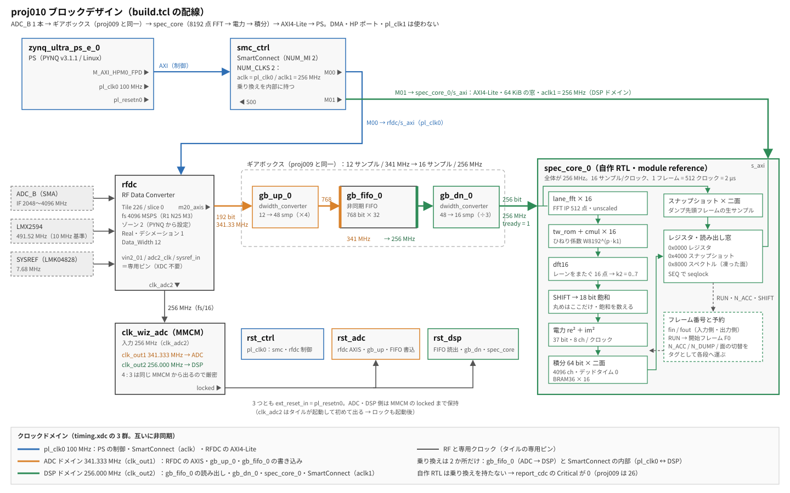

# proj010 — 最小構成の分光計（ADC → 8192 点 FFT → 電力 → 積分）

日付: 2026-09-18
状態: 進行中（実機 判定 0・1・2・4・5・6 通過。判定 3 は 1 s 以上が保留、判定 7 は閉じた）

## 目的

**一番簡単な形で分光計を端から端まで通す。**ADC 1 本（ADC_B）の全帯域 2 GHz を 8192 点 FFT で
**4096 ch（0.5 MHz）** に分け、電力を 100 ms 積分して PS から読む。

proj009 の結論では、次は「窓の切り出し」だった（IF ごとに 2〜8 窓。ソフト DDC か粗い PFB か）。
**それを後ろへ回し、先に分光計を完成させる。**理由:

- 窓の切り出しをどちらの方式にしても、**後段（電力・積分・読み出し・判定の道具）は同じもの**が要る。
  先に作っておけば、方式の比較を積分したスペクトルで行える
- 16 並列の FFT は、PFB を選んだ場合もその FFT 部分になる（PFB = FIR + 同じ FFT）
- 持ち越している 2 つの宿題（**インタリーブのイメージは積分で沈むか**、proj004 のノイズフロア 1.3 dB）は、
  どちらも積分器を待っていた

## 仕様

| | 値 | 備考 |
|---|---|---|
| fs | 4096 MSPS | proj009。第 2 ナイキスト |
| 入力 | ADC_B 1 本 | Tile 226 / slice 0（VERSIONS.md） |
| 帯域 | 2048 MHz（IF 2048〜4096 MHz） | ゾーン 2 なので **ch k ↔ IF 4096 − 0.5·k MHz**（反転） |
| FFT | 8192 点（実数入力） | 窓関数なし（矩形）。PFB は後の proj |
| 出力 | **4096 ch × 0.5 MHz** | SAM45 と同じ 4096 ch。分解能は SAM45 の 2 GHz モード（488 kHz）より 2.4 % 粗い |
| 1 フレーム | 2.000 µs ちょうど | 1 s = 500,000 フレーム |
| 積分 | 既定 50,000 フレーム = **100 ms** | レジスタで可変。**二面で交互に積むのでデッドタイム 0** |
| 積分器 | 64 bit | 18 bit² × 2 = 37 bit の電力を 268 s 積んでも溢れない |
| 読み出し | AXI4-Lite（PYNQ の MMIO） | 4096 ch × 64 bit = 32 KiB。seqlock で 1 ダンプを保証 |

## 構成



（`docs/block_design.svg` は手描き。build.tcl の配線を変えたらこちらも直す）

```
RFDC ─(12 smp @ 341 MHz)─▶ ギアボックス ─(16 smp @ 256 MHz)─▶ spec_core ─(AXI4-Lite @ 256 MHz)─▶ SmartConnect ─▶ PS
                          （proj009 と同一）                  │
                                                             ├ lane_fft × 16（Xilinx FFT IP、512 点）
                                                             ├ ひねり係数（tw_rom + cmul × 16）
                                                             ├ 16 点 DFT（dft16。k2 = 0..7 だけ）
                                                             ├ 右シフト → 18 bit 飽和 → 電力 re² + im²
                                                             ├ 積分（64 bit、8 ch/クロック × 二面 = BRAM36 × 16）
                                                             └ スナップショット（ダンプ先頭フレームの生サンプル、二面）
```

### 決めたこと

- **8192 = 16 × 512 に分解する。**ギアボックスの出口は 1 クロック 16 サンプル（n = 16m + p）なので、
  レーン p ごとに 512 点 FFT（Y_p[k1]）→ ひねり係数 W8192^(p·k1) → レーンをまたぐ 16 点 DFT で
  X[k1 + 512·k2] が 1 クロックに 16 本（うち実数入力で要る 8 本）出る。CASPER の wideband FFT と同じ組み方
- **レーン FFT は Xilinx FFT IP、それ以外は自作 RTL。**IP は 16 個とも同じ設定・同じリセットで、
  出力の valid と XK_INDEX が揃っていることを常時照合する（FLAGS）。自作部分は iverilog と numpy で bit 単位に検証する
  - 見送った案: すべて自作（R2²SDF）— 書く量とバグの余地が増える／Vitis HLS の SSR FFT — ビルドの流れが変わる
- **IP は unscaled・自然順・XK_INDEX 付き・nonrealtime。**unscaled なら IP の中で飽和もスケーリングも起きない
  （実数 14 bit 入力の 512 点で |Y| ≦ 2^22、出力 24 bit）。**丸めて捨てる場所は SHIFT の 1 か所だけ**にした
- **読み出しは AXI4-Lite だけ。DMA は使わない。**spec_core を 256 MHz のまま AXI4-Lite で受け、PS との乗り換えは
  SmartConnect（NUM_CLKS = 2）にさせる。**自作の CDC が 1 つも無い。**100 ms の積分に対して読み出しは数 ms の見込み
  - 見送った案: AXI DMA — 1 kHz 級のダンプが要るようになったら戻る
- **「どのフレームを積んだか」をフレーム番号で持つ。**入力側と出力側にフレーム番号（fin / fout）を持ち、RUN のたびに
  開始フレーム F0 を決める。スナップショットと積分は同じ番号を見るので、**SNAP_F == DUMP_F0 が読み出しで確かめられる。**
  N_ACC = 1 にすればスナップショットの FFT とダンプが 1 対 1 に対応し、**実機で IP ごと numpy と照合できる**
- 時刻層（proj007/008 の 1PPS）はまだ載せない。フレーム番号が、後で時刻を貼るときの足場になる

### 語幅

入力 |x| ≦ 2^13。実数入力の DFT の成分は Σ|x| を越えないので、各段の上限が決まる。

| 段 | 上限 | 語幅 |
|---|---|---|
| Y（レーン 512 点、IP の出力） | 2^22 | 24（IP の unscaled = 14 + 9 + 1） |
| V = W·Y | 2^22 | 25 |
| U（4 点和） | 2^24 | 27（DSP の A ポート 27 bit にちょうど載る） |
| Z（16 点） | 2^26 | 29 |
| Q = Z >> SHIFT、飽和 | — | 18 |
| 電力 | 2^35 | 37 |
| 積分 | 2^35 × 2^27 フレーム | 64 |

**SHIFT は雑音の成分の σ が 2^9 付近になるよう選ぶ**（`--shift auto`）。切り捨ては平均 −0.5 LSB の偏りを持つので、
σ が数 LSB まで小さいと電力に偏りが出る。σ ≫ 1 LSB に保つこと。

## やったこと

- RTL: `src/spec_core.v`（本体・AXI4-Lite）/ `src/cmul.v` / `src/dft16.v` / `src/tw_rom.v`（`tools/gen_tw_rom.py` の生成物）
- シミュレーション（`make sim`）: FFT IP の代わりに `sim/lane_fft_model.v` を置き、`sim/check.py` が 3 層で判定する
  - **A. bit 単位** — レーン FFT の出力を記録し、自作部分の整数模型に通したものとダンプが 1 bit も違わない
  - **B. numpy** — スナップショット（同じフレームの生サンプル）の 8192 点 FFT と振幅で一致。**模型を介さずに分解の式そのものを確かめる**
    （A だけでは模型と RTL が同じ誤解をしていても通る）
  - **C. 帳簿** — FLAGS = 0、SNAP_F = DUMP_F0、DUMP_N / DUMP_K、読み出し中に SEQ が動かない、N_DUMP で止まる、STOP で止まる
- `build.tcl`: proj009 から capture_gate / FIFO / DMA / GPIO / pl_clk1 / HP ポートを外し、spec_core と FFT IP を足した。
  FFT IP は **設定を読み返し、RTL が使うポートの名前と幅を IP のトップ（VHDL）から照合してから**合成に進む
- `pynq/spectrometer.py`: `--probe` / `--golden` / `--tone` / `--radiometer` / `--save`

### シミュレーションの結果（2026-09-18）

刺激: 雑音 σ 200 LSB ＋ CW 3 本（ch 1000.3 に 2000 LSB、ch 3000 に 500 LSB、ch 4095 に 3000 LSB）。

| 試験 | 内容 | SHIFT 7（飽和なし） | SHIFT 4（強い線が飽和） |
|---|---|---|---|
| t1 | N_ACC 1 / N_DUMP 1 | A 一致（不一致 0 / 4096 ch）・B 差/許容 0.66・C 全部 | A 一致・**SAT 3（模型 3）**・B 0.74・C 全部 |
| t2 | N_ACC 3 / N_DUMP 2、2 つ目を読む | A 一致・C 全部（DUMP_K = 1） | A 一致・SAT 9（模型 9） |
| t3 | N_ACC 2 / 連続 → STOP | A 一致・SEQ が止まる | A 一致・SAT 6（模型 6） |

- B の平均の差 0.46〜0.48 LSB は切り捨ての偏り（成分ごとに −0.5 LSB）でほぼ説明がつく
- **B の判定の組み方で 2 回落ちた。**どちらも RTL ではなく、比べ方の誤りだった:
  1. 電力の相対誤差 1 % で比べた → 2.4 % で落ちた。電力 1e4 の ch は振幅 100 LSB で、±1 LSB の量子化がそのまま 2 % になる
  2. 振幅の差を固定 2 LSB で比べた → SHIFT 4 で 3.4 LSB で落ちた。**落ちた ch は ch 2047 と ch 1（どちらも k1 = 511 とその鏡像）で、
     ch 4095（k1 = 511）に 7.7e5 LSB の強い線がいる。**ひねり係数の丸め誤差はレーン FFT の出力 Y_p[k1] に比例して入り、
     Y_p[k1] には k1 を共有する 16 本の ch が全部乗っているので、**強い線は 512 ch おきの ch に誤差を落とす**。
     大きさは 2^-17 ≒ −100 dBc 級で、インタリーブのイメージ（−55 dBc）より 45 dB 低い。
     許容を「2 LSB ＋ 同じ k1 の組の最大振幅 × 3e-5」にし、**落ちた ch が本当に強い線と k1 を共有しているかを確かめてから**変えた
- t3 では SNAP_F = DUMP_F0 だったが、連続運転では次の予約で上書きされうる（入力側が出力側より IP の遅延ぶん先行する）。
  **一致しないことは読み出しで検出できる**ので、判定には使わず表示だけにしている

## 予言（測る前に書く）

**ビルド**

| | 予言 | 根拠 |
|---|---|---|
| DSP48E2 | 450〜850（4272 の 11〜20 %） | cmul 32 個 × 4 = 128、電力 16、FFT IP 16 個 × 20〜45 |
| BRAM36 | 80〜120（1080 の 7〜11 %） | 積分 16、スナップショット 8、FFT IP 16 個 × 3〜5、ROM 0〜8、ギアボックス |
| WNS（−2） | 正。proj009 1ch の +0.348 より小さい | 256 MHz に載るロジックが桁で増える。**最悪経路は spec_core の中**（AXI4-Lite の読み出し選択か 64 bit の積分加算）と見る |
| CDC | proj009 1ch から DMA 側が消え、SmartConnect の乗り換えが増える | 自作の乗り換えは無い |

**実機**

| 判定 | 内容 | 予言 |
|---|---|---|
| 0 | `--probe` | ID 0x0010_0001。FIN が **500,000 フレーム/s**（PS の時計で ±0.1 %）。**FIN − FOUT が一定**。FLAGS = 0。MMIO の一括読みと 1 語ずつが一致 |
| 1 | CW の位置 | IF 3000.0 MHz → **ch 2192**。3000.25 MHz → ch 2191 と 2192 の境目で、中心より **−3.92 dB** |
| 2 | `--golden`（同じフレームの numpy FFT と照合） | SNAP_F = DUMP_F0。差/許容 の最大は **sim の 0.74 より少し大きく、2 未満**（IP 内部の係数の量子化ぶん） |
| 3 | `--radiometer`（50 Ω 終端より増幅した雑音が望ましい） | σ/μ = 1/√(Δν·τ)。Δν = 0.5 MHz（矩形窓の ENBW = 1 ch）: **10 ms 1.414 % / 100 ms 0.447 % / 1 s 0.141 %**。外れ方の読み: 大きい → デッドタイム・相関・利得の揺れ／小さい → 同じ中身を二度積んでいる |
| 4 | 直線性 | SG を 10 dB ずつ振ると ch の電力が 10.0 ± 0.1 dB ずつ動く（飽和 SAT = 0 の範囲で） |
| 5 | インタリーブのイメージ | f ± k·512 MHz（= ±1024·k ch）に立つ。**線に対する比は積分時間に依らず一定**（線と同じくコヒーレントなので沈まない）。雑音の床に対しては √N で浮き上がる |
| 6 | 速度グレード −1 | `make timing-check` で閉じる |
| — | ひねり係数のスプリアス | 強い線から ±512·n ch に −100 dBc 級（sim で確認）。**インタリーブのイメージより 45 dB 低いので実機では見えない**と予言する |

### 1PPS が ADC に入ったままでできる判定（2026-09-19 追記。予言は測る前に書く）

proj008 の配線（1PPS を 5 分配して ADC_A〜D の全部に入れた状態）のまま、SG を使わずに進められるもの。
ADC_B の入力は、ほぼ全時間が **ADC 自身の雑音**で、毎秒 2 回だけ PPS の縁（100 µs 幅の立ち上がりと立ち下がり）が入る。
バランが直流を通さないので効くのは縁だけで、縁は広帯域（ゾーン 1 の成分も BPF が無いので帯域に折り返してくる）。

| 判定 | できるか | 予言 |
|---|---|---|
| 0 `--probe` | **できる**（入力に依らない） | 上の表のとおり |
| 2 `--golden` | **できる**（雑音のフレームで照合。縁を含むフレームに当たる確率は 2 µs × 2 / 1 s ≒ 4e-6） | SNAP_F = DUMP_F0、差/許容 < 2。SHIFT は auto で 0 付近（入力 std が数 LSB） |
| 3 `--radiometer` | **できる**（ADC 自身の雑音を使う。縁を含むダンプは全 ch の和の外れとして除く） | σ/μ = 1/√(Δν·τ) が比 1 ± 0.1。**1 s では全ダンプが縁を 2 つずつ含むので除かれず、それでも比 1** |
| 1・4・5 | できない（SG が要る） | — |
| **7 `--tick`（新設）** | **できる** | 下 |
| **8 固定の線（新設）** | **できる** | 下 |

**判定 7 — PPS の縁で積分の連続性を外部の時計と照合する**（`--tick 60`、N_ACC 50,000 = 100 ms）

ダンプは隙間なく並ぶので、縁を含むダンプは**ちょうど 10 ダンプおき**に来て、**秒内の位置（DUMP_F0 mod 500,000）が動かない**。
フレームを 1 つでも落とせば秒内の位置がずれる。**FIN − FOUT が一定（判定 0）を、外部の 1PPS という独立な時計で裏づける**試験。

- 予言: 事象の間隔は 10 ダンプだけ、秒内の位置の広がり 0（縁がダンプの境目にかかった回だけ 1 ダンプ = 50,000 フレーム）
- 予言: 縁の超過は全 ch の和の揺れ（100 ms で 1/√(2 GHz·τ) ≒ 7e-5）より**十分大きい（20 σ 以上）**。
  見えなければ縁が小さいので `--nacc 5000`（10 ms）にする。相対的な超過が 10 倍になる
- 読み出しが追いつかずダンプを飛ばしても（DUMP_K の飛び）、それは読み出しの話で、積分の連続性の判定には影響しない

**判定 8 — 何も入れていないのに立つ線（固定のバーディー）を洗い出す**（`--nacc 500000 --ndump 60 --peaks 30` = 60 s 積分）

60 s 積分で ch あたりの雑音の相対揺れは 1/√(0.5 MHz × 60 s) ≒ 1.8e-4。床比 +0.01 dB（2.3e-3）でも 10 σ を越えるので、弱い線まで出る。
候補は `identify()` がボード内のクロックの高調波から当てる（ch = 第 1 ゾーンに折り返した周波数 / 0.5 MHz）。

- 予言（立つ）: **ch 983（491.51 MHz。LMX の回り込み、proj003 で RF 周波数として確認済み）と ch 491.5（245.76 MHz、同）**
- 予言（立つ）: **ch 1024・2048・3072（fs/8 の倍数。インタリーブの副 ADC のオフセットの不整合）**。ch 512 の奇数倍（fs/16）は弱いか出ない
- 予言（立たない）: ひねり係数のスプリアス（−100 dBc 級。強い線が無いので土台が無い）
- 分光計の仕様としては、ここで出た線が「**観測に常に乗る固定の線**」の一覧になる。VERSIONS.md に固定値として載せる候補

## 結果

### ビルド（2026-09-18、`-2`）

CRITICAL WARNING なし。**WNS +0.474 ns / WHS +0.010 ns。**

| | 予言 | 実際 | |
|---|---|---|---|
| DSP48E2 | 450〜850 | **944（22.1 %）** | **外れ（上に）** |
| BRAM | 80〜120（BRAM36 換算） | 79 タイル（RAMB36 23 ＋ RAMB18 112） | 下限のすぐ下 |
| WNS（−2） | 正で proj009 1ch の +0.348 より小さい | **+0.474** | **外れ（逆向き）** |
| 最悪経路 | spec_core の中（AXI4-Lite の読み出し選択か 64 bit の積分加算） | spec_core の中だが **FFT IP の内部** | **外れ（場所）** |
| CDC | DMA 側が消え、SmartConnect の乗り換えが増える | **Critical 0**、CDC-3 20、CDC-15 833 | |

**DSP の内訳**: FFT IP が **1 個 50 × 16 = 800**、自作部分が **144**（cmul 32 個 × 4 ＋ 電力 16。見積もりと一致）。
外れは FFT IP 1 個あたりの見積もり（20〜45）だけ。`use_mults_performance` と `use_xtremedsp_slices` の効き。
**4ch にすると 944 × 4 = 3776（88 %）なので、4ch の最初の手はこの 2 つを資源優先に振ること。**

**BRAM の内訳**: FFT IP が RAMB18 × 6 × 16 = 96。spec_core 本体が RAMB36 23（積分 16 ＋ スナップショット）・RAMB18 16（ひねり係数の ROM ほか）。

**最悪経路（`clk_out2`、256 MHz）**: `g_lane[5].u_fft` の中の
`axi_wrapper/gen_ce_non_real_time.ce_predicted_reg` → 内部の乗算器の遅延線の **CE**。論理 0 段・配線 2.887 ns（97 %）。
**nonrealtime を選んだために IP の中に生えるクロックイネーブルの大ファンアウト**である。
入力が途切れない（valid 常時 1・出力の tready 1 固定）ので実際には常に 1 だが、配線は残る。
予言は「自作の積分加算か読み出し選択」だったが、**自作の部分は上位 5 本に出てこない。**
余裕が要るようになったら、realtime にすればこの CE は消える（代わりに入力の隙間でフレームの境界がずれる危険を自分で見張る）。

**WNS が proj009 より大きくなった理由（見立て）**: 341 MHz 側（ギアボックス。回路は proj009 と同一）の最悪経路も
+0.348 → +0.483 に広がっている。**DMA（200 MHz、1024 bit）を外して配置の混み具合が変わった**のが効いたと読む。

**CDC**: proj009 にあった CDC-1（1 bit の分類されない乗り換え）26 件が消え、**Critical が 0**。自作の乗り換えを無くした効果。
CDC-15 は proj009 1ch の 857（89 ＋ ギアボックスの FIFO 768）から DMA 側が抜けて 833。

**外れた予言の教訓**: 資源と最悪経路の予言は、**自作部分については当たり、既製 IP の中身で外れた。**
IP の資源は、次からは IP を 1 個だけ合成して数えてから予言する。

### 実機（2026-09-19、1PPS が ADC に入ったまま・外部 10 MHz）

**判定 0（`--probe`）**: ID・PARAM 一致、**499,995〜499,999 フレーム/s**（PS の時計で測った範囲で 500,000）、FLAGS 0、
MMIO の一括読みと 1 語ずつが一致。**FIN − FOUT は −9 → −11 と負になった。**これは深さではなく読み出しの間隔
（FIN を読んでから FOUT を読むまで約 20 µs = 10 フレーム）を測っていた。**sim では読み出しが一瞬なので出なかった。**
`--probe` を FIN → FOUT → FIN の挟み読みで区間を絞る方式に直した。
**再測定（同日）: FIN − FOUT の区間は [−6, 10] で、5 秒おいた 2 回で同じ → 一定。判定 0 は通過。**

**判定 2（`--golden`）**: **SNAP_F = DUMP_F0 は一致**（同じフレームを指している）。SHIFT 0（入力 std 5.8 LSB）。
|X| の差は**平均 9.5 LSB・最大 61 LSB で、予言（差/許容 < 2）は外れた**（差/許容 30）。

- 外れた理由の見立て: **FFT IP の内部の丸め。**unscaled でも各段のひねり係数の積は入力の LSB で丸まり、その誤差は
  後段の変換で √(残りの点数) 倍に増幅されて、**入力の大きさに依らない絶対量**として出る。予言は「係数の量子化
  （相対誤差）」しか見ておらず、この項が無かった。sim の IP モデルは倍精度の FFT で丸めないので、sim でも出なかった
- 見立ての検証: 各段で丸める模型（`tools/ipround_model.py`）で、**差の平均 ≒ 8 LSB・最大 ≒ 45〜65 LSB、しかも入力の
  大きさ（σ 5.8 / 58 / 580）に依らない**と出た。**実機の 9.5 / 61 と合う**
- 分光計としての意味: 丸めの雑音は入力に依らない一定の床で、今の入力（ADC 自身の雑音、σ 5.8 LSB）に対して
  振幅で約 2 %・電力で約 −34 dB。**観測の入力レベル（σ 数十 LSB 以上）ではさらに小さく、実害は無い**。
  ただし入力を絞りすぎると効いてくるので、運用のレベル設定の下限の目安になる
- `--golden` の判定を「平均 < 2 × 模型 ＋ 1、最大 < 2 × 模型の最大 ＋ 2 ＋ 係数の項」に直した。
  **再測定（同日）: 平均 9.55 LSB・最大 51.47 LSB、許容に対する比 0.39 で通過**

### 実機（2026-09-19〜24）判定 7・3・8 — 1PPS を入れたまま → 50 Ω 終端

構成: 9/19（土）と 9/24 の午前は proj008 の配線のまま（1PPS を 5 分配して ADC_A〜D の全部に入れた状態）。
9/24 の午後に**構成 B（ADC に 1PPS を入れない）へ戻し、ADC_B を 50 Ω で終端**した。基準は外部 10 MHz（`--clkin 0`）。
道具: `--tick 60 --save` の記録（100 ms × 600 ダンプ）を `tools/tick_analyze.py` で切り分けた。

**判定 7（PPS の縁）: 閉じる。予言は大きさの見積もりで外れた。**静かな ch だけで 1 秒に畳んでも、10 位相すべてが ±1.2 σ 以内。
縁の超過の上限は 1 ダンプあたり相対 2e-3（3σ）で、予言の「20 σ 以上で見える」には遠い。
積分の連続性は、判定 0（FIN − FOUT が一定）と帳簿（DUMP_F0 の間隔 = DUMP_K × N_ACC）で見ている。

**全 ch の和の揺れの出どころ**（期待 1/√(2 GHz·100 ms) ≒ 7e-5 に対して 30〜300 倍）:

| 成分 | PPS 入り（9/19 土） | PPS 入り（9/24 平日） | 50 Ω 終端（9/24） | 出どころ |
|---|---|---|---|---|
| 820〜824 MHz（ch 1640〜1648。ゾーン 2 なら 3272〜3276 MHz）の間欠的な混信 | 無し | **全 ch の和を 1 ダンプで +3〜18 %**。数秒に固まって出る。1 s で SAT 44〜45 | 2 桁以上弱い残りだけ | **PPS の分配ケーブル経由**。平日だけ出る外部の送信源（800 MHz 帯 LTE の上りの帯域と見るが未確認）。本人のスマホを機内モードにしても消えなかった |
| 第 1 ゾーンの 30〜140 MHz に 10 MHz おきの線（ch 60・120・140・160・220・240・260・280） | 有り | 有り | **無し**（外部基準でも内蔵基準でも） | **PPS の分配ケーブル経由**（PPS 源は同じ 10 MHz から作られる） |
| 床の電力（全 ch の和の中央値） | — | 5.46e13 | 5.02e13（**−8 %**） | PPS をつなぐだけで床が 0.35 dB 上がっていた |
| 全 ch に共通の利得の揺れ c（隣との差） | 2.67e-3 | 2.47e-3 | **2.26e-3** | **ADC 側**（PPS に依らない） |
| fs/8 の線（ch 1024・3072）の跳ね | 有り | 有り | 有り | インタリーブの較正（強さは起動ごとに 5〜7 dB 変わる） |

→ **構成 B（ADC に 1PPS を常時入れない）は、時刻の精度だけでなく、混信と床の点でも正しかった。**
終端でも、弱い間欠的な混信が ch 1681〜1685（842 MHz / 3254 MHz）と ch 1646 付近に残る（基板が直接拾う分と見る）。

**判定 3（ラジオメータ式）: 10 ms・100 ms は通過、1 s 以上は保留。**50 Ω 終端で、入力は ADC 自身の雑音（σ 5.8 LSB）。

| τ | 期待 σ/μ | 比（割らない） | 比（共通の利得を除く） |
|---|---|---|---|
| 10 ms | 1.414 % | 1.012 | **0.984** |
| 100 ms | 0.447 % | 1.178 | **1.011** |
| 1 s | 0.141 % | 2.482 | **1.390** |

- 全 ch 共通の利得の揺れ（c ≒ 2.3e-3、ADC 側）を除いて判定するように直した。初版は全 ch の和で割ったため、間欠的な混信の揺れが全 ch に配られて 1 s で 1.86 に悪化した → **ch ごとの比の中央値で割る**。
  **積分の正しさ（デッドタイム・二度積みが無いこと）は 10 ms・100 ms で確かめられた**
- 1 s の超過を、tick の記録を束ねて切り分けた（tick_analyze の 9。束ねた 1 s の値は判定 3 の実測を再現する: 割らない 2.01 / 中央値で割る 1.33）。
  **3 成分とも、0.1〜3 s で大きさがほぼ一定 = ちらつき型（1/f 的）**:

| 成分（相対） | 0.1 s | 1 s | 3 s |
|---|---|---|---|
| 全 ch 共通の利得 | 2.3e-3 | 2.1e-3 | 1.6e-3 |
| 帯域のなめらかな傾き（1 次の多項式で取れる） | 0.7e-3 | 0.8e-3 | 0.9e-3 |
| 128 ch より細かい構造 | 0.9e-3 | 0.9e-3 | 0.8e-3 |

- ch ごとの共通でない揺れ（約 1.2e-3）が 1/√(Δν·τ) と並ぶのは τ ≒ 1.4 s。**ただしこれは ADC 自身の雑音の揺れを測っている。**
  実入力（σ 20〜40 LSB）を入れて、揺れが (σ_ADC / σ_入力)² で縮むか（ADC の雑音の大きさの揺れ）、縮まないか（利得の揺れ）を分けるのが次の測定。雑音源待ち

**判定 8（固定の線）**（50 Ω 終端、60 s 積分）:

| 予言 | 結果 |
|---|---|
| ch 1024・2048・3072（fs/8 の倍数）が立つ | **当たり**（1024 が 15〜20 dB。強さは起動ごとに 5〜7 dB 変わる） |
| ch 983・491.5（491.52 / 245.76 MHz そのもの）が立つ | **外れ**（出ない） |
| — | 予言していなかった: **LMX2594 の 491.52 MHz の 5〜12 倍高調波**が 8 本（ch 655・3604・2621・1638・3277・1311・328・2294、床比 6〜15 dB）。内蔵基準でも外部基準でも同じ強さ（0.4 dB 以内） |
| ひねり係数のスプリアスは立たない | 当たり |

**周波数軸の検証（SG なし）**: LMX の高調波は周波数が計算で分かり、ch の間に落ちるものがある。
両隣の ch の強さの比（床を引いた後）を矩形窓の sinc² の予言と比べると、4 本 × 3 回の実行で**すべて 0.05 dB 以内**
（ch 1638.40: 予言 3.52 dB / 実測 3.56〜3.57、655.36: 5.00 / 5.01〜5.02、3604.48: 0.70 / 0.70〜0.71、2621.44: 2.09 / 2.09）。
**周波数軸と ch の割り付けは 1 ch 未満の精度で正しい。**

### 実機（2026-09-24、SG — 判定 1・4・5）

構成: **E8257D → MWX412-AP-AP 50 cm → ADC_B**（ケーブルの損失は差し引いていない）。
10 MHz は水素メーザー → E8257D → E8257D の 10 MHz 出力 → RFSoC4x2 の CLK_IN（`--clkin 0`）。ADC_A・C・D は開放、1PPS は ADC に入れない。
減衰器: Orient Microwave BX20-0476-00（公称 20 dB）、TAMAGAWA ELECTRONICS SFA-01A（公称 10 dB）。
この E8257D は出力の下限が −20 dBm（ステップ減衰器なし）なので、それより下は減衰器で作った。

**判定 1（線の位置）: 通過。**

| SG | 立った ch | 振幅 | |
|---|---|---|---|
| 3000.00 MHz −20 dBm | **2192**（予言 2192） | −25.91〜−25.92 dBFS | 3 回で 0.01 dB |
| 3000.25 MHz −20 dBm | **2191 と 2192 が同じ強さ（差 0.00 dB）** | −29.84 dBFS | **予言 −25.92 − 3.92 = −29.84 と一致** |
| 2500.00 MHz −20 dBm | **3192**（予言 3192） | −25.95 dBFS | 2.5〜3 GHz で平坦（0.03 dB。SG・ケーブル込み） |

- 境目のトーンでは矩形窓の漏れが ±16 ch に広がり、床比が 69 → 25 dB に落ちた。**強い線が ch の中心を外れると数十 ch に漏れる**（将来、窓関数か PFB が要る根拠）
- レベルの帳簿が境目で落ち込みぶんを戻しておらず +9.84 dBm と出た → sinc² を戻すよう直した

**判定 4（直線性）: 通過。−56〜−6 dBFS で 0.02 dB。**SG の設定を固定し、10 dB の減衰器（SFA-01A）を付け外した差で見た
（減衰器は受動部品なのでレベルに依らない。SG のレベルの確度が入らない）:

| ADC の入力 | 10 dB を外した差 |
|---|---|
| −56 → −46 dBFS | 10.06 |
| −36 → −26 dBFS | 10.06 |
| −26 → −16 dBFS | 10.08 |
| −16 → −6 dBFS | 10.08 |

- SAT はすべて 0。20 dB の減衰器（BX20）は 3 GHz で 20.11 dB と読める
- **SG の出力を変えた段が 9.81 dB と外れたのは SG 側**: 直線と確かめた ADC を物差しにすると、E8257D の −20 → −10 dBm は 9.81〜9.82 dB（2 回で再現）、−10 → 0 dBm は 10.00 dB
- **0 dBFS 換算は 3 GHz で +5.9〜+6.1 dBm**（幅は SG の設定ごとの出力の誤差）。100 MHz の +5.8 dBm とほぼ同じ。
  **予言「バランの損失で数 dB 大きく出る」は外れた**

**判定 5（インタリーブのイメージ）: 通過。**予言した ±f + k·fs/8 の 7 か所を名指しで読んだ（`--tone` と `--peaks` で表が出る）:

| トーン | 最も強いイメージ | その他 | H2 / H3 |
|---|---|---|---|
| 3000.00 MHz | −64.2 dBc（ch 1168）/ −68.1 dBc（ch 3216） | −77〜−88 dBc | −68.6 / −81.1 dBc |
| 3000.25 MHz | −71.6 dBc（ch 880.5） | −72〜−84 dBc、上限 −85〜−86 | −66.1 / < −80 dBc |
| 2500.00 MHz | **−58.5 dBc**（ch 2168）/ −60.9 dBc（ch 3976） | −70〜−80 dBc、上限 −88 | −69.2 / −80.7 dBc |

- **最悪 −58.5 dBc で、予言（−53〜−66 dBc）の範囲**。最も強いのは毎回 ±fs/8 の対。同じ位置でも起動ごとに 5〜14 dB 変わる（背景較正の収束。proj009 と同じ）
- H2・H3 は SG 由来か ADC 由来か区別できない（LPF なし）
- **16 MHz おきの線**（約 −63〜−65 dBc、16 ch の倍数に並ぶ）は、RF OFF で消え、SG の周波数で位置が変わり、トーンには付いて動かない → **E8257D の非高調波スプリアス**。−65 dBc より下を測るには、この SG ではスプリアスが邪魔になる

### 速度グレード −1（判定 6）

**WNS +0.081 ns / WHS +0.010 ns で閉じた。判定 6 は通過。**ただし余裕は周期 3.906 ns の **2 %** しかない
（`-2` は +0.474 ns = 12 %）。proj009 4ch の `-1`（+0.122）より薄い。
`-1` の検証ビルドは board_part もプリセットも使わない別の配置配線なので、`-2` の数字と差を取って意味づけしない（VERSIONS.md）。

**意味**: 1ch の今は刻印がどちらでも安全と言える。**4ch に広げるときは `-1` で閉じない見込みが高い。**
先に手を打つ候補は、FFT IP の realtime 化（`-2` の最悪経路だった nonrealtime の CE が消える）と、
乗算器・バタフライの資源優先化（DSP 1 個 50 → 30 台の見込み）。どちらも IP の設定だけで済む。

## 結論・次にやること

- [x] `make sim`（SHIFT 7）を Vivado サーバでも回す — apt の iverilog でも同じ数字で全部通過
- [x] `make` → 予言と突き合わせる（DSP・WNS・最悪経路の 3 つが外れ。上の「結果」）
- [x] `make timing-check` — WNS +0.081（余裕 2 %）で閉じた
- [x] 実機 判定 0・1・2・4・5（上の「結果」）。判定 7 は閉じた
- [ ] 判定 3 の 1 s 以上: 増幅した雑音（2〜4 GHz、σ 20〜40 LSB）を入れ、ちらつき型の揺れが (σ_ADC/σ_入力)² で縮むかを見る
- [ ] 判定 5 の残り: イメージの線に対する比が積分時間に依らないこと（N_ACC を変えて同じトーン）
- [ ] 820〜845 MHz の間欠的な混信の正体（平日だけ・PPS の分配ケーブル経由。実運用では IF の BPF で落ちる帯域）
- [ ] VERSIONS.md に載せる: 3 GHz の 0 dBFS 換算、固定の線（fs/8・LMX の高調波）、E8257D の下限 −20 dBm と段の誤差、減衰器の実測値
- [ ] 窓の切り出し（proj009 から持ち越し）。この proj の後段をそのまま使う
- [ ] 時刻層（1PPS）の 256 MHz への移植。フレーム番号 F0 に絶対時刻を貼る

## 再現手順

```bash
make sim                 # Vivado 不要。8〜10 分。SIM_SHIFT=4 で飽和の数え方も見る
make                     # 合成〜ビットストリーム（build/proj010.bit / .hwh）
make timing-check        # 速度グレード -1
make prog                # JTAG（PYNQ から Overlay で読むなら不要）
make twiddle             # tw_rom.v を作り直す（係数の式を変えたときだけ）
```

ボード（`pynq/` と `build/proj010.bit` / `.hwh` を同じディレクトリに置く）:

```bash
sudo python3 spectrometer.py --clkin 0 --probe
sudo python3 spectrometer.py --clkin 0 --golden --tone 3000.0 --sg-dbm -20 --atten-db 0
sudo python3 spectrometer.py --clkin 0 --tone 3000.0 --sg-dbm -20 --atten-db 0
sudo python3 spectrometer.py --clkin 0 --radiometer --nacc 5000,50000,500000 --ndump 30
sudo python3 spectrometer.py --clkin 0 --ndump 100 --save run.npz                  # 100 ms × 100 個（メモリに溜めてから書く）
sudo python3 spectrometer.py --clkin 0 --nacc 500000 --record 3600 --out noise1h   # 1 s × 1 時間（少しずつファイルへ）
python3 tools/allan.py noise1h --plot noise1h_allan.png                              # アラン分散とラジオメータ式の曲線
```

`--record` は PREFIX.spec.npy（[ダンプ, 4096] uint64）・.meta.npy・.info.json を書く。容量は 100 ms で 1 時間 1.2 GB、1 s で 120 MB。
`tools/allan.py` は `--record` の出力のほか、`--tick --save` / `--ndump --save` の .npz も読む（連続した最長の区間だけを使う）。

`pynq/extref.py` と `clocks/` は proj009 からそのまま持ってきた（自己完結のため）。

環境は [`../VERSIONS.md`](../VERSIONS.md)、詰まったときは
[`../proj001/docs/runbook.md`](../proj001/docs/runbook.md)。
