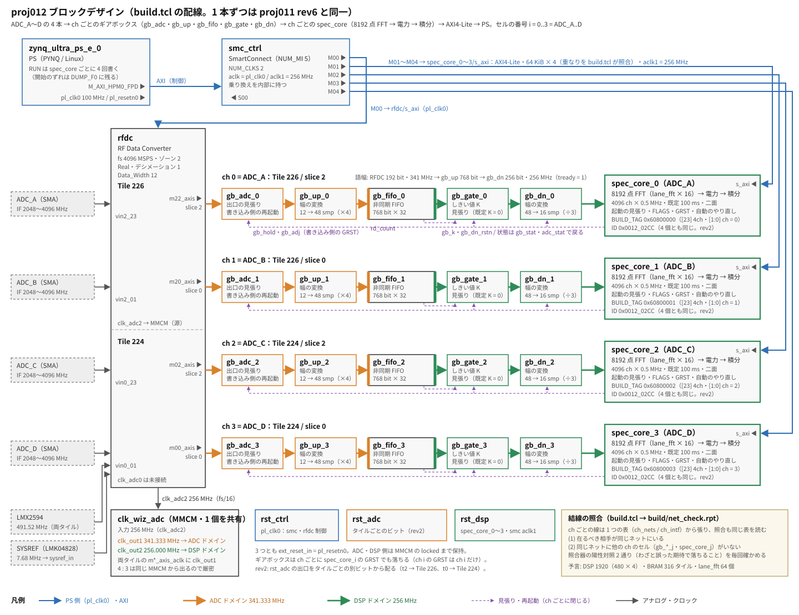

# proj012 — 全帯域 4096 ch の分光計を 4 IF に広げる（1ch → 4ch）

日付: 2026-09-28
状態: **進行中**（rev1 のビルドは `-2` / `-1` とも閉じ、DSP 1920 は予言どおり。CDC-11 Critical 2 は rst_adc の配り方と特定し、rev2 で消す。rev2 はビルド前。PS 側の 4 本化は未着手）

## 目的

**全帯域・4 IF・4096 ch × 0.5 MHz のモードを、最終形の一つとして 4ch で端から端まで通す。**

全帯域モードは窓の切り出しとは独立に最終形に残す（2026-09-28 に決定）。だから 4ch 化は捨てる作業にならず、
窓の方式（proj013 以降）を選ぶ前に済ませておける。次の 2 つをこの proj で実測に変える:

- **窓の予算の前提。**proj011 の「4ch の後に残る予算（DSP 55 %・LUT ≧ 54.5 %）」は 1ch の 4 倍の見積もりで、
  LUT・FF は上限でしかない。`-1` の余裕も 1ch の値（rev2 +0.277 ns・7 % → rev6 +0.110 ns・2.8 %。配置の組み替わりで動く）で、4ch では測り直しになる
- **4ch で初めて出るもの。**起動の途切れ（原因未解明）が 4 本それぞれでどう出るか、読み出しが 100 ms に間に合うか、ch 間の一致と漏れ

**1 本ずつの機能は proj011 rev6 と同一**（8192 点・realtime / res・100 ms 積分・起動の見張り・FLAGS・`--record` の自動のやり直し）。
proj011 の判定を 4 本それぞれの回帰試験に使う。

## ブロックデザイン

（`docs/block_design.svg` は `docs/block_design.py` で描いた。build.tcl の配線を変えたらこちらも直す）

## 着手の前に決めたこと（2026-09-28）

| | 案 | 読み |
|---|---|---|
| **分光計の置き方** | **(A) spec_core × 4 を独立に置き、AXI の窓を 4 つ（64 KiB × 4）** ← 決定／(B) 1 個の spec_core に 4ch を入れる | (A) は spec_core.v の本体に触らず、sim も 1 本ぶんのまま使える |
| **4 本の積分の開始をどう揃えるか** | (a) PS が RUN を 4 回書く（F0 は ch ごとに別）／(b) 共通の開始の打鍵（1 本の RUN で 4 本が同じクロックに F0 を決める）／(c) 1PPS に揃える | **(a) に決定**。RTL を触らない。ずれは PS の書き込み 4 回ぶん（数 µs ＝ 数フレーム）で、**帳簿（DUMP_F0）に残るので後から揃えられる**。(b)(c) は時刻層と一緒に決める |
| 起動の順序 | 源のタイル（226）を先に | VERSIONS.md: 複数タイルの `ShutDown()` は順序を直しても成立しない。**PS からタイルを止める操作は書かない**（起動は Overlay に任せる） |
| 変種 | 4ch だけにする（1ch の参照は proj011） | `FFT_OPT` / `GB_K` / `GB_SLOW` は残す。`NCH` は作らない |

## proj011 から変えるもの・変えないもの（予定）

| | proj011 | proj012 |
|---|---|---|
| 入力 | ADC_B（Tile 226 / slice 0）の 1 本 | **ADC_A〜D の 4 本**。`chans = {{2 2} {2 0} {0 2} {0 0}}` = **ラベル順**（proj009 の 4ch の並びは 512 bit に束ねる都合だった。束ねないので並べ替えた）。セルの番号 i = 0..3 = ADC_A..D |
| ギアボックス（gb_adc / gb_up / gb_fifo / gb_gate / gb_dn） | 1 組 | **4 組**（proj009 の 4ch と同じ組み方。Clocking Wizard は clk_adc2 の 1 個を共有） |
| spec_core | 1 個（`spec_core_0`） | **4 個**（`spec_core_0..3` = ADC_A..D。案 (A)）。**BUILD_TAG に [23] 4ch・[1:0] ch の番号**を載せ、PS がセル名と突き合わせる |
| 結線の照合 | なし | **新設**（`build/net_check.rpt`）。ch ごとに「在るべき相手と同じネット」と「他の ch のセルが載っていない」の両側。照合器の陽性対照 2 通り（わざと誤った期待で落ちること）をビルドのたびに確かめる |
| SmartConnect | M 2 本（RFDC・spec_core） | **M 5 本** |
| spec_core の ID | 0x0011_06CC | **0x0012_01CC**（複製の時点で変えた） |
| `pynq/spectrometer.py` | 1 本 | **`--ch` で 1 本を選ぶ／全部。判定は 4 本それぞれ**。ch の並びと SMA の対応は VERSIONS.md（ch 番号は SMA の逆順） |
| spec_core.v の本体・FFT IP の設定・XDC | — | **同一**（spec_core.v は ID の定数と BUILD の説明のコメントだけ。XDC はコメントだけ） |
| `GB_SLOW`（検証ビルド） | gb_fifo_0 = ADC_B | gb_fifo_0 = **ADC_A** に効く（`tools/gb_slow.tcl`・`gb_cdc.tcl` は gb_fifo_0 を見る） |

## 予言（測る前に書く）

### ビルド（`make`、`-2`・res）

1ch は proj011 rev6 の配置配線後の実測。

| | 1ch（proj011 rev6） | 4ch の予言 | 根拠 |
|---|---|---|---|
| DSP48E2 | 480 | **1920（44.9 %）ちょうど** | 4 倍。RFDC・PS まわりに DSP は無い |
| BRAM | 79 タイル | **316 タイル（29.3 %）ちょうど** | 同上 |
| LUT | 48,393 | **175k〜190k（41〜45 %）** | lane_fft 4 × 35,264 = 141k ＋ spec_core の残り・ギアボックス × 4 ＋ 4 倍にならない PS・SmartConnect・RFDC の制御 |
| FF | 89,807 | **330k〜355k（39〜42 %）** | 同上 |
| CDC | rev6 の分類別件数を C とする | **Critical 0。CDC-15 = C(15) + 768 × 3**、CDC-3 = C(3) + 2 × 3 ＋ gb_adc の乗り換えが 3 組 × 3 | proj009: ギアボックスの FIFO 1 本につき CDC-15 +768・CDC-3 +2 で揃った（89 + 768 × 4 = 3161）。**rev6 の C は Vivado サーバの `build/` のレポートから、ビルドの前にここへ書き写す** |
| WNS `-2` | **rev6 +0.410**（rev2 +0.327） | **正。+0.10〜+0.30 ns** | 同じ回路が 4 組並ぶだけで、最悪経路の形は 1ch と同じ（spec_core の制御かギアボックス）。配置の混み具合のぶん下がる |
| WNS `-1` | **rev6 +0.110（2.8 %）**（rev2 +0.277） | **−0.05〜+0.10 ns。閉じない恐れがある**（初版は +0.05〜+0.20。rev6 の 1ch が +0.110 と分かったので、ビルドの前に下げた。2026-09-28） | 同上。**負なら窓の予算の前提が崩れる**ので、proj013 の前に手を打つ |

- 外れ方の読み: DSP・BRAM が 4 倍から 1 個でも外れたら、複製の段階で何かが 4 組になっていない（または余計に増えた）。WNS を読む前に構造を疑う
- rev6 の `-1`（proj011 の残り）は済んだ（2026-09-28、`-2` +0.410 / `-1` +0.110。proj011 の README）。**1ch でも配置しだいで 7 % → 2.8 % と動いた**ので、4ch の 1 回の値から余裕を言い切らない

### 実機

| 判定 | 内容 | 予言 |
|---|---|---|
| 0 `--probe` × 4 | ID・フレームの速さ・FIN − FOUT・FLAGS | 4 本とも ID 0x0012_01xx・500,000 フレーム/s・FIN − FOUT の区間が一定・FLAGS 00（[3] は起動のたびに立つ既知の事象として別に数える） |
| 起動の見張り × 4 | Overlay の起動 40 回、`--keep-startup-flags --probe` | 4 本とも見張りが開き、[4][5][6] は 0。**起動の途切れはビット列で率が変わる**（proj011）ので、4 本のうち途切れる本数は予言しない。ch ごとの率を記録する |
| 読み出し | 4 本 × 4096 ch × 64 bit を 1 ダンプごと | **4 本で 5〜20 ms**（1 語 0.2〜0.5 µs × 8192 語 × 4）。100 ms のダンプに間に合う。**測る**（`--probe` に時間を出す） |
| 開始のずれ（案 (a)） | 4 本の DUMP_F0 の差 | **0〜5 フレーム（0〜10 µs）**。PS の書き込み 4 回ぶん |
| 1 `--tone` × 4 | 3000.0 MHz を 4 分配して ADC_A〜D へ | 4 本とも ch 2192。**振幅の差 ≦ 0.3 dB**（proj009 の ch 間利得差 0.2 dB ＋ 分配器の不揃い）。分配器の各出口の損失を先に測って差し引く |
| ch 間の漏れ | 1 本だけに SG、残り 3 本は 50 Ω で終端 | **≦ −59 dBc**（proj006 の実測、2 番目の ch との差 59〜61 dB） |
| 2 `--golden` × 4 | 同じフレームを numpy と照合 | 4 本とも proj011 rev6 と同じ（差/許容の最大 ≦ 0.5） |
| 3 `--radiometer` × 4 | 10 ms・100 ms | 共通の利得を除いた比が 1 ± 0.05 |
| realtime の危険 | 4 本同時の 1 時間の `--record` | FLAGS 00・自動のやり直し 0 回 |

- **試験の構成は測定ごとに README に書く**（SG の型番・分配器・減衰器・ケーブル・終端した入力）。
  4 本に配ると「どの SMA に何が挿さっているか」の取り違えが増える。**配線の状態は測定ごとに言葉で確かめる**（業務ログ 9/24 の教訓）
- Tile 224 と 226 の入力極性は反転している（VERSIONS.md）。自己相関では見えないので、この proj の判定には効かない

## 手順（予定）

1. proj011 の残り: rev6 の `make timing-check`（`-1`）。rev6 の CDC の分類別件数を上の予言の表に書き写す
2. `build.tcl` を 4ch に（proj009 の 4ch の組み方を移す）。spec_core × 4・SmartConnect M 5 本・アドレスの照合を 4 窓に
3. `make sim-all`（spec_core.v は変えないので、ID の期待値の確認だけ）
4. `make` → `make timing-check` → 予言と突き合わせ
5. `pynq/spectrometer.py` を 4 本に。判定 0 → 起動 40 回 → 1・漏れ → 2・3 → 1 時間の `--record`

## やったこと

- 2026-09-28: proj011 の追跡されているファイルを複製（`git ls-files proj011`。`build-patch/` などの追跡外は持ち込まない）。
  名前と ID だけを変えた: `build.tcl` の `proj`・`program.tcl` の `bitname`・`Makefile` の `DCP` の既定値・
  `pynq/spectrometer.py` の `BITFILE` / `ID_EXPECT`・`src/spec_core.v` の ID（0x0012_01CC）・`sim/check.py` の ID の期待値。
  ソースの冒頭と履歴のコメント（proj011 rev6 のまま）は、4ch の改修のときに直す
- 2026-09-28: **`build.tcl` を 4ch に。**
  - `chans` をラベル順の 4 本、`ch_labels`、`adc_tiles = {0 2}`。RFDC の設定・読み返し・外部ポートは proj011 から `chans` / `adc_tiles` の繰り返しになっていたので、そのまま 4 本に効く
  - ギアボックスの読み返し（gb_fifo の IS_ACLK_ASYNC・HAS_RD_DATA_COUNT・FIFO_DEPTH）を全 ch に
  - spec_core・gb_adc・gb_gate を ch ごとに作り、FFT_CFG・BUILD_TAG・GB_K_RST・DW・CW を読み返す
  - ch ごとの点対点の結線は **表 1 つ（`ch_nets`）から張り、照合も同じ表を読む**。データ経路と AXI のインタフェースのネットも同じく表（`ch_intf`）から
  - SmartConnect の NUM_MI = 1 + 4（M00 = RFDC、M0(1+i) = spec_core_i）。spec_core の窓 64 KiB × 4 を読み返し、**重なりも見る**
  - lane_fft の個数の期待を 16 × 4 に。DSP を ch ごと（spec_core_i の下）にも出す
  - 照合器は Mac の tclsh で模擬のネットリストに当てて確かめた（正しい結線で 0 件、在るべき相手の取り違え・他の ch の混入・未接続をそれぞれ検出）。**Vivado の BD の上では未確認**（初回のビルドで見る）
- 2026-09-28: `pynq/spectrometer.py` に **`feat_rev()`** を足した。proj011 の PS 側は ID の rev（[15:8]）で機能を切り替えていた（≧ 4 で SRST、≧ 6 で GRST・生の見張り・BUILD の照合）。
  proj012 は rev1 なので、**そのままだと GRST・BUILD の照合などが黙って旧い道に落ちる**。proj012 の ID なら 6 を返すようにし、機能の判定を全部これに替えた。4 本化はまだ

## rev2（2026-09-28）— CDC-11 を消す（rst_adc をタイルごとのビットから配る）

rev1 の CDC-11 の 2 件は実害なしと読んだが（下の「結果」）、**「Critical 0」を構造の指紋として保つ**ために消す。
この先の proj はこの構成を土台にするので、Critical が 1 件でも出たら新しい異常と読める状態にしておく。

- `build.tcl`: rst_adc の `C_NUM_PERP_ARESETN` = タイルの数（2）。`rst_adc_t2` / `rst_adc_t0`（xlslice。無ければ ilslice）で
  ビット 0 → Tile 226（m2_axis_aresetn・gb_adc_0 / 1）、ビット 1 → Tile 224（m0_axis_aresetn・gb_adc_2 / 3）。
  proc_sys_reset の出口はビットごとに別の DFF（`ACTIVE_LOW_PR_OUT_DFF[k]`）で、同じ順序回路・同じクロックから解かれるので、**解除の時刻は揃ったまま**
- 結線の照合: gb_adc_i のリセットが ch のタイルのビットと同じネットにあること、**タイル 0 と 2 のリセットが別のネットであること**（在ってはいけない側）、
  m*_axis_aresetn が rst_adc に直に繋がっていないこと、を足した
- spec_core の ID を 0x0012_02CC に（RTL の変更はこの定数だけ）。`sim/check.py` の期待値も
- **rev2 は危険を取り除く修正ではない。**2 本の同期段がそれぞれ独立に準安定を解くのは rev1 と同じで、
  「2 タイルの clk_valid が 1 クロックずれうる」性質はそのまま残る（起点が 1 個か、同じ時刻に解ける 2 個かの違いだけ）。
  直すのは `report_cdc` の分類（CDC-11 → CDC-3）で、目的は「Critical 0」を見張りとして保つこと。
  本当に揃っている必要がある信号なら、正しい直し方は「1 回だけ同期してから配る」

### rev2 の予言（ビルドの前に書く）

| | rev1 | rev2 の予言 | 根拠 |
|---|---|---|---|
| CDC-11 | 2（Critical） | **0** | 起点のフロップがタイルごとに 1 個になり、1 個の起点から同期段へ 1 本ずつ |
| CDC-3 | 76 | **78** | CDC-11 の 2 件が CDC-3 × 2 に戻る（1ch rev6 の rst_adc 1 件と同じ形がタイルの数だけ） |
| CDC-6 / CDC-15 | 8 / 3137 | **8 / 3137** | 触っていない |
| Critical の合計 | 2 | **0** | |
| DSP / BRAM | 1920 / 316 | **1920 / 316** | 同上 |
| LUT / FF | 178,163 / 346,282 | ほぼ同じ（FF は +1、切り出しは配線だけ） | |
| 結線の照合 | 80 行・問題 0 | ch の行 80 ＋ タイルの行 2・**問題 0**・陽性対照 OK | |
| WNS `-2` / `-1` | +0.260 / +0.073 | **正。値は動く**（±0.05 ns 程度）。rev1 と同じ値にはならない | 定数（ID）とセルが変わると配置が組み替わる。**同一性は CDC の分類別件数・DSP・BRAM で見る** |

## PS 側の 4 本化（2026-09-28、`pynq/spectrometer.py`）

- `--ch`（all / 0〜3 / A〜D、カンマ区切り。既定 all）。判定は選んだ ch を順に回し、最後に ch ごとの OK / NG を出す
- 起動: 4 本すべてのタイルの PLL と fs を確かめ、**4 本すべてのブロックにゾーンを設定**して読み返す（選ばなかった ch も）。タイルの起動・停止はしない
- **4 個の spec_core すべてについて ID と BUILD（[23] 4ch・[1:0] ch の番号）を読み、セル名 spec_core_i と ch = i が合わなければ止める**
- SHIFT の auto は ch ごと
- `--probe` を 2 本以上で: ch ごとの判定 0 の後に、**読み出しの時間**（1 ダンプずつと 4 本続けて）・**FIN のずれ**（ch ごとに別の起動から数えるので、順と逆順に読んで平均）・
  **RUN を 4 回書いたときの開始のずれ**（RUN_F0 から FIN のずれを引いた実時間のずれ。精度は ± 数フレーム）
- `--tone` を 2 本以上で: 期待 ch の電力の ch 間の比。`--split` で 4 分配の一致（≦ 0.3 dB）、`--leak-from I` で漏れ（≦ −59 dBc）を判定。
  **ch 間の比は 4^SHIFT を戻した値で取る**（SHIFT は ch ごとに違いうる）
- `--save` は 2 本以上なら ch ごとのファイル（`名前_ADC_A.npz` …）。`--record` / `--tick` / `--flag-timeline` は 1 本ずつ（4 本同時の記録は未）。`--any-id`（proj010 の対照）は外した
- **模擬で確かめた**（pynq・xrfdc の MMIO を numpy で模した。クラウドの作業環境）: `--probe` 4 本・`--tone --split`（0.25 dB で OK、0.91 dB で NG）・
  `--tone --leak-from 0`（−59.5 dBc で OK、−39.6 dBc で NG）・`--ch B --golden`・BUILD の ch を入れ替えると止まる・`--record` を 4 本で止める・`--ch E` を弾く。
  模擬の漏れの試験で、**ch ごとに SHIFT が違うと比が 43 dB 狂う**誤りを見つけて直した。**実機では未確認**
- 漏れの試験は、漏れが床に埋もれると床の値を読む。−59 dBc を切るのを見るには、床が十分低くなる積分（`--nacc`）と強さのトーンにする

## 結果

### 実機の予備試験（2026-09-28、rev1 のビット列 `proj012_rev1.bit`、`--clkin 0 --probe`）

**4 本とも判定 0 が通った。**本番の判定は rev2 でやり直す（rev1 と rev2 の差はリセットの配り方と ID だけ）。

| | ADC_A | ADC_B | ADC_C | ADC_D | 読み |
|---|---|---|---|---|---|
| ID / BUILD | 00120107 / 60800000 | 〜01 | 〜02 | 〜03 | セル名と ch の番号が合う |
| ゾーン 2 の読み返し | OK | OK | OK | OK | 4 本とも |
| 起動の見張り | 途切れ 0・64.078 ms で開く | 同左 | 途切れ 0・64.063 ms | 同左 | 4 本とも途切れ 0 |
| 最初の valid まで | 64.014 ms | 64.014 ms | 63.999 ms | 63.999 ms | **タイルごとに揃い、Tile 224 が 15.1 µs（3858 クロック ≒ 7.5 フレーム）早い** |
| フレーム/s | 499,996 | 500,010 | 500,019 | 500,020 | PS の時計で ±0.1 % |
| FIN − FOUT | [−6, 10] → [−6, 10] | 同左 | 同左 | 同左 | 1ch（proj011 rev6 [−6, 11]）と同じ |
| FLAGS | 00 | 00 | 00 | 00 | |

| 4 本の部分 | 予言 | 結果 | |
|---|---|---|---|
| 読み出しの時間 | 4 本で 5〜20 ms | **4 本続けて 8.4 ms**（1 本 2.1〜2.3 ms。最初の 1 回だけ 11.6 ms） | 当たり。100 ms のダンプに十分間に合う |
| FIN のずれ | — | A 基準で B +1.5・C +9.0・D +9.0（± 36） | Tile 224 が約 7.5 フレーム早く流れ始めたこと（上の表）と合う向き。**± 36 は測り方が粗い**（下） |
| RUN の開始のずれ（案 (a)） | 0〜5 フレーム | **B +24.5・C +50.0・D +75.0**（± 36） | **外れ**。1 本ずつ `run()`（5 回の読み書き）を順に打ったので、1 本あたり ≒ 25 フレーム（50 µs）。PYNQ の MMIO の 1 回を 1 µs 級と見ていたのが誤り（≒ 10 µs） |

- 直した（PS だけ）: FIN のずれは「ch 0 → ch i → ch 0 の挟み読み」で区間を狭める（判定 0 の深さと同じ方法）。
  RUN は設定を先に全部に書き、**RUN の 1 語だけを続けて打つ**。順と逆順の 2 回を出す。**次の予言: 1 本あたり 1 書き込み ≒ 5 フレーム、4 本で 0〜15 フレーム**
#### 2 回目（直した測り方、同じ rev1 のビット列）

- 4 本とも判定 0 OK（FIN − FOUT [−6, 11]・FLAGS 00・途切れ 0）。読み出しは 4 本続けて 8.4 ms（1 回目と同じ）
- 最初の valid まで: A・B 64.005 ms、C・D 63.998 ms。**Tile 224 が 1891 クロック（7.4 µs）早い**（1 回目は 3858 クロック。**Overlay ごとに変わる**）
- FIN のずれ（挟み読み）: B [−8, 8]・C [−5, 12]・D [−5, 12]。**区間の幅 16〜17 フレームより狭くならない** → 1 回の rd64 に ≒ 16 µs かかり、挟み読みはそれで止まる
- RUN の開始のずれ（設定を先に書き RUN の 1 語だけ続けて打つ）: 順で B [−3, 13]・C [2, 19]・D [7, 24]（中心 5・10.5・15.5）、
  逆順で B [−13, 3]・C [−18, −1]・D [−23, −6]（中心 −5・−9.5・−14.5）。**書く順に 1 本あたり ≒ 5 フレーム（10 µs）ずつ、順を返すと符号が返る**
  → ずれは PS の書き込みの順と時間そのもの。新しい予言（1 本あたり ≒ 5・4 本で 0〜15）に当たり
- 直した（PS だけ）: **FIN のずれを ST_CYC の差から 1 クロック単位で出す**。4 個の spec_core は同じ rst_dsp で同じクロックに起動し、
  見張りが口を開けた後から FIN を数えるので、ずれ = (ST_CYC_0 − ST_CYC_i) / 512 フレーム。
  2 回目の値なら C・D は +1891 / 512 = +3.69 フレームで、挟み読みの区間 [−5, 12] に入る。挟み読みは食い違いの見張りに残す。
  RUN の開始のずれもこのずれで直して 1 つの数で出す
#### 3 回目（2026-09-28、同じ rev1 のビット列・ST_CYC の差の版）— **ADC_C で起動の途切れ**

- **ch 2（ADC_C）: 判定 0 NG（FLAGS 20 = IP の TLAST 事象）。**
  ギアボックスの出口（生）の途切れ 1 回・**最初の valid から 17036 クロック目**（66.5 µs）・長さ 1、**gb_gate の空振り 1**・残量の最小 0、RFDC の出口の途切れ 0。
  起動の見張りは途切れ 0 のまま 16384 クロックで口を開けていた → **途切れは口が開いた 652 クロック後**で、IP に届いた
- ch 0・1・3 は判定 0 OK。FIN のずれ（ST_CYC の差）: B +0.000・C +3.717・D +3.715 → 挟み読みの区間 [−4, 12] と合う。
  **C と D も 1 クロック違う**（最初の valid が 16383450 / 16383451。同じタイルでもギアボックスの起動が 1 クロックずれうる）
- RUN の開始のずれ: 順で B +5.00・C +10.28・D +15.29、逆順で −5.00・−9.72・−14.71。**1 本あたり 5.0 フレーム（10 µs）**で予言どおり
- 読み:
  - **proj011 の持ち越し（起動の途切れ）が 4ch の rev1 の ADC_C で出た。**RFDC の出口は途切れず、ギアボックスの FIFO が 1 回空になった（空振り 1・残量の最小 0）。
    rev6 の見立て「余裕 0 の FIFO の読み出しが 1 回空振りする」の形そのもの。**これまでの「データの始まりの瞬間」と違い、始まりから 66.5 µs 後**
  - **64 µs の見張りの外側で起きた。**守りの 2 段目（FLAGS）が捕まえて判定が NG になった（守りは設計どおり働いた）。見張りの長さは足りないことがある
  - 位置の覚え: 17036 / 3 ≒ 5679 語、5679 mod 32 = 15（gray の bit 4 が変わる受け渡し）。**偶然かもしれない**。GRST で位置の分布を取って確かめる
  - **rev1 のビット列は「途切れる型」の手がかりとして残す**（proj011 が探していた、途切れるビット列で GRST を回す機会）

#### GRST で再現するか（2026-09-28、rev1・ch C、`--ch C --grst-trials 50 --gb-k 0,4`）

- この Overlay でも ch C の起動で途切れた: **最初の valid から 17132 クロック目**・長さ 1・空振り 1・残量の最小 0（3 回目は 17036）
- **GRST（ギアボックスだけの起動のやり直し）: 400 回とも途切れ 0**（K = 0 と 4 × ADJ 0〜3 × 50 回）。K = 0 の残量の最小は 0（余裕 0 で動いている）、K = 4 は 4。
  FLAGS[3] は毎回（既知）、[4][5][6] は 0
- 読み:
  - **2 回の位置の差は 96 クロック = 32 語 × 3 クロック = gb_fifo（深さ 32）のちょうど 1 周。**途切れはデータの始まりから決まった時刻（≒ 66.5 µs）の、
    **FIFO の同じ番地の受け渡し**で起きている。PS の書き込み（ゾーンの設定など）はこの精度（0.4 µs）でデータの始まりに揃わないので、**PS が起こしたものではない**と読む
  - **GRST では再現しない → proj011 の場合分けの (ii)「Overlay の起動に固有の何か」。**余裕 0 は GRST でも同じなので、余裕 0 だけでは途切れない。
    Overlay の起動のときだけ、データの始まりから ≒ 66 µs に 1 回、ギアボックスの乗り換えを 1 クロック遅らせる何か（タイルの起動の過程で起きる一時的な乱れ）があり、
    **乗り換えの余裕がいちばん小さい ch（配置で決まる）だけが空振りする**、という見立て（**未検証**）
  - 守りとしては、**K ≧ 1 なら残量が 1 語以上あり、1 クロックの遅れでは空にならない**（仕組みの上の議論。Overlay の起動で効くことはまだ確かめていない）

#### Overlay の起動 20 回（2026-09-28、rev1、`--probe` × 20）

| | ADC_A | ADC_B | ADC_C | ADC_D |
|---|---|---|---|---|
| 途切れた起動 | 0 / 20 | 0 / 20 | **5 / 20** | 0 / 20 |
| これまでの分も足すと | 0 / 24 | 0 / 24 | **7 / 24（29 %）** | 0 / 24 |

- **途切れは ch C だけ。**同じタイル・同じリセット・同じクロックの ch D は 0 / 24。7 回の途切れが偶然 1 本に集まる確率は、
  C と D の 2 本だけで比べても C(24, 7) / C(48, 7) ≒ 0.005（片側）→ **タイルの性質ではなく ch C（の配置）の性質**
- proj011 rev6（1ch）は Overlay 0 / 40。rev1 の ch C は、proj010・rev2・rev4 の「2〜5 割」と同じ型
- 見立て（未検証）と合う: 乱れはタイルか起動に共通でも、空振りするのは乗り換えの余裕がいちばん小さい ch C だけ

- ずれは帳簿（DUMP_F0 と FIN のずれ）で後から揃えられる。µs 単位で揃える必要が出たら、共通の開始の打鍵（案 (b)）か 1PPS（案 (c)）

### ビルド（2026-09-28、`-2`・res と `-1`・res）

| | 予言 | 結果 | |
|---|---|---|---|
| 結線の照合 | 問題 0・陽性対照 OK | **80 行・問題 0 件・陽性対照 OK**（`-2` / `-1` とも） | 当たり（Vivado の BD の上で初めて動いた） |
| BUILD_TAG | 0x6080000i | **0x60800000〜03**（`-1` は 0x10800000〜03） | 当たり |
| spec_core の窓 | 64 KiB × 4・重なりなし | **0xA004_0000 / 5 / 6 / 7 の 0000 から 64 KiB ずつ** | 当たり |
| lane_fft の個数 | 64 | **64** | 当たり |
| DSP48E2 | 1920 ちょうど | **1920**（FFT 64 × 21 = 1344 ＋ それ以外 576 = 144 × 4。spec_core_0〜3 とも 480） | **当たり（1 個単位）** |
| WNS `-2` | +0.10〜+0.30 ns | **+0.260 ns**（WHS +0.009） | 当たり（1ch rev6 +0.410 から −0.150） |
| WNS `-1` | −0.05〜+0.10 ns（初版 +0.05〜+0.20） | **+0.073 ns**（1.9 %。WHS +0.006） | 当たり（初版の範囲にも入る。1ch rev6 +0.110 から −0.037） |
| CDC-15 | C(15) + 768 × 3 | **3137** = 833 + 768 × 3（1ch rev6 の C(15) = 833 を確認） | **当たり（1 件単位）** |
| CDC-6 | 1ch rev6 × 4 | **8** = 2 × 4（1ch rev6 は 2。spec_core_i の gb_adj → gb_adc_i の a1 など） | 当たり |
| CDC-3 | 1ch rev6 から | **76**（1ch rev6 は 22）。起点のセルごと（下の表）に説明がつく。集計の取りこぼしと gb_fifo_0 の 1 件は未確認 | ほぼ当たり |
| CDC の Critical | 0 | **CDC-11 が 2 件**。rst_adc の出口のフロップ 1 個 → rfdc の中の `cdc_adc0_clk_valid_i` と `cdc_adc2_clk_valid_i` の同期段 | **外れ**。1ch の CDC-3 の rst_adc 1 件が、2 タイルに配られて CDC-11 に移った（下） |
| run の CRITICAL WARNING | なし | なし | |
| LUT | 175k〜190k（41〜45 %） | **178,163（41.9 %）** | 当たり（1ch の 4 倍 193,572 の 92 %） |
| FF | 330k〜355k（39〜42 %） | **346,282（40.7 %）** | 当たり |
| BRAM | 316 タイルちょうど | **316（29.3 %）** | **当たり** |
| URAM | — | 0 | 窓の切り出しに 80 個まるごと残っている |
| `-1` の最悪経路 | spec_core の制御かギアボックス | 上位 5 本とも clk_out2 → clk_out2（DSP ドメインの内側。乗り換えではない）。+0.073 の 1 本の後に +0.107 が並ぶ | 中身は未読 |

- `-2` の 1 回目のビルドは、OOC の run `system_gb_gate_2_0_synth_1` が**合成を 0 errors で終えた後に Vivado が segfault**（`Abnormal program termination (11)`）して失敗扱いになり、止まった。
  同じ RTL の gb_gate_0・1・3 は通り、物理メモリも 68 GB 空いていた → Vivado の偶発的な落ち。`make JOBS=16` でやり直して通った（`JOBS` はビルドの中身に効かない）。
  **runme.log の `^ERROR` を数えても 0 件になり、この落ち方は見えない**。`Abnormal program termination` / `segfault` を探す
#### CDC の内訳（起点のセルごと、CDC-3 と CDC-11。`cdc.rpt` の詳細の行を数えた）

| 起点 | 1ch rev6 | 4ch | 読み |
|---|---|---|---|
| smc_ctrl | 15 | **57** | 共有 1 ＋ aclk1 側の M ポート 1 本あたり 14。1 + 14 × 4 = 57 |
| spec_core_i（gb_hold → gb_adc_i の h1） | 1 | **1 × 4** | ch ごと |
| gb_fifo_i（xpm_fifo のリセットの同期） | 1 | **2 + 1 + 1 + 1** | ch ごと。**gb_fifo_0 だけ 2 件の理由は未確認** |
| rfdc（adcN_done） | 1（adc2） | **2**（adc0・adc2） | Tile 224 を使うので 1 件増える |
| rst_ctrl | 1 | 1 | 共有 |
| rst_adc | 1（CDC-3） | **0（CDC-3）→ 2（CDC-11）** | 分類の移動 |

- 詳細の行の合計は 1ch 20・4ch 69（＋ CDC-11 2）で、要約表の 22・76 と 2 件・7 件合わない（集計の正規表現が拾えない行がある）
- **CDC-11 の読み**: rst_adc の peripheral_aresetn（ADC ドメインのフロップ 1 個）が、両タイルの m*_axis_aresetn に配られ、
  RFDC の IP の中で**タイルごとに別々の同期段**に入る（`cdc_adc{0,2}_clk_valid_i`）。1 個の起点から 2 本の同期段へ枝分かれするので、
  2 本の同期の結果が 1 クロックずれうる、という指摘。1ch はタイルが 1 つで同期段も 1 本なので CDC-3 だった。
  **行き先はタイルごとの状態（clk_valid）で、データの経路ではなく、2 つを組み合わせて使う回路も自作側には無い** → 実害なしと読む。
  proj009 の 4ch（同じ配り方）でも出ていたはず（proj009 の README に記録なし）
- 消すなら: rst_adc の `C_NUM_PERP_ARESETN` を 2 にして、タイルごとに別のフロップ（`ACTIVE_LOW_PR_OUT_DFF[0]` / `[1]`）から配る。
  CDC-11 は CDC-3 × 2 に戻り、**「Critical 0」を構造の指紋として保てる**

- `-1` の余裕は 1ch rev6 の 2.8 % → 4ch で 1.9 %。閉じてはいるが、**窓の切り出しを足す proj013 以降で `-1` が閉じなくなる恐れが高い**。最悪経路の中身を読んでおく

## 結論・次にやること

（未実施）

- [x] 着手の前に決めること（置き方 (A)・開始の揃え方 (a)）
- [x] proj011 rev6 の `-1`（+0.110 ns。proj011 で完了）
- [x] build.tcl の 4ch 化
- [x] rev1 のビルド `-2` / `-1`（閉じた。CDC-11 Critical 2）
- [ ] rev2: `make sim-all` / `make` / `make timing-check`（CDC-11 が 0 になること）
- [x] `make sim`（SHIFT 7、2026-09-28、クラウドの作業環境の iverilog 12.0）: **全部通過**、ID 00120100。RTL は ID の定数だけなので、sim-all の残りの変種は Vivado サーバで回す
- [x] `make sim-all`（2026-09-28、Vivado サーバ）: **6 本とも全部通過**（7-0-0・4-0-0・7-5-0・7-0-1・7-0-2・gb）。spec_core.v は ID の定数だけの変更なので、proj011 rev6 と同じ結果
- [ ] `make` / `make timing-check`
- [x] PS 側の 4 本化（模擬で確認。実機は未）
- [ ] 実機の判定（rev1 のビット列で予備試験、本番は rev2）
