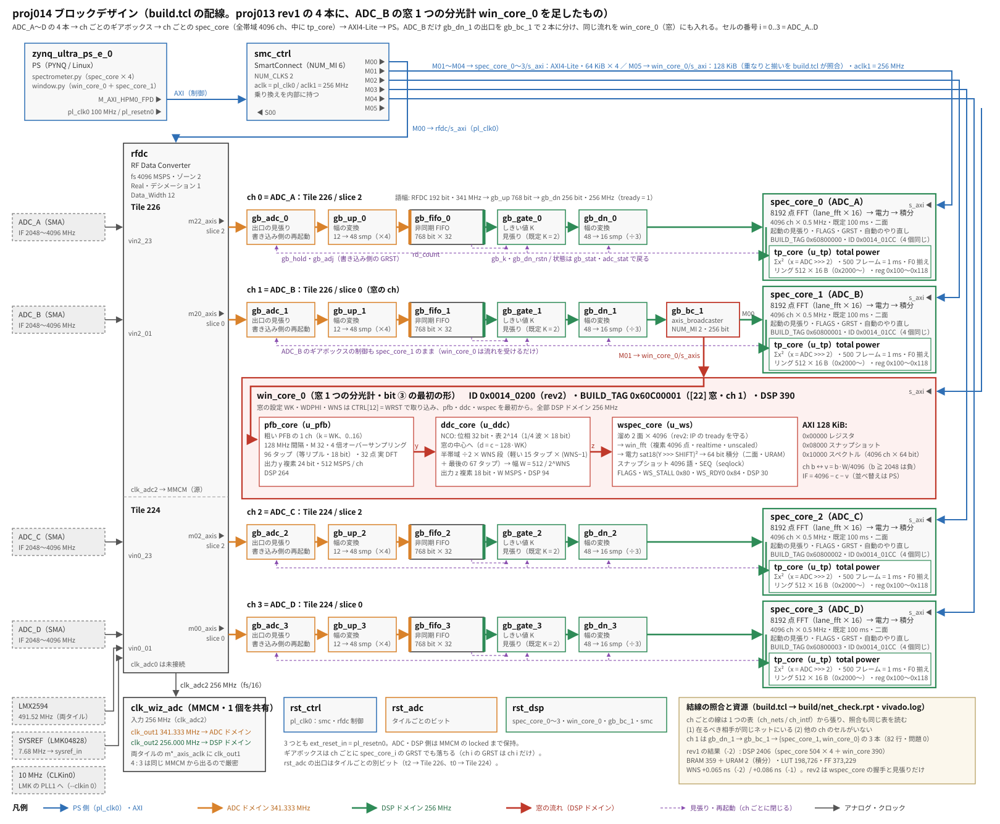

# proj014 — 狭帯域の窓（256〜8 MHz）を粗い PFB ＋ 窓ごとの DDC で切り出す（まず 1 ADC・1 窓）

日付: 2026-09-29
状態: **進行中**（rev2（wspec_core が FFT IP の tready を守る）の実機で、**W = 256 MHz の W-0・W-G・W-1・W-1b・W-6 が通過**。**次は W = 8 MHz**）

## 目的

**窓の切り出し（最終仕様の残りの本体）のうち、新しい部品がいちばん多い狭帯域の系統（bit ③）を、ADC 1 本・窓 1 つで端から端まで通す。**

- 粗い PFB（ADC ごとに共有）→ 窓ごとの NCO ＋ 半帯域フィルタの縦続 → 複素 4096 点 FFT → 電力 → 積分
- 幅は半帯域の段数をレジスタで選んで、**1 本の bit で 256・128・64・32・16・8 MHz の 6 通り**を切り替える
- 先に numpy の模型と survey で資源を実測に変え、**256 MHz 窓を ③ に置けるか**（置けなければ ② へ移すか 3 本目）を決める
- 4 ADC × 4 窓への拡張は次の proj へ送る

土台は proj013 rev1（全帯域 4 IF ＋ total power）。ギアボックス・RFDC・結線の照合・PS 側の道具を引き継ぐ。
RTL を書く段（手順 3）で `git ls-files proj013` の追跡ファイルを複製する。

## ブロックデザイン



（`docs/block_design.svg` は `docs/block_design.py` で描いた。proj013 rev1 の 4 本はそのままで、ADC_B の gb_dn_1 の出口を gb_bc_1 で分けて win_core_0 に入れ、smc_ctrl の M05 で読む。build.tcl の配線を変えたらこちらも直す）

窓の 3 段（pfb_core・ddc_core・wspec_core）の振る舞いのまとめ: [docs/win_chain.html](docs/win_chain.html)（式・振る舞いの約束・WNS ごとの幅と速さ・FLAGS・語長・確かめ方）

## 最終仕様（窓のモード。2026-09-29 に決定）

| 幅 | 窓の数 / ADC | 分光点数 | ch 幅 | 系統 |
|---|---|---|---|---|
| 2048 MHz（全帯域）| 1 | 4096 | 500 kHz | ① 既存（proj012/013）|
| 1024 MHz | 1 | 4096 | 250 kHz | ② 広帯域 |
| 512 MHz | 2 | 4096 | 125 kHz | ② 広帯域 |
| 256 MHz | ≧ 4 | 4096 | 62.5 kHz | ③ 狭帯域（survey で ② へ移す可能性あり）|
| 128 MHz | ≧ 4 | 4096 | 31.25 kHz | ③ |
| 64 MHz | ≧ 4 | 4096 | 15.625 kHz | ③ |
| 32 MHz | ≧ 4 | 4096 | 7.8125 kHz | ③ |
| 16 MHz | ≧ 4 | 4096 | 3.90625 kHz | ③ |
| 8 MHz | ≧ 4 | 4096 | 1.953125 kHz | ③ |

- 幅は 4096 MHz の 2 のべき乗分の 1（要求の 2 GHz・1 GHz・500 MHz … 7.8125 MHz を、4096 MHz を等分割した値に丸めてよいことを確認済み）
- **各窓の両端 5 % は遷移帯として使わない**（使える帯域は中央の 90 %）
- 窓のモードは 1 観測（≒ 1 時間）のあいだ変えない。観測開始時に設定し、数秒のリードタイムは許される → **bit ファイルを複数持ち、Overlay で切り替えてよい**。ただし本数は少なく保つ

## 着手の前に決めたこと（2026-09-29）

| | 案 | 読み |
|---|---|---|
| **bit の分け方** | **① 全帯域（既存）／② 広帯域 1 GHz・512 MHz（FFT を大きくして ch を選ぶ）／③ 狭帯域 256〜8 MHz（粗い PFB ＋ DDC）** ← 決定 | モードは bit の中のレジスタで切り替える。①は②の FFT 長の実行時切り替え（8192 点）に吸収できる可能性がある。②と③は Overlay で切り替えるので、**それぞれ FPGA をまるごと使える**（全帯域の分光計と資源を分け合わない） |
| ②の方式 | **全帯域の FFT を 16384 / 32768 点に伸ばし、4096 ch × 窓の数だけ積分** ← 方針 | フィルタが要らず位置の制約も無い。spec_core との差分が最小。レーン FFT の長さは FFT IP の実行時の長さ切り替えで。メモリ（BRAM）が律速の見当 |
| ③の方式 | **粗い PFB（ch 間隔 128 MHz・4 倍のオーバーサンプリング、各 ch 512 MSPS）→ 窓ごとの NCO → 半帯域 ÷2 の縦続 → 複素 4096 点 FFT** ← 方針 | 4 倍にすると幅 256 MHz 以下の窓はどこに置いても粗い ch 1 本の平らな帯域に収まる（境目をまたがない）。見送った案: 窓ごとの直接の DDC（16 サンプル / クロックの間引きフィルタが窓ごとに要り、1 窓 ≒ 300 DSP 以上） |
| 出力レートと遷移帯 | **窓の出力を複素 W MSPS、最終段を半帯域（遷移 0.45W〜0.55W）** ← 決定 | 折り返しがちょうど両端 5 % に落ちる。60 dB で ≒ 70 タップ、係数の半分が 0 で対称なので乗算は十数個 |
| **窓の中心周波数** | **ハードは「帯域の中なら任意」**（中心 ∈ [2048 + W/2, 4096 − W/2] MHz、NCO 32 bit = 0.95 Hz 刻み）。窓どうしの重なり可・ADC ごとに独立 ← 決定 | 位置の制約で削れるのは粗い PFB の分だけで、全体の 1〜2 割（見積もり）。任意のままにする |
| 中心の格子 | **PS 側の既定を ch の格子（W/4096 刻み）に乗せる。ハードでは強制しない** ← 決定 | 格子上なら NCO が誤差なく表せ（fs = 2¹² MHz）、窓どうし・観測どうしで ch が揃う |
| k·fs/8 の線 | **2560・3072・3584 MHz を含む窓は PS 側で警告する（禁止しない）** ← 決定 | 8 並列インタリーブのオフセットの線（proj013 で DC・k·fs/8 に見えた）。運用のレベルでは小さいが、狭い窓では 1 ch に集まって目立つ |
| 位置の制約の予備 | 256 MHz 窓だけ粗い ch の境目の近くに禁止帯（オーバーサンプリング 4 → 3 倍）| **survey で資源が足りないときだけ使う**。見送った案: 位置を W/2 の格子に固定（NCO が要らない。線を窓の中央に置けない）／1 ADC の窓を 512 MHz の帯域に集める（共有の DDC が要り、軽くならない） |
| 速度グレード | **`-1` で閉じることを合否の条件にする**（proj013 と同じ） | |
| **語長と NCO** | **u・y・v・半帯域 24 bit（小数 12 / 8 / 8 / 8）、FFT の入力 18 bit・小数 G = 4（レジスタで変えられる形）、NCO の位相 32 bit・表の番地 P = 14・値 18 bit** ← 決定（手順 1 の固定小数点の模型から） | 固定小数点の誤差は −47 dBFS の雑音で 8 MHz 窓でも 5.3e-4（感度の損 0.05 %）、NCO の線は ≦ −74.3 dBc、−10 dBFS の雑音と −1 dBFS の CW で飽和 0。詳細は「結果」 |
| **フィルタの要求** | **中央 90 % の平坦さ ≦ 0.1 dB p-p、主の経路以外（窓の外・折り返し・鏡像）≦ −60 dB、係数 18 bit** ← 決定（2026-09-29）。既存の分光計 XFFTS の ch あたりの応答も −60 dB 程度で、別の望遠鏡でよく使われていて問題が出ていない（西村）。以下はそのときの読み: | ADC 自身のインタリーブのイメージが −53〜−66 dBc（proj009・010）なので、フィルタをそれより深くしても効かない。平坦さはホットロードで較正する前提で緩めでよい。**深さを 50 → 70 dB に振っても窓 1 つ 60 → 72 DSP、PFB は T 3 → 4 で頭打ち**（`make model-sweep`）なので、要るなら 70 dB にしても安い |

## 資源の見当（予言。numpy の模型と survey で置き換える）

bit ③（4 ADC × 4 窓、256 MHz 窓で規模が決まる）。**自作部分は手順 1 の設計の値**（`make model` の「資源の見当」）、FFT IP は手順 2 で置き換える:

| | DSP | 根拠 |
|---|---|---|
| 粗い PFB の FIR | **192 / ADC**（模型） | 原型 N = 96（32 分岐 × 3 タップ、等リプル）× 2 フレーム / クロック。**前置加算は使えない**（対称の相手 h[N−1−n] は別の分岐 31 − r の和に入る）。初版の見当 128 は前置加算を数えた誤り |
| 粗い PFB の 16 点 複素 DFT | **64 / ADC**（模型） | 32 点の実 DFT を 16 点の複素 DFT で。自明でないひねり係数 8 個 × cmul 4 × 2 フレーム / クロック（proj013 の dft16 は自明な係数も cmul に通していた） |
| 窓 1 つ（FFT を除く） | **64**（模型） | final 34（L = 17、複素・対称・1 出力 / クロック）＋ light 16（L = 4、段を重ねて ≒ 2 倍）＋ NCO 6 ＋ 選んだ ch の実数化 8（cmul 1 × 2 フレーム） |
| 窓 1 つの FFT | **30**（survey の実測） | 複素 4096 点・入力 18 bit・realtime・res/lut。LUT 4.0k・FF 7.7k・BRAM 15 / 個 |
| 窓 1 つの NCO の表 | BRAM36 × 4 | 1/4 波 4096 語 × 18 bit・2 口の ROM × 2（2 サンプル / クロック × T[r] と T[q−1−r]）。P 12 なら 1/16 |
| 合計 | **≒ 2530（≒ 59 %）**（tp_core を残すなら ＋ 96） | (192 + 64) × 4 ＋ (64 + 30) × 16。初版の Kaiser の設計のまま前置加算の誤りを直すと ≒ 2950（69 %）だった |
| 積分器 | URAM ≒ 32〜64 | 16 窓 × 4096 × 2 面 × 64 bit = 8 Mbit |

- 64 MHz 以下の幅では、窓 4 つで FFT 1 個を時分割で共有できる（窓の数 ≧ 4 の要求に 8 / ADC の余地）
- **proj013 の教訓**: DSP の出口どうしの加算にレジスタを付けると、合成はそれも DSP に載せる。加算木の最初の段は DSP 側に数える
- `-1` の予言は ±0.2 ns の幅で書く（proj012 rev3 → proj013 rev1 で +0.100 ns 動いた）

### survey の結果と、決めたこと（2026-09-29）

`make survey`（Vivado サーバ、OOC 合成後）:

| 名前 | 点数 | 入力 | 実行時の長さ切り替え | DSP | LUT | FF | BRAM |
|---|---|---|---|---|---|---|---|
| 物差し（proj011〜013 の lane_fft） | 512 | 14 | なし | **21** | 2,336 | 4,715 | 3 |
| ③ 窓の FFT res/lut | 4096 | 18 | なし | **30** | 4,023 | 7,691 | 15 |
| ③ 窓の FFT res/dsp | 4096 | 18 | なし | 64 | 2,993 | 7,112 | 15 |
| ③ 窓の FFT perf/dsp | 4096 | 18 | なし | 74 | 2,502 | 5,936 | 15 |
| ② レーン FFT | 2048 | 14 | なし | **27** | 3,060 | 6,134 | 7.5 |
| ② レーン FFT | 2048 | 14 | **あり** | **27** | 3,773 | 7,186 | 7.5 |

- **物差しが本番の 21 / 個と一致**したので、この表を予言に使える
- **窓の FFT の予言 ≒ 30 は当たり**（res/lut で 30）。バタフライを DSP にすると +34（LUT −1k）で、窓 16 個では DSP が +544 になるので res/lut を使う
- **決定: 256 MHz 窓は ③ に置く。**③ は 4 ADC × 4 窓（256 MHz）で DSP ≒ 2450（57 %）、BRAM は FFT 15 × 16 = 240 ＋ NCO 32〜64。② へ移す理由がない
- **決定: ② はレーン FFT の実行時の長さ切り替え（512〜2048）で、全帯域（8192 点）・1 GHz（16384 点）・512 MHz（32768 点）の 3 モードを持ち、① を吸収する → bit は ②・③ の 2 本。**
  切り替えの代償は DSP 0・LUT +713 / 個（64 個で +46k、≒ 11 %）。1 GHz と 512 MHz を 1 本に入れるのにどのみち切り替えが要るので、全帯域の分は追加の代償なし。
  ② の見当: DSP ≒ 27 × 64 ＋ 自作 144 × 4（proj012）＋ tp_core 96 ≒ 2400（56 %）、BRAM は FFT だけで 7.5 × 64 = 480（proj012 は 3 × 64 = 192）。
  ひねり係数・16 点 DFT・ch の選択・積分（ch が 2 倍）も長さ切り替えに合わせる。**① は ② が実機で proj012/013 の判定を通るまで残す**
  - 見送った案: 1 GHz を 32768 点の隣り合う 2 ch の電力の和で作る（切り替えが要らないが、ch の応答の形が 16384 点と違う）

### ビルドの予言（proj014 rev1 = proj013 rev1 ＋ win_core × 1、2026-09-30。測る前に書く）

| | proj013 rev1 | 予言 | 根拠 |
|---|---|---|---|
| DSP48E2 | 2016 | **≒ 2400（+ 360〜420）** | win_core: pfb 264（分岐の和 192・dft16f 64・実数化 8）＋ ddc 94 ＋ FFT 30 ＝ 388 |
| BRAM | 324 | **≒ 370〜380（+ 47〜55）** | 溜め 8・スナップショット 8・積分 16・FFT 15・NCO 4 |
| LUT | 180,396 | **+ 15k〜30k** | FFT 4.0k（survey）、pfb の窓（112 × 14 bit のレジスタと mux）・加算、hb2 の和 |
| FF | 348,665 | **+ 25k〜45k** | pfb の窓と積の段、hb2 × 6 の履歴、wspec の段 |
| CDC | CDC-3 78・CDC-6 8・CDC-15 3137・Critical 0 | **同じ** | win_core は DSP ドメインの内側だけ |
| 結線の照合 | 80 行・問題 0 | **行が増え、問題 0** | ch 1 の行に gb_bc_1 の 3 本 |
| WNS `-2` / `-1` | +0.205 / +0.170 | **−0.03〜+0.37 / 閉じない恐れあり** | proj013 の教訓（±0.2 ns で書く）。**負なら `make worst-paths` で、proj013 の群（A〜E）か win_core の中（pfb の分岐の和・hb2・wspec）かを分ける** |

### ビルドの結果（2026-09-30、Vivado サーバ）

| | 予言 | 結果 | |
|---|---|---|---|
| WNS / WHS `-2` | −0.03〜+0.37 | **+0.065 / +0.006 ns** | 範囲の中（proj013 rev1 の +0.205 から下がった） |
| WNS / WHS `-1` | 閉じない恐れ | **+0.086 / +0.010 ns で閉じた** | `-1` のほうが `-2` より余裕がある（配置のばらつき。proj012 でも起きた） |
| `-1` の最悪経路（slack < 0.30 ns の上位 200 本、全部配線型、照合の問題 0 件） | proj013 の群（A〜E）か win_core か | **最悪は群 C（gb_fifo_1 の書き込みアドレス FO 887、+0.086）**。次いで spec_core_1 の lane_fft[7] の sclr（+0.103、FO 114）、群 A（ひねり係数 → DFT の DSP、+0.144） | **win_core は pfb +0.186・ddc +0.239・wspec +0.257 で、最悪ではない** |

- 最悪の群 C が gb_fifo_0（proj012・013）から **gb_fifo_1（ADC_B = win_core に分けた ch）に移った**。gb_bc_1 と win_core_0 がその近くに載って配置が混んだと読む（未確認）。構造（FO 887・1 段）は proj012 と同じ
- 資源・CDC・結線の照合（`-2` の build/vivado.log、2026-09-30）:

| | 予言 | 結果 | |
|---|---|---|---|
| DSP48E2 | ≒ 2400（+ 360〜420） | **2406（+ 390）**。spec_core は 4 個とも 504 のまま | 当たり。win_core 390 は見当 388（pfb 264 ＋ ddc 94 ＋ FFT 30）とほぼ同じ |
| BRAM | 370〜380（+ 47〜55） | **359（+ 35）＋ URAM 2** | **外れ（少なく出た）**: 積分の二面（4096 × 64 bit × 2）が合成で URAM 2 個に載った。残りの +35 は溜め 8・スナップショット 8・FFT 15・NCO 4 の和そのもの |
| CDC | CDC-3 78・CDC-6 8・CDC-15 3137・Critical 0（同じ） | **CDC-3 92**・CDC-6 8・CDC-15 3137・Critical 0 | **CDC-3 が +14 で外れ**。92 のうち 72 が smc_ctrl（SmartConnect）の中で、**proj013 rev1 の smc_ctrl は 58 → +14 がちょうど SmartConnect の分と確かめた**（M を 1 本足すと PS → DSP の乗り換えの同期段が増える）。win_core の中の CDC は 0 のまま。**予言は win_core の中だけを見ていて、つなぎ側を数えていなかった** |
| 結線の照合 | 行が増え、問題 0 | **82 行（80 → 82）・問題 0・陽性対照 OK** | 当たり（ch 1 の gb_dn → spec_core の 1 本が gb_bc 経由の 3 本になって +2） |
| CRITICAL WARNING・asynchronous | なし・7 | なし・7 | 当たり |
| LUT | +15k〜30k | **198,726（46.7 %）= +18,330** | 当たり |
| FF | +25k〜45k | **373,229（43.9 %）= +24,564** | **わずかに外れ（下限の 25k を 0.4k 下回った）**。proj013 と同じく、積の段のレジスタの一部が DSP の中に吸われたと読む |
| （道具） | | vivado.log に全体の LUT・FF が出ていなかった（上の表は BRAM・DSP だけ） | build.tcl が utilization.rpt から全体の LUT・FF・URAM と win_core の DSP の内訳を出すように直した（次のビルドから） |

- `make sim-all`（Vivado サーバ）: spec_core の 8 本（proj013 の 7 変種 ＋ gb）と窓の 7 本（pfb・ddc・win・wspec 3 変種・陽性対照 3 本）が全部「結果: 全部通過」。sim-top は sim-all に入れていない（30 分級。クラウドの作業環境で通過）

### 実機 1 回目（2026-09-30、出荷時のクロック源、入力の構成は未記録）

- **`spectrometer.py --probe`: 4 本とも判定 0 が通過**（proj013 の回帰。ID 0x0014_0107・起動の途切れ 0・FLAGS 00・読み出し 4 本 8.4 ms）
- **`window.py --if 3000 --w 256 --probe`: W-0 が NG**。ID 0x0014_0100・BUILD 0x60C00001（窓・ch 1）・z が流れる・飽和 0・ダンプ 3 個 × 6250 フレームは OK。
  **FLAGS = 0x4（FLAGS[2] = FFT IP の TLAST 事象）** が 3 ダンプとも立っていた（粘着）
  - window.py は RUN の前に FLAGS を消すので、**立ったのは WRST から 50 ms 後の RUN より後**（起動の瞬間だけのものではない）
  - FLAGS[3]（IP の入力の途切れ）・[4]（IP が入力を受けない）・[1]（溜めの読み出しの遅れ）・[0]（XK_INDEX の飛び）は 0。
    **sim の FFT のモデルは TLAST を数えるだけで、IP の振る舞い（realtime の起動・設定の口）はモデルしていない**ので、sim では出ない種類
  - 見立て（未検証）: proj011 の realtime の IP で見た「IP の TLAST の検査の数えだけがずれて、データの枠は正しい」と同じ型。
    ずれの元の候補は、設定の口（s_axis_config_tvalid を常に 1 にしている。spec_core は起動の後に開ける gate_c）か、リセット直後の IP の準備の間に溜めが最初の面を流し始めたこと
  - **切り分けの道具を window.py に足した**: (1) WRST の後 50 ms と、消してから 0.2 s の FLAGS を分けて出す（起動だけか、動いているあいだずっとか）
    (2) **`--golden`（判定 W-G）**: N_ACC = 1 のダンプを、同じフレームのスナップショットを numpy で FFT した電力と ch ごとに比べる。
    **データの枠が 1 サンプルでもずれていれば 4096 ch の大半で合わない**（sim の wspec のダンプで確かめた: ずれ 0 → 0 ch、±1 → 3743・3890 ch、64 → 4010 ch。
    ただし**巡回のずれは電力では見えない**ので、比べるのはスナップショットの z そのもの＝溜めの面と、IP が変換したフレーム）
- **SG の自動操作 `pynq/sg.py`**（新規）: LAN の SCPI（raw socket、5025 番、標準の socket だけ）。設定は読み返して一致を確かめ、*IDN?・周波数・レベル・ON/OFF をログと npz に残す。
  終わったら出力の状態を戻す。**宛先はリポジトリに書かない**（--sg HOST[:PORT] か環境変数 RFSOC_SG）。window.py の --tone に --sg・--sg-dbm で連動

### 実機 2 回目（2026-09-30、出荷時のクロック源）: W-G が NG → 原因は wspec_core が FFT IP の tready を見ていなかったこと（rev2 で直す）

入力の構成（雑音 ＋ SG）:

| 経路 | 構成 |
|---|---|
| SG | E8257D → ケーブル 70 cm → 分配器 A |
| 雑音 | 終端 → AMP → 3 dB → AMP → 3 dB → BPF → 分配器 A |
| 分配 | A → 3 dB → 分配器 B → C・D。C → 20 cm → ADC_B・ADC_D / D → 20 cm → ADC_A・ADC_C |

- `window.py --if 3000 --w 256 --golden --shift 7`（雑音だけ）: **W-G が NG**。4096 ch のうち 2692 ch が許容（4.0）を超えた（最悪 ch 2087: 差 10.8 / 振幅 35）。
  **データの枠が本当にずれている**（rev1 の見立て「TLAST の数えだけがずれる」ではない）
  - FLAGS: WRST の後 50 ms = **0x14**（[2] IP の TLAST 事象 / [4] IP が入力を受けない）/ 消してから 0.2 s = **0x4**
  - 読み: WRST の直後に IP の s_axis_data_tready が 0 の間、rev1 の wspec_core はそれを見ずに流した → IP が受けなかった語のぶん
    **IP の中のフレームの枠が溜めの枠からずれ**、realtime で途切れなく回るのでずれたまま（TLAST 事象がフレームごとに立ち続ける）。
    sim の FFT のモデルは tready = 1 に固定していたので sim では出なかった
  - **sim で同じ形を再現した**: FFT のモデルに tready を足し（解除から RDLY クロック 0・周期的に STALL クロック 0）、rev1 の振る舞い（-DWSPEC_NOREADY）に
    RDLY = 6000（最初の面が溜まっても IP が受けない）を与えると、**FLAGS = 0x14 で B（FFT の枠 = z の枠）が落ちる** — 実機 1・2 回目の FLAGS と同じ
- `window.py --if 3000 --w 256 --tone 3010.5 --sg-dbm -30 --shift 9 --shift-full 6 --w6`: sg.py が **`+512,"Reference unlocked;…"`** で止まった
  （SG の基準のロック外れ。溜まっていたエラーか、外部基準の抜き差し）。**W-1 の ch 単位の位置は、SG と RFSoC の基準が同じ 10 MHz に載っていないと
  1 ppm（3 GHz で 3 kHz = 8 MHz 窓の 1.5 ch）ずれうる**。W-6（電力の比）には効かない

直したこと（proj014 rev2、ID 0x0014_0200）:

- **wspec_core が FFT IP の tready を守る**: 出口のレジスタ（fd・f_v・f_last）を「空いている か IP が受けた」ときだけ進める。待たされても 1 語も落とさず、
  IP の枠 = 溜めの枠が保たれる。遅れて読み終わる面の次の面は pend で予約して遅れて始め、書き込みが未読の番地に追いついたときだけ FLAGS[1]。
  FLAGS[4] は「待たされた（データは保った）」の意味に変わる。**見張り: 0x80 WS_STALL（待たされたクロック数）/ 0x84 WS_RDY0（WRST の解除から tready が 1 になるまで）**
- sim: FFT のモデルが tready を下げる（+FFT_RDLY・+FFT_STALL）。sim-wspec の変種に g0r（RDLY 6000、途切れなし）・g3s（STALL 40、GAP 3）を足した。
  **陽性対照 `make sim-wspec-r`（-DWSPEC_NOREADY = rev1）: 2 変種とも B が落ちる**（sim-win-all に入れた）
- sg.py: つないだときに溜まっていたエラーを読んでログに残してから *CLS。基準の状態（:ROSC:SOUR?）をログと npz に。**Reference unlocked の類は止めずに警告**
  - 追記: +512 Reference unlocked は前の操作の溜まり（2 回目には出なかった）。代わりに **`--sg-dbm -30` が -20 dBm に丸められて止まった**:
    この E8257D はステップ減衰器が無く下限が -20 dBm 前後。sg.py はつないだときに `:POW? MIN` / `MAX` を読み、範囲外は送る前に止める。
    -30 dBm 以下が要るときは SG の出口に固定減衰器を入れ、その値を入力の構成に書く
- window.py: rev2 の ID を期待（rev1 の .bit なら止める）。WS_RDY0・WS_STALL を出す

rev1 での W-1・W-6 の下見（`--allow-rev1`、SG -20 dBm・EXT 基準、ボードは出荷時のクロック源、SHIFT 11 / 8）:

- 1 回目は RFSOC_SG の設定忘れで SG が出ず、W-1 は IF 3072 MHz の k·fs/8 の線を拾った（window.py はこの場合に「SG を操作しない」と出すようにした）
- 2 回目: **W-1 は予言 ch 3928 に対し実測 3927（1 ch = 62.5 kHz の差）、W-6 は −0.783 dB**。飽和 0
- 見立て: **SG（EXT 基準）とボード（出荷時のクロック源）の周波数の基準のずれ**。トーンが ch の中心から δ ≈ 0.23 ch 外れると、
  窓（矩形窓の 4096 点 FFT）の山の ch は sinc²(0.23) = −0.769 dB 目減りし、W-6 の −0.783 dB とほぼ一致する
  （全帯域は ch が 8 倍広いので目減りは −0.01 dB）。山が隣の ch に移るのも同じずれで説明できる（IF で約 +48 kHz ≈ +16 ppm の見当）
- window.py に足した: 山の隣の ch から端数 δ を出して推定 IF と SG との差（kHz・ppm）を出す。**W-1b: 窓と全帯域の推定 IF の差**
  （同じ ADC のクロックで測るので基準のずれは打ち消す）。**W-6 は山の ch の目減り sinc²(δ) を戻して判定**（そのままの値も出す）
- 予言: rev2 でも同じ構成なら W-1 は 1 ch ずれたまま・W-1b は ±10 kHz 以内・目減りを戻した W-6 は ±0.1 dB 以内。
  ボードを SG と同じ 10 MHz（`--clkin`・`--ref 10`）に載せれば W-1 も通る
- 3 回目（**ボードを SG と同じ 10 MHz に載せた**: `--clkin 0 --ref 10`、CLKin0 → PLL1 80 kHz 比較）: **W-1 通過（予言 ch 3928 = 実測 3928）・
  W-6 通過（比 0.9974、予言 1 → −0.011 dB）**・飽和 0。見立て（基準のずれ）どおり。ボードの window.py は端数の推定・W-1b を足す前の版だった。
  W-0 の FLAGS（0x4）は rev1 の枠のずれで NG のまま → rev2 で W-0・W-G を確かめる

予言（rev2 の実機。測る前に書く）: `--golden` で **W-G 通過**・消してから 0.2 s の FLAGS = 0。WRST の後 50 ms は [4] が立ちうる（待たされただけ）。
WS_RDY0 は 4096 より大きい（rev1 で最初の面を流し始めた時点でまだ 0 だった）。資源・タイミングは rev1 とほぼ同じ（LUT が数十増える程度）

### 実機 3 回目（2026-09-30、rev2 = ID 0x0014_0200、ボードは SG と同じ 10 MHz: `--clkin 0 --ref 10`）: W = 256 MHz で W-0・W-G・W-1・W-1b・W-6 が通過

| 判定 | 予言 | 結果 |
|---|---|---|
| W-0 FLAGS（消してから 0.2 s） | 0 | **0**（WRST の後 50 ms は 0x10 = 待たされただけ） |
| W-G（`--golden --shift 7`、雑音） | 通過 | **通過**: 4096 ch で許容 2.0 を超えた ch 0（最悪 ch 1047: 差 1.4 / 振幅 20） |
| WS_RDY0（WRST の解除から tready が 1 まで） | **4096 より大きい** | **0 クロック**（**外れ**）。WS_STALL（待たされた）= **1 クロック** |
| W-1（SG 3010.5 MHz・−20 dBm、SHIFT 11 / 8） | ch 3928 | **ch 3928**（2 回とも） |
| W-1b（窓と全帯域の推定 IF の差） | ±10 kHz 以内 | **+2.23 / +2.22 kHz** |
| W-6（窓 / 全帯域の電力の比） | ±0.1 dB | **−0.011 / −0.005 dB**（目減りを戻す前後でほぼ同じ。トーンが ch の中心にあるので） |

- **WS_RDY0 の予言の外れ**: tready は解除の時点ですでに 1 で、**待たされたのは 1 クロックだけ**だった（起動のどこかで 1 回だけ下がる）。
  rev1 の枠のずれは「長く 0 だった」のではなく**この 1 クロックに流した 1 語を IP が受けなかった**ことで説明がつく（ずれは 1 語で足りる: sim で ±1 → 3743・3890 ch が不一致）。
  予言の根拠（最初の面を流し始めた時点で tready = 0 が続いていた）は、FLAGS[4] が立つことしか見ておらず、長さを見ていなかった
- 推定 IF の差（窓 −0.17 kHz・全帯域 −2.40 kHz）は、**トーンが ch の中心にあるときの端数の推定の床**: 隣の ch は漏れではなく雑音（山から −51 dB ≈ 振幅比 0.003）なので、
  δ ≈ 0.003 ch（窓で 0.2 kHz）/ 0.005 ch（全帯域の 0.5 MHz ch で 2.4 kHz）より細かくは読めない。W-1b の +2.2 kHz はこの床で、窓の周波数軸のずれではない
- W-6 の比（0.9976・0.9989）は 2 回で 0.006 dB の中で揃った

### 実機 4 回目（2026-09-30、rev2、W = 8 MHz・IF 3010 MHz: WK 8・d = +62 MHz・WNS 6）: W-G・W-1・W-1b・W-6 が通過、W-0 は FLAGS[4] だけで NG

| 判定 | 結果 |
|---|---|
| W-G（`--shift 7`、雑音） | **通過**（超えた ch 0、最悪 ch 1370: 差 1.4 / 振幅 4。雑音は ch あたり 256 MHz 窓の 1/32 なので振幅は小さい） |
| W-1（SG 3010.5 MHz・−20 dBm） | **ch 3840（予言どおり）**。窓の推定 IF と SG の差 −0.01 kHz（ch 幅 1.95 kHz） |
| W-1b | −2.40 kHz（全帯域の推定の床。256 MHz 窓のときと符号だけ逆） |
| W-6 | **+0.005 dB**（比 1.001）。SHIFT 11 / 8 は 256 MHz 窓と同じで飽和 0 |
| W-0 FLAGS | **0x10（IP に待たされた）が消した後も立つ**。それ以外は 0。WS_STALL = 489 クロック |

- 待たされた 489 クロックは、WRST から読むまで（約 0.25 s ÷ 1 フレーム 512 µs ≈ 490 フレーム）の**フレームの数とほぼ同じ** → **1 フレームに 1 クロック**。
  W = 256 MHz（面が途切れなく続く）では 1 クロックだけだったので、**途切れた後の面の頭で IP が 1 クロック待たせる**と読む（未確認）。
  rev2 は待つあいだデータを保つので値は正しい（W-G 通過が証拠）。rev1 なら 1 フレームごとに 1 語ずつ落ちていたはず
- window.py の W-0 は FLAGS[4] を判定から外し、待たされたクロック数を溜め終えたフレームの数で割って出す（次の実行で 1.0 前後なら読みどおり）

### 掃引の道具 `pynq/winsweep.py`（W-2・W-3、2026-09-30）

- SG の周波数を動かしながら、窓（win_core_0）と全帯域（spec_core_1）を同時に測る。**SG を切った基準を ch ごとに引き**、
  **全帯域で測った CW の電力で割ってアナログの傾きを消す**（全帯域の ch の端数は sinc² で戻す。W ≧ 64 MHz では CW を 0.5 MHz 格子にも揃えて戻さずに済ます）
- W-2: 窓の中の 55 点（中央 90 % に 37・両端 5 % を 0.005W 刻み）。W-2a 中央 90 % の p-p ≦ 0.15 dB / W-2b 模型との差 ≦ 0.05 dB / W-2c 両端の模型との差 ≦ 0.3 dB。
  模型は src/win_coef.vh の係数から model/win_model.py の chain_gain と同じ流れで計算する（3 通りの窓 × 50 点で chain_gain と差 0 を確かめた）
- W-3: 折り返し先 a（中央 90 % の中の 4 か所）＋ 離れ m·W（m = 1〜64、640 MHz まで）と PFB の折り返し 512·j。要求 −60 dB、検出限界は引き算の後の揺れの 5σ。
  **窓と同じ IF に全帯域でも線があれば ADC 側の線として除く**。窓の雑音の床が 4 LSB² を切ったら量子化で見えないので「判定できない」
- 検出限界の見当: −20 dBm・0.5 s では −55 dB 前後で −60 dB に届かない → **W-3 は `--w3-dbm 0 --w3-shift-full 12`**（窓の SHIFT はそのまま）
- 偽のボード（模型から作ったスペクトル＋雑音）で通した: W = 256・8 で全部通過、陽性対照（窓の外の CW に −50 dB の折り返しを足す）で W-3 が NG、
  −20 dBm のままでは W-3 が「判定できない」になる
- 模型の予言（`--dry-run`）: W = 256 の中央 90 % の p-p 0.025 dB・0.494W で −4.35 dB・折り返しの最大 −61.1 dB（ν +166 MHz）/ W = 8 は 0.019 dB・−61.4 dB

## 手順（予定）

1. **numpy の模型**: 粗い PFB（タップ数・オーバーサンプリング・平らな帯域）、半帯域の段と係数、通過帯域のリップル、両端 5 % の外への折り返しの量。窓の位置を粗い ch の境目・中央・帯域の端に振る。**模型は RTL の写しではなく仕様から書く**（後で bit 単位の照合の正にする）
2. **survey**（`make survey` の型）: 複素 4096 点 FFT（③）、2048 点のレーン FFT（②）、PFB の FIR をそれぞれ 1 個だけ合成して数え、上の表を実測値に置き換える。**256 MHz 窓の置き場所を決める**
3. **ADC 1 本・窓 1 つを端から端まで**（幅は可変のまま）: `git ls-files proj013` で複製し、窓の回路を足す。sim で模型と bit 単位で照合（陽性対照つき）
4. 実機の判定（下）を 6 通りの幅で

## 判定（案。手順 1 の後に数値を書き入れる）

| 判定 | 内容 |
|---|---|
| W-0 | ID・モードのレジスタ（幅・中心・段数）の読み返し。載っている `.bit` の ID と PS 側の照合 |
| W-1 | CW で周波数軸: 窓の中心・ch の位置・ゾーン 2 の反転を含めた対応 |
| W-2 | 両端 5 % の境目での利得の落ち方（模型との一致）と、中央 90 % の平らさ |
| W-3 | 窓の外からの折り返し: 窓の外に CW を置いて、中央 90 % に落ちる量 |
| W-4 | 粗い ch の境目に窓を置いたときに、境目の痕跡が出ないこと |
| W-5 | 雑音（増幅した雑音、−30 dBFS 程度）で積分の揺れがラジオメータ式どおり |
| W-6 | 全帯域（proj013）との照合: 同じ入力で、窓の電力を全帯域の該当 ch の和と比べる |

## やったこと

- 2026-09-29: 窓のモードの最終仕様と、bit の分け方・方式・中心周波数の扱いを決めた（上の表）
- **手順 1: 仕様の模型 `model/win_model.py`**（numpy だけ。`make model` / `make model-posctl` / `make model-sweep`）
  - 仕様（冒頭のコメント）から書いた。粗い PFB は「k 番の ch へ −k·S ずらし、原型で絞って D で間引く」の式で定義し、ポリフェーズ＋FFT はその実装として扱う（RTL の照合の正はこの式）
  - 各フィルタの要求は「守るのは |ν| ≦ 0.45W だけ」から導いた: final は通過 0.45W / 阻止 0.55W（レート 2W）、light は通過 0.1125R / 阻止 0.3875R、
    PFB は通過 64 + 115.2 = 179.2 / 阻止 512 − 179.2 = 332.8 MHz。**18 bit に丸めた後で**要求を満たす最小の長さを探す。
    初版は Kaiser 窓の sinc、**2 版から等リプル（Lawson の反復重み付き最小二乗、numpy だけ。scipy の remez と同じ解になることを突き合わせた）**。`--method kaiser` で初版を再現できる
  - 検証は 2 層: **層 1（解析）** 入力の周波数（両側 ±2048 MHz、5 kHz 刻み）ごとに、各段の利得と間引きの折り返しの行き先を整数で追い、
    出力のどの ν にどの利得で落ちるかを全部数える。窓の置き場所は幅ごとに 83〜89 か所（粗い ch の中央・境目・境目 − 5 kHz・帯域の両端・ch の格子上の乱数 40）。
    **層 2（時間領域）** 浮動小数点で連鎖をそのまま回し、CW で層 1 の予言（ch の位置・主の利得・鏡像の電力・最悪の折り返しの量）と比べる
  - 陽性対照 4 通り（`--posctl`）: pfb-short（原型 1 タップ / 分岐）・hb-short（final を半分の長さ）・nco-sign（NCO の符号を逆に）・ppfb（PFB の位相 exp(−j2πkp/M) を落とす）。
    **4 通りとも落ちた**（前 2 つは層 1 と層 2 の折り返しで、後ろ 2 つは層 2 の ch の位置と利得で）
  - 層 2 の「主以外の電力」の許容に、倍精度の連鎖の床 1e-14（主の −134 dB）を足した。1 回目は W = 64 で予言 −155 dB の鏡像に対して 1.11 倍と出て落ちた（床の 1e-17 級）
  - 初版は Kaiser の β を 4 通りしか振らず、要求の深さ 50 dB のほうが 60 dB より light が長くなる逆転が出た（light は平坦さの予算 0.005 dB が律速で、β を深くしないと通らない）→ β を 0〜24 dB 上乗せまで振るようにした
- **手順 2 の準備: `tools/ip_survey.tcl`（`make survey`）**。FFT IP 6 通りを OOC で数える: 物差し（proj011〜013 の lane_fft、本番 21 DSP / 個）・
  ③の窓の複素 4096 点 × 3 通り（res/lut・res/dsp・perf/dsp、入力 18 bit）・②のレーン 2048 点（固定長 / 実行時の長さ切り替え）
- **固定小数点の模型 `model/win_fixed.py`**（`make fixed` / `make fixed-posctl`）。同じ連鎖を段の境目で丸めて回し、同じ入力の浮動小数点と比べる。
  PFB はポリフェーズ（分岐の和 u_r → 32 点の DFT の 1 ch → (−j)^(km)）の形で書いた（仕様の式の定数の位相 exp(−j2πk(N−1)/M) を落とした形。電力に効かない）。
  初版は 32 点の DFT の中の丸めを 1 回の丸めで代表させていた。**2 版で RTL の形そのものに置き換えた**: z[n] = u[2n] + j·u[2n+1] → 16 点 複素 DFT
  （proj013 の dft16 と同じ 4 × 4 の分解・同じ cmul の丸め（2^16 = 1.0、+2^15 して 16 bit 右）、出力は 16 本とも）→ 選んだ ch k だけ
  A = Z[k] + conj(Z[16−k])、B = Z[k] − conj(Z[16−k])、2·X = A + (−j·W32^k)·B → 共役（仕様の exp(+j…)）。
  cmul の入口を DSP の A ポート 27 bit に収めるため u を 22 bit（Q10）にした（Z 26・A と B 27 bit。整数部は Σ|h|·8192 から）。
  単体で 17 ch とも浮動小数点の DFT と相対 2e-5（ひねり係数の 18 bit）で一致、結果（下の表）は初版と変わらない
  - 判定: N1 −47 dBFS の雑音で誤差 ≦ 1e-3 / N2 −10 dBFS の雑音で飽和 0・誤差 ≦ 1e-3 / C1 −1 dBFS の CW で飽和 0・固定小数点の線 ≦ −70 dBc。
    6 通りの幅 × 窓の置き場所 3 か所（粗い ch の境目・ch の格子の上の乱数・格子に乗らない乱数）
  - 初版（NCO の番地 P = 12）は C1 が格子に乗らない中心で 6 通りとも −62.3 dBc で落ちた。位相の切り捨ての線で、P を振ると ≒ −6.0·P + 10 dBc → **P = 14**
  - FFT の入力の小数 G を振った: 3 は N1 が 2.1e-3 で NG、6 は −1 dBFS の CW が飽和（18 万回）→ **G = 4**（N1 に 2 倍、CW に 7 dB の余裕）
  - 陽性対照: G = 0 で N1 が 18 件とも落ちた。飽和の見張りは G = 6 の振りで立つことを確かめた
- **手順 3（RTL）の 1 つ目: `src/pfb_core.v`（粗い PFB の 1 ch）と単体の sim（`make sim-pfb`）**。proj013 の複製の前に、単体で作って照合した
  - 構成: 7 ビートの窓 → 分岐の和（2 フレーム × 32 分岐 × 3 タップ、積 → t0 + t1 → + t2 → 丸め Q10・飽和 22 bit）→ `dft16f` × 2 →
    選んだ ch k の実数化（A・B → cmul 1 個）→ (−j)^(k·m) → 丸め Q8・飽和 24 bit。レイテンシ 18 クロック。1 ビートに 2 フレーム（m = 2q − 11、2q − 10）
  - `src/dft16f.v`: proj013 の dft16 と同じ分解で出力 16 本とも。**自明な係数（1・−j）は cmul を通さず遅延線**（cmul に通した値と bit 単位で同じ）→ cmul 8 個（DSP 32）
  - 係数は `tools/gen_coef.py`（`make coef`）で `src/win_coef.vh` に生成してリポジトリに入れる（proj013 の tw_rom.v と同じ扱い）。
    **Mac（numpy 2.2.6）とクラウドの作業環境（numpy 2.4.4）で生成物が 1 byte も違わない**ことを確かめた（等リプルの反復は LAPACK に依るが、18 bit に丸めた後は同じ）
  - 照合: 雑音 ＋ CW 2 本 ＋ 満杯の区間（±8191 を 100 サンプル）、ADC の低位 2 bit は乱数。k = 0, 1, 4, 5, 8, 13, 15, 16 × 入力の途切れ あり / なし（valid を 1/8 で落とす）。
    **16 通りとも 2037 フレームが 1 LSB も違わない**。陽性対照（`SIM_PFB_POSCTL=1`、分岐の和の丸めを切り捨てに）は 16 通りとも一致しなかった（1 LSB の差）
  - 初版の誤り: X（28 bit）を受ける線を y の幅（24 bit）で宣言していて、満杯の区間の 2 フレームだけ虚部が 2^24 巻き戻った。**満杯の区間を入力に入れていなければ見えなかった**
- **手順 3 の 2 つ目: `src/ddc_core.v`（NCO → 半帯域 × NS → FFT の入力 z）と単体の sim（`make sim-ddc`）、つないだ sim（`make sim-win`）**（2026-09-30）
  - pfb_core の（y0 = 奇 m, y1 = 偶 m）を（このビートの y1, 次のビートの y0）の組にまとめ直し、組ごとに NCO（θe = 2nΔ、θo = θe + Δ）→ 混合 → 丸め Q8
  - 半帯域は `src/hb2.v`（（偶, 奇）の組で受けて 1 サンプル出す。前置加算で乗算 L + 1 / 成分）と `src/pair2.v`（1 サンプルずつを組に）。
    light × 5 段を縦に並べ、final の入力を NS で選ぶ（NS = 1 なら NCO の組、NS ≧ 2 なら light の NS − 1 段目の出力を組にしたもの）
  - NCO の表 `src/nco_rom.v` は `make coef` の生成物（1/4 波 4096 語 × 18 bit、2 口）。**模型の NCO を半番地ずらした φ = 2π(a + 1/2)/2^14 に変えた**:
    1/4 波の対称が端点なしで厳密に成り立ち、RTL の表から模型と同じ値が出る（定数の位相 π/2^14 は電力に効かない。切り捨ての位相の誤差の平均も 0 になる）
  - 照合（sim-ddc）: 入力は pfb_fixed の y（雑音 ＋ CW 2 本 ＋ 満杯の区間）。NS 1..6 × d = +64 MHz（粗い ch の境目、Δ = 2^29）/ −37.81234567 MHz（格子の外）
    × 入力の途切れ あり / なし の **24 通りとも 1 LSB も違わない**。陽性対照（`SIM_DDC_POSCTL=1`、偶の側の NCO の番地を 1 つずらす）は 24 通りとも一致しなかった
  - 照合（sim-win）: x → pfb_core → ddc_core を 1 本につないで、NS 1..6（k = 5、格子の外の d、途切れあり）の **6 通りとも一致**
  - 1 回目は出力の数だけが模型より 1 多かった（値は全部一致）。各段は（偶, 奇）の組で受けるので、流れの最後の相手のいない 1 個が次の段に入らない
    → **模型（ddc_fixed）も各段の入力を偶数個で切る**ように直した（仕様の端の扱いを RTL に合わせた。途中の値には効かない）
  - **資源（この版）: NCO の乗算 8 ＋ light 5 段 × 10 ＋ final 36 = 94 DSP / 窓**（見当の 64 より多い）。light の 2 段目より後ろと、NS ≧ 2 のときの final は
    組が 2 クロックに 1 回以下なので、時分割で乗算を半分以下にできる。**値は変わらないので、同じ sim-ddc・sim-win を回帰試験にして後で詰める**
- **判定の誤りを直した（2026-09-30、`win_fixed.py` の C1）**: 固定小数点の線を「誤差のスペクトルの最大」で数えていて、CW の ch そのものの誤差
  （NCO の切り捨ての位相の平均のずれ = 定数の位相）を線と読んでいた。**9/29 の「P 12 は −62.3 dBc で NG、P ≒ −6.0·P + 10」はこれ**。
  CW の ch を除いて数え直すと P 10: −59.3 / 11: −66.2 / 12: −79.4 / 13: −79.4 / 14: −85.2 dBc で、P 12 でも要求（−70）を 9 dB で通る。
  表は BRAM が余っているので P 14 のままにした（余裕 15 dB）。見つけたきっかけは、半番地のずらしを入れたら格子の上の中心（位相の切り捨てのない中心）で
  −74 dBc の「線」が出たこと（ずらしの定数の位相 π/2^14 = −74 dB そのもの）
- **手順 3 の 3 つ目: `src/wspec_core.v`（溜め → 複素 4096 点 FFT → 電力 → 積分）と単体の sim（`make sim-wspec`）**（2026-09-30）
  - 溜め: z を 2 面 × 4096 語に書き、溜まった面を 4096 クロック途切れなく FFT へ（realtime の IP は途切れを待たないので）。次の面が溜まるには 4096 クロック以上かかるので読み出しは間に合う（間に合わなければ FLAGS[1]）
  - FFT は build では Xilinx FFT IP（`win_fft`、survey の win4096_res_lut と同じ設定）、sim では `sim/win_fft_model.v`（倍精度の基数 2 を丸める。proj013 の lane_fft_model の型）
  - 電力と積分は spec_core と同じ約束: q = sat18(Y >>> SHIFT)、p = re² + im²（37 bit）、64 bit で N_ACC フレーム、二面・RUN の F0 = fin + 2・seqlock・スナップショット（ダンプ k の最初のフレームの z）。
    フレームの判定（pre_* に比較を追い出す形）も spec_core の rev2 の形をそのまま
  - 判定 4 層（`sim/check_wspec.py`）: A 積分が FFT のモデルの出力から bit 単位（全 4096 ch・飽和の回数も）/ B FFT のモデル = numpy（差 0 LSB）/
    C 帳簿（SEQ・k・f0 = RUN_F0 + k·N・面・スナップショットの番号と中身）/ D FLAGS 0・fin − fout ≦ 2。
    変種 3 つ（途切れなし = 256 MHz 窓の速さ・N_ACC 4 / 平均 3 クロックに 1 個・N_ACC 2・SHIFT 7 / 32 クロックに 1 個 = 8 MHz 窓の速さ・N_ACC 1）とも通過。
    陽性対照（`SIM_WSPEC_POSCTL=1`、初回のフレームでも読み値に足す）は A が落ちた
  - sim の道具の誤り 2 件: ダンプの読み出しが遅くて（3 クロック / 語）、次の次のダンプのスナップショットが同じ面に書かれ始めた（sim の NG は道具の側）→ 1 クロック / 語に。
    その直後に拾う位置を 1 つずらして A が全 ch で落ちた（NBA の順序で 2 クロック後の値を読む）
  - **スナップショットの制約**: ダンプ k のスナップショットは、commit から (N_ACC − 2) フレーム以内に読むこと（次の次のダンプの最初のフレームが同じ面に書かれる）。
    100 ms の積分（256 MHz 窓で 6250 フレーム）なら問題にならない。N_ACC = 1 で照合するときは N_DUMP = 1 にする
  - **BRAM の見当（窓 1 つ）**: 溜め 8・スナップショット 8・積分 16（二面 × 4096 × 64 bit）・FFT 15・NCO 4 = 51 → 16 窓で ≒ 816（1080 の 76 %）。
    **積分を URAM に（窓 1 つ 2 個、16 窓で 32 / 80）、スナップショットを ADC ごとに 1 つに**すれば ≒ 440 に下がる。4 窓にするときに決める
- **手順 3 の 4 つ目: `src/win_core.v`（AXI4-Lite の上位）と、AXI 越しの sim（`make sim-top`）**（2026-09-30）
  - レジスタは spec_core と同じ並び（ID・CTRL・N_ACC・N_DUMP・SHIFT・FLAGS・SEQ・FIN/FOUT・DUMP_*・SNAP_F・BANK・RUN_F0）に、
    窓の設定 WK・WDPHI・WNS（**CTRL[12] = WRST で取り込み、窓の経路を最初から**）・WCUR・PFB_SAT・DDC_SAT・BUILD・WRST_T を足した。窓は 128 KiB
    （0x08000– スナップショット、0x10000– スペクトル）。表は src/win_core.v の冒頭
  - **入力の途切れが値を変えない**: pfb_core は valid なビートだけで窓を進めるので、realtime の FFT IP に直につないでいた proj011〜013 の
    起動の途切れの守り（見張り・GRST）はこの経路では要らない。sim では、ダンプを AXI で読む間に入力を止めて（tvalid = 0）、再開しても値が変わらないことも確かめている
  - `make sim-top`（NS = 1、N_ACC 2 × 3 ダンプ、入力の途切れあり、AXI で全部読む。iverilog で 30 分）: **z が模型（x → pfb_fixed → ddc_fixed）と 52,682 個 1 LSB も違わず**、
    wspec の 4 層（積分が bit 単位・FFT のモデル = numpy・帳簿・FLAGS）と WCUR・飽和の印も通過
  - 気づいたこと: SHIFT 4 では窓の中の強い CW（振幅 2000 LSB）が ch あたり 23〜29 回飽和した。窓の FFT の出力は全帯域より 8 倍（18 dB）大きい
    （z は Q4、4096 点）。**SHIFT の既定は窓の幅と入力のレベルから決める**（PS の自動の SHIFT は後で）
  - 半帯域の和を 2 段（4 項ずつの部分和 → 和）に切った（final は 18 項 × 43 bit を 1 クロックで足していた。256 MHz に収まらない見込み）。レイテンシ 4 → 5、値は同じ（sim-ddc・sim-win で確かめた）
- **proj013 への組み込み（手順 3 の 5 つ目、2026-09-30）**: `git ls-files proj013` の追跡ファイルを複製（Makefile・README・cmul.v・ip_survey.tcl は proj014 のものを残した）し、
  - **build.tcl**: proj013 rev1 の 4ch の全帯域（spec_core × 4 ＋ total power）はそのままに、**ADC_B（ch 1）の gb_dn の出口を axis_broadcaster（gb_bc_1）で 2 本に分け、
    spec_core_1 と win_core_0 に同じ流れを入れる**。同じ入力で全帯域と窓を比べられる（判定 W-6）。ギアボックスの制御は spec_core_1 のまま。
    FFT IP win_fft（survey の win4096_res_lut と同じ設定、読み返しで照合）、SmartConnect の M を 6 本、win_core の窓 128 KiB（揃い・重なりを照合）、
    BUILD_TAG の [22] = 窓のコア。変更点は build.tcl の冒頭。当てたスクリプトは 1 回限り（proj014 の履歴に残らない。差分は git diff proj013/build.tcl proj014/build.tcl）
  - **spec_core の ID を 0x0014_01CC に**（RTL は proj013 rev1 と同一で定数だけ。sim/check.py の期待値も）。pynq/spectrometer.py は BITFILE と ID_EXPECT だけ
  - **pynq/window.py**（新規）: win_core_0 の判定 W-0（ID・BUILD・WCUR・FLAGS・飽和）・W-1（CW の ch の位置）・W-6（spec_core_1 と同時に測って電力の比を予言 64·4^(SHIFT_full − SHIFT_win) と比べる、±0.1 dB）。
    起動（クロック・Overlay・タイル）は spectrometer.py のものを使う。窓の中心は ch の格子に丸め、k·fs/8 の線が中央 90 % に入れば警告
  - Makefile は proj013 のもの（ビルド・spec_core の sim）の後ろに窓の標的を足した。`make sim-all` = sim-spec-all（proj013 の 7 本）＋ sim-win-all（窓の 7 本）
- この proj014 の Makefile には model・survey・sim だけを置いた（← 上の組み込みで、ビルドの標的も持つようになった）。**手順 3 で proj013 を複製するまで、ビルドのターゲットは置かない**（proj013 と同じ名前の .bit を作る道を作らない）

## 結果

### 手順 1: 模型（2026-09-29、要求 60 dB・0.1 dB p-p・係数 18 bit。クラウドの作業環境 numpy 2.4.4 と Mac の numpy 2.2.6 で同じ結果）

| フィルタ | 長さ | 平坦さ | 阻止 |
|---|---|---|---|
| フィルタ | 等リプル（2 版・既定） | 平坦さ / 阻止 | Kaiser（初版） | 平坦さ / 阻止 |
|---|---|---|---|---|
| 粗い PFB（原型） | **N = 96（32 分岐 × T = 3）** | 0.012 dB / 63.3 dB | N = 128（T = 4） | 0.021 dB / 64.2 dB |
| light（半帯域） | **N = 15（L = 4）** | 0.002 dB / 80.1 dB | N = 19（L = 5） | 0.005 dB / 70.1 dB |
| final（半帯域） | **N = 67（L = 17）** | 0.016 dB / 60.9 dB | N = 79（L = 20） | 0.011 dB / 62.4 dB |

下の表は初版（Kaiser）の結果。**2 版（等リプル）は 6 通りの幅とも平坦さ 0.022〜0.029 dB・主以外 −60.9〜−61.0 dB で通過**（層 2 も全部一致）、
陽性対照 4 通りとも落ちた。final の余裕は 0.9 dB（最小の長さを選ぶ規則のため）

以下、初版:

| フィルタ | 長さ | 平坦さ | 阻止 |
|---|---|---|---|
| 粗い PFB（原型） | N = 128（32 分岐 × T = 4）、カットオフ 236.8 MHz | 0.021 dB | 64.2 dB |
| light（半帯域） | N = 19（L = 5） | 0.005 dB | 70.1 dB |
| final（半帯域） | N = 79（L = 20） | 0.011 dB | 62.4 dB |

| W | 置き場所 | 平坦さ（最悪） | 主以外（最悪） | 時間領域: ch の位置・主の利得・鏡像・最悪の折り返し |
|---|---|---|---|---|
| 256 | 83 | 0.026 dB | −62.4 dB | 一致・±0.0000 dB・1.000 倍・±0.000 dB |
| 128 | 86 | 0.021 dB | −62.4 dB | 同上 |
| 64 | 89 | 0.022 dB | −62.4 dB | 同上 |
| 32 | 89 | 0.022 dB | −62.4 dB | 同上 |
| 16 | 89 | 0.020 dB | −62.4 dB | 同上 |
| 8 | 89 | 0.019 dB | −62.4 dB | 同上 |

- **6 通りの幅すべて、どこに置いても要求を満たす**（粗い ch の境目 |d| = 64 MHz を含む）。主以外の最悪は 6 通りとも final の阻止の端（−62.4 dB）で、PFB と light は律速にならない
- 予言（着手の前の見当）との比べ: PFB は **T = 3 の予言が外れて T = 4**。丸めのせいではない: Kaiser 窓の sinc は平坦さと阻止が連動し、
  PFB に配った平坦さの予算 0.03 dB（全体 0.1 dB の 3 割）では、丸める前でも T = 3 の上限が 57.9 dB（平坦さを 0.1 dB まで PFB に許せば T = 3 で 61.2 dB）。
  T 4 → 3 で減るのは 32 DSP / ADC（全体の ≒ 3 %）なので、今は T = 4 のままにする。等リプルの設計（remez）なら短くできる余地がある
  final は ≒ 70 タップ・乗算十数個の予言に対して N = 79・L = 20（複素で 40 DSP）
- 要求の深さを振った設計（`make model-sweep`、情報）: 初版 50 dB → PFB T 3・窓 60 DSP ／ 60 dB → T 4・66 ／ 70 dB → T 4・72。
  **2 版: 50 dB → T 3・62 ／ 60 dB → T 3・64 ／ 70 dB → T 3・72**（窓の DSP に実数化の 8 を含む）

### 手順 1: 固定小数点（2026-09-29、`make fixed`。2 版（等リプル・32 点 実 DFT を RTL の形）でも数字は 2 桁目まで同じ。Mac でも通過）

| W | N1 誤差（−47 dBFS の雑音） | N2 誤差（−10 dBFS） | 飽和（N2・C1） | C1 固定小数点の線（格子の上 / 格子の外） |
|---|---|---|---|---|
| 256 | 1.6e-5 | ≦ 5e-8 | 0 | −101 / −74.3 dBc |
| 128 | 3.3e-5 | ≦ 6e-8 | 0 | −101 / −74.3 dBc |
| 64 | 6.6e-5 | ≦ 6e-8 | 0 | −80.3 / −74.3 dBc |
| 32 | 1.3e-4 | ≦ 7e-8 | 0 | −101 / −74.3 dBc |
| 16 | 2.6e-4 | ≦ 1e-7 | 0 | −76.8 / −74.3 dBc |
| 8 | **5.3e-4** | ≦ 2e-7 | 0 | −76.8 / −74.3 dBc |

- N1 の誤差は 1/W で増える（FFT の入力の丸めが支配。窓が狭いほど窓の中の雑音が小さい）。予言（丸めの雑音 2·(1/16)²/12 を窓の雑音 25.9² · W / 2048 で割る）は W = 8 で 2.5e-4 で、**実測 5.3e-4 は予言の 2 倍**。
  FFT の入力の手前の丸め（半帯域の各段、Q8）と NCO が同じ程度に足されていると読む（未確認）
- NCO の線は、ch の格子の上の中心でも W ≦ 64 で出る（Δ の下位 bit が P = 14 より下に残る）。格子の上で線が消えるのは P ≧ 18（W = 8 の格子）

## 結論・次にやること

- [x] 最終仕様（窓のモード）と bit の分け方
- [x] 中心周波数の扱い（ハードは任意・PS の既定は ch の格子・k·fs/8 は警告）
- [x] numpy の模型（粗い PFB・半帯域の縦続）: 6 通りの幅・83〜89 か所で通過、陽性対照 4 通りとも落ちた
- [ ] フィルタの要求（60 dB・0.1 dB）を確定する（今は仮）
- [x] `make survey`（Vivado サーバ）: 物差し 21 で一致。窓の FFT 30（予言どおり）。**256 MHz 窓は ③**、**② は長さ切り替えで ① を吸収して bit 2 本**
- [x] 固定小数点の模型（語長・NCO の位相の bit・丸め）: 既定の語長で N1・N2・C1 とも通過、陽性対照が落ちた
- [ ] 32 点の実 FFT（PFB）の形と内部の丸めを決めて固定小数点の模型に足す（RTL の bit 単位の照合の正）
- [x] RTL の 1 つ目: pfb_core（粗い PFB の 1 ch）を固定小数点の模型と bit 単位で照合（16 通り・陽性対照つき）
- [x] RTL: NCO・半帯域の縦続（幅可変、ddc_core）を模型と bit 単位で照合（24 通り＋つないだ 6 通り・陽性対照つき）
- [x] RTL: 窓の FFT・電力・積分（wspec_core）と sim（4 層・変種 3 つ・陽性対照）
- [x] AXI4-Lite の上位（win_core）と、AXI 越しの sim（sim-top）
- [x] proj013 への組み込み（build.tcl・ID・window.py・Makefile）
- [x] Vivado サーバ: `make` → `make timing-check` → `make worst-paths`: `-2` +0.065・`-1` +0.086 ns で閉じた。win_core は最悪経路に出ない
- [x] 資源・CDC・結線の照合・`make sim-all`（上の表。CDC-3 +14 は SmartConnect の分と確かめた。LUT +18k・FF +25k）
- [x] 実機 1・2 回目: spectrometer.py の回帰 4 本は通過。window.py の W-G が NG → wspec_core が FFT IP の tready を見ていなかった（rev2 で直した、sim で再現と陽性対照）
- [x] rev2 のビルド → 実機（W = 256）: W-0・W-G・W-1・W-1b・W-6 通過。ボードは SG と同じ 10 MHz に載せる（`--clkin 0 --ref 10`）
- [x] W = 8 MHz で W-G・W-1・W-1b・W-6 通過（W-0 は FLAGS[4] = 1 フレーム 1 クロックの待ちで NG → 判定から外した）
- [ ] 他の幅（128〜16 MHz）と中心の掃引（W-2・W-3）
- 設計のメモ（wspec_core で実装済み）: **FFT の前にフレームの溜め（4096 語 × 2 面）を置き、1 フレームを途切れなく流す**:
  realtime の FFT IP は入力の途切れを待たずに進む（proj011）が、窓の出力は W MSPS（W = 8 なら 32 クロックに 1 個）で必ず途切れる。
  溜めれば realtime のまま使え、64 MHz 以下の窓 4 つで FFT 1 個を共有する時分割もこの溜めの上に載る（BRAM 36 × 4〜8 / 窓）。見送った案: nonrealtime の IP（待つが、proj010 の CE の大ファンアウト）
- [ ] ddc_core の時分割（94 → 64 DSP / 窓の見当）。sim-ddc・sim-win を回帰試験に
- [ ] proj013 を複製して build.tcl に組み込む（ID・proj の名前を変えてから）
- [ ] ビルド（`-2` / `-1`）と実機の判定 W-0〜W-6
- 次: proj015 で ② 広帯域（1 GHz・512 MHz）か、③ の 4 ADC × 4 窓への拡張

## 再現手順

```bash
make model          # 仕様の模型（numpy だけ、3〜5 分）。「結果: 全部通過」で読む。係数は build-model/coeffs.json
make model-posctl   # 陽性対照 4 通り（10 分級）。4 通りとも落ちれば「結果: 全部通過」
make model-sweep    # 要求の深さ 50〜70 dB の設計の比較（情報）
make fixed          # 固定小数点の模型（3 分級）。「結果: 全部通過」
make fixed-posctl   # 陽性対照（G = 0 で N1 が落ちる）
make coef           # src/win_coef.vh を作り直す（設計を変えたとき）
make sim-pfb        # pfb_core の単体の sim（iverilog、1 分級）
make sim-pfb SIM_PFB_POSCTL=1   # 陽性対照
make sim-ddc        # ddc_core の単体の sim（NS 6 通り × d 2 × 途切れ 2）
make sim-win        # pfb_core → ddc_core（6 通り、1 本 1 分級）
make sim-wspec      # wspec_core の単体の sim（変種 3 つ、1 分級）
make sim-all        # sim を全部と陽性対照 3 つを並べる。各 build-sim-*/check.log の「結果: 全部通過」で読む
make survey         # FFT IP 単体の資源（Vivado サーバ、ライセンスが要る）。build-survey/survey.txt
# 手順 3 以降のビルドは proj013 から複製した Makefile に足して書く
```

環境は [`../VERSIONS.md`](../VERSIONS.md)、詰まったときは
[`../proj001/docs/runbook.md`](../proj001/docs/runbook.md)。
