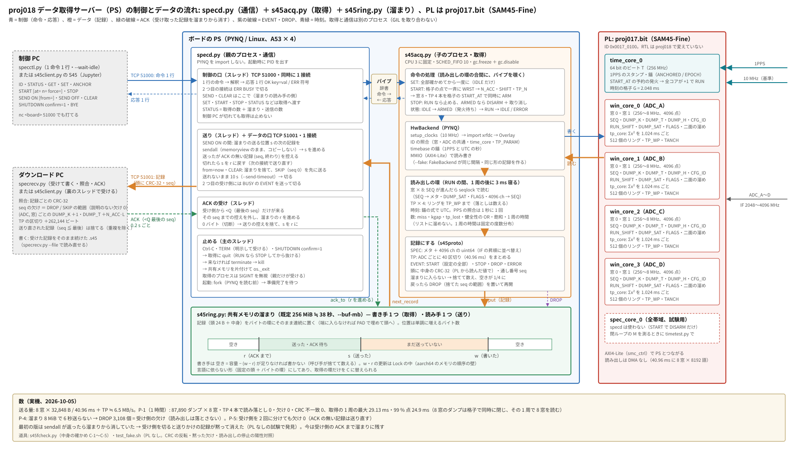

# proj018 — SAM45-Fine のデータ取得サーバー（PS 側。制御 PC の命令で取得し、ダウンロード PC へ送る）

日付: 2026-10-05
状態: **完了**（2026-10-05。実機で P-1（1 時間）・P-1b・P-4・P-5・C-1〜C-5 が通過）

## ソフトウェアの制御とデータの流れ



（`docs/sw_flow.py` で描いた。specd・s45acq・s45ring・s45proto の形を変えたらこちらも直す）

## 目的

**proj017 の bit（SAM45-Fine、ID 0x0017_0100）を、制御 PC から命令で動かし、データをダウンロード PC へ送るサーバーを PS に置く。**
RTL・bit は変えない（proj017 rev1 をそのまま載せる。起動時に ID を照合する）。

- ソケットのサーバー。**制御 PC**（命令・状態）と**ダウンロード PC**（データの受け取り）の 2 つの口
- 制御 PC の命令で: 設定・取得の開始と停止・ダウンロード PC への送信の開始と停止・状態の取得
- 取得したデータは PS に一定量溜め、送れない間に溢れたら捨てて**捨てたことを記録する**
- 送る中身は **生の積分値**（64 bit、PL から読んだ値そのまま）。絶対強度への換算（`fmt=abs`）は [proj019](../proj019/) で足す
- 40.96 ms × 8 窓 ＋ TP 4 本を**読み落としなく**、ダウンロード PC へ送りながら 1 時間

まず SAM45-Fine 専用にする（9 本で共通の枠にするのは、2 本目の bit のとき）。

## 着手の前に決めたこと（2026-10-05、確認済み）

| | 決定 | 読み |
|---|---|---|
| 制御の形式 | **行単位のテキスト**（ASCII、LF 区切り。1 命令に 1 行の応答） | telnet / nc で人が試せる。検証が簡単 |
| 送る中身 | **生（64 bit の積分値）と絶対強度（換算済み）を命令で選ぶ**。proj018 は生だけ、abs は proj019 | 生は検証の正、絶対強度は受け側が楽。**proj を分けた**（2026-10-05）: サーバーの正しさ（ソフト）と単位の正しさ（測定の主張）は別の問いで、生だけなら「送った値 = PL から読んだ値」を bit 単位で照合できる |
| 送れないとき | **PS に一定量溜め、溢れたら捨てて記録** | 捨てた範囲は記録の番号の欠けと EVENT で分かる |
| 共通化 | **まず SAM45-Fine 専用** | 一番早く動く |
| 言語 | **Python**。取得の側と通信の側の境目は言語に依らない形（共有メモリのバイトの環・固定の頭）にして、取得の環だけを C に替えられるようにする。**C に移す基準: P-1 の 1 時間で取得の 1 周の最大が 38 ms を越えたら** | PL の起動（Overlay・xrfdc・クロック）・timebase・proj017 の読み出しは実機で通った Python。重いのは AXI4-Lite のバスの往復で言語ではない。送る量は 6.4 MB/s で小さい。proj017 の最大 35.6 ms は GC（30 分伸ばし続けたリスト）と OS のスケジューリングを疑い、Python のまま対策する（下） |
| SHIFT | **既定 9（6 幅とも共通）**。窓ごとに命令で変えられる | 入力 −10 dBm（−15.9 dBFS）・R +5 dB・最強の線 ch の雑音 +10 dB で、6 幅とも飽和まで ≧ 25 dB・σ_q = 4 の床まで ≧ 23 dB（2026-10-05 の見積もり、`model/win_fixed.py` で E\|Y\|² = 256·W·σ_x² を確認） |

## 設計（実装した形）

### 構成

| | 取得のプロセス（`s45acq.py`、子） | 通信のプロセス（`specd.py`、親） |
|---|---|---|
| 持つもの | PL（Overlay・RFDC・time_core・8 窓・TP 4 本）、timebase | 制御の口・データの口・送信。**PYNQ を import しない** |
| 回すもの | proj017 F-4 の読み出しの環（SEQ を見て閉じたダンプを seqlock で読む・TP のリングを TP_WP まで）→ 記録にして溜まりへ | 命令の解釈 → 取得へパイプで渡す / 溜まりから送る |
| 遅れの対策 | **記録を Python のリストに溜めない**（数は整数だけ、1 周の時間は固定の度数分布）、`gc.freeze()` の後 `gc.disable()`、CPU 3 に固定（`--cpu`）、可能なら SCHED_FIFO 10（`--rt`） | |

- 間は **共有メモリのバイトの環**（`s45ring.py`、既定 256 MiB ≒ 38 秒）と命令のパイプ（辞書）。fork は PYNQ を読む前
- `--fake`: PL の代わりに同じ間隔・同じ形の記録を作る裏（`FakeBackend`）。通信・溜まり・照合を PL なしで試す

### 制御の口（既定 51000、同時に 1 接続。2 つ目は `ERR BUSY`）

1 行の命令に 1 行の応答 `OK key=value ...` / `ERR <符号> <説明>`（符号: STATE・ARG・TIME・CMD・FAIL・ACQ・BUSY）。

| 命令 | 状態 | 中身 |
|---|---|---|
| `ID` | いつでも | サーバーの版・窓 / ADC の共通 / time_core の ID・ADC 4・窓 2・記録の版 |
| `STATUS` | いつでも | state（IDLE / ARMED / RUN / ERROR）・time_ok・start_at・dumps（8 窓の最小）・miss（PL で読み落としたダンプ）・kgap・tp（ADC ごとの区切りの数）・tp_lost・tp_bad・tp_ovr・health（DUMP_H の OR）・flags・sat・loop_max_ms・loop_p99_ms・seq・drop・buf_used_mb / buf_cap_mb・data_client・send・sent・acked・inflight・skip |
| `GET` | いつでも | tint・cfg・窓ごとの if / ns / bw / shift |
| `SET key=val ...` | IDLE / ERROR | `tint=0.04096`（2.048 ms の倍数）・`cfg=0x...`（CFG_ID）・`A0.if=3000`・`A0.ns=1` か `A0.bw=256`・`A0.shift=9`・`all.shift=9`（窓は A〜D × 0・1）。全部を確かめてから一度に入れる |
| `ANCHOR` | IDLE / ERROR | 錨を打ち直す（PPS を直した後など） |
| `START [at=<UTC>] [n=<ダンプ数>] [force=1]` | IDLE / ERROR | 窓を格子の点で一斉に WRST → 格子の点（at= 以降の最初、無ければ今 ＋ 0.5 秒以降）で窓 8・TP 4 本を同時に開始。`OK start_at=<ビート> utc=...`。at= は ISO 8601（時間帯つき）か unix 秒。n = 0 は STOP まで。時刻を答えられないときは force=1 が要る（記録に印） |
| `STOP` | ARMED / RUN | 止める（溜まった分は残る） |
| `SEND ON [from=oldest\|now]` / `SEND OFF` | いつでも | データの口へ送る。from=now は溜まりを捨ててから（SKIP の EVENT） |
| `CLEAR` | いつでも | 溜まりを捨てる（SKIP の EVENT） |
| `BYE` / `HELP` | いつでも | |
| `SHUTDOWN confirm=1` | いつでも | サーバーを止める（RUN なら STOP してから、共有メモリを片付けて抜ける） |

制御 PC が切れても取得は止めない。既定の窓: 各 ADC の窓 0 = 256 MHz・窓 1 = 8 MHz、IF 3000 MHz、SHIFT 9、40.96 ms。

### データの口（既定 51001、同時に 1 接続）

記録の形は `s45proto.py` の冒頭が正。共通の頭（24 バイト: 印・版・種類・長さ・**中身の CRC-32**・**通し番号 seq**）＋ 中身。

- **SPEC**（ダンプ 1 個 × 窓 1 つ、32,848 バイト）: ADC・窓・NS・SHIFT（RUN_SHIFT）・G・CFG_ID・DUMP_K・N_ACC・DUMP_SAT・FLAGS・
  健全性（DUMP_H ＋ サーバーの印 [16] 時刻なし・[17] force）・DUMP_T・最初のサンプルの UTC（ns）・IF の中心、4096 ch の uint64（**IF の昇順**）
- **TP**（ADC ごと、40 区切り = 40.96 ms をまとめて）: 区切りごとに 頭のビート・UTC・Σx²・フレーム数・FLAGS
- **EVENT**（JSON）: START（設定の全部・ID）・STOP（数・TP の錨の組の照合）・DROP / SKIP（捨てた seq の範囲）・ERROR・WARN
- **CRC は取得の側が PL から読んだ値で計算する**。溜まり・ソケットを通った後に受け側で照合 → 「送った値 = PL から読んだ値」（P-1b）
- **受け側は ACK を返す**（<Q の 8 バイト = 受け取って書き終えた最後の seq、0.2 秒おき）。サーバーは ACK のあった記録だけを溜まりから消し、
  切れたら ACK の無い記録を次の接続で送り直す（受け側は seq で重複を除く）。**ACK を返さない受け側では溜まりが溢れて DROP になる**
- 送る量: 8 窓 × 32.8 KB / 40.96 ms ＋ TP ≒ **6.5 MB/s**（52 Mbit/s）

### 溜まりが溢れたとき

- 新しい記録を捨てる（溜まっている側は連続のまま）。**一度溢れたら空きが 1/4 に戻るまで捨て続け**、再開の直前に DROP（範囲・数）を置く
- EVENT（小さい・START / STOP を落としたくない）は空きがあれば割り込む
- seq の欠けは、すべて DROP / SKIP の範囲で説明できる（`specrecv.py` の「説明のない欠け」= 0 が合格）

### 試験用: Jupyter から（`s45client.py`）

制御とデータの受けを 1 つの物で行う（裏のスレッドで受けて ACK を返し、窓ごとに直近 500 ダンプ・ADC ごとに直近 20 万区切りの TP を手元に持つ）。

```python
from s45client import S45
s = S45("<board>")                       # 制御・データの両方の口に繋ぐ（制御の口を持つので、開いている間 specctl は ERR BUSY）
s.set(A0_bw=256, A1_bw=8, all_shift=9)   # "A0.bw" は A0_bw と書ける
d = s.acquire(25)                        # SEND ON → START n=25 → 8 窓とも届くまで待つ。前の残りは捨ててから
d.spec("A0"), d.freq("A0"), d.meta("A0"), d.tp("A"), d.events
s.plot(["A0", "A1"]); s.check(); s.close()
s.live()                                 # スペアナのように 8 窓を描き続ける（avg=5 ダンプの平均、hold=True で最大値、ylim=(下, 上)）
s.stop()                                 # live は Jupyter の ■ で止まるが、取得は続いているので
```

ボードの上の Jupyter で使うと、受けの処理がボードの CPU を使う。P-1（読み出しの余裕）の試験では使わない。

1PPS が無い（錨が打てない）ときは、`acquire()` は**警告を出して時刻なしで取る**（サーバーの `START force=1`。utc_ns は 0、健全性に
[16] 時刻なし・[17] force、TP の FLAGS に [16]）。スペクトル・DUMP_T・TP の区切りは普通に出る。`acquire(n, force=False)` で
サーバーの既定（時刻が無ければ断る）に戻せる。サーバー（specd）の既定は変えていない（本番は時刻なしの記録を作らない）。
s45fcheck の C-1〜C-4 は時刻の印を注意だけにする（C-5 は 1PPS を入れて）

### 中身の確かめ（実機・SG）: `s45fcheck.py` ／ `fcheck.ipynb`

PL なしの試験はスペクトルの中身が乱数なので、中身は実機の信号で確かめる（Jupyter で 1 セルずつ。入力の繋ぎ方はノートの各セルの前）。

| | 何を | 予言・合否 |
|---|---|---|
| C-1 | 周波数軸の向き（IF の昇順への並べ替えは実機で初めて） | SG の CW の山が予言の IF（256 MHz・8 MHz の窓とも、±1.5 ch ＋ 2 ppm）。SG を +1 MHz 動かすと山も同じ向きに同じだけ動く |
| C-2 | 設定が効く | 8 窓に別々の幅・IF・SHIFT → 記録の頭・START の EVENT・GET・周波数軸の幅が全部その値、N_ACC = tint / L |
| C-3 | ADC と窓の対応 | SG を 1 本の ADC だけに → その ADC の窓は山 / 中央値 ≧ 30 dB、ほかの 6 窓は ≦ 10 dB |
| C-4 | SHIFT | 同じ CW で SHIFT 9 / 11 の山の比 = 16（12.04 dB、±0.1 dB ＋ SG の揺らぎ）、飽和 0 |
| C-5 | 時刻 | ダンプの間隔 UTC 40,960,000 ns・DUMP_T N_ACC·L ちょうど、TP の区切り 262,144 ビート・1,024,000 ns ちょうど |

位置や比を読む前に、山 / 中央値 ≧ 30 dB（信号が来ている）を確かめる（argmax は必ず何かを返す）。
PL なし（偽物、信号なし）で回すと、C-2・C-5 は通過、C-1・C-3・C-4 は「信号が来ていない」で NG になる（その見張りが効いていること）。

## 予言と判定

| | 何を | 予言・合否 |
|---|---|---|
| P-1 | 読み出しの余裕（実機） | 送信 ON・ダウンロード PC で全部受けながら 1 時間: 8 窓・TP 4 本の読み落とし 0（STATUS の miss・tp_lost）、説明のない欠け 0、取得の 1 周の最大 < 38 ms（越えたら取得の環を C に）。**予言: 最大は proj017 の 35.6 ms より下がる**（リストを伸ばさない・GC 停止・CPU 固定） |
| P-1b | 送った値の正しさ | 受けた記録の CRC（取得の側で PL の値から計算）の不一致 0。陽性対照 `--posctl-corrupt N`（CRC の後に 1 bit 反転）で seq/N 個 |
| P-4 | 溢れたときの記録 | 送らずに溜まりの長さ以上待つ → 欠け = DROP の範囲 = サーバーの drop、説明のない欠け 0、再開後は続きから |
| P-5 | 切断 | 制御・受け側を RUN 中に切って繋ぎ直す: 取得は続き、2 回に分けた受けを続けると欠け 0（ACK の無い記録は送り直される） |
| 陽性対照 | 見張りが立つこと | `--posctl-gap N`（黙って捨てる）→ 説明のない欠け seq/N 個・照合は失敗。`--fake-stall N`（読み出しを 50 ms 止める）→ miss と DUMP_K の飛び |

## やったこと

- `pynq/` は proj017 の追跡ファイルを複製（`git ls-files proj017/pynq`）し、新しく 6 本:
  `s45proto.py`（記録の形）・`s45ring.py`（溜まり）・`s45acq.py`（取得）・`specd.py`（サーバー）・`specctl.py`（制御 PC の道具）・
  `specrecv.py`（ダウンロード PC の道具: 受けて書く・照合・ACK）、試験 `test_fake.sh`
- 溜まりの単体の試験: 乱数の長さ（8 B〜32 KB）・書く / 送る / ACK / 切断（送り直し）を 3 万回ずつ、種 5 つ → 置けた記録が欠けも重複もなく順に出る

## 結果（PL なし、`test_fake.sh`、2026-10-05）

| 試験 | 結果 |
|---|---|
| basic（100 ダンプ × 8 窓） | **通過**: SPEC 800・CRC 不一致 0・説明のない欠け 0・DUMP_K / DUMP_T / TP の連続。1 回だけ、8 窓とも 1 ダンプ読み落とした（試験の機械の Linux で取得のプロセスが 41 ms 以上止まった。RT・CPU 固定なしで回している。**miss と DUMP_K の飛びがその通り立った**）。続く 3 回は 0 |
| corrupt（陽性対照） | **通過**: CRC 不一致 23（期待 23） |
| gap（陽性対照） | **通過**: 説明のない欠け 23（期待 23）、照合は失敗 |
| drop（P-4、溜まり 4 MiB で 5 秒送らない） | **通過**: 欠け 1149〜1305 = DROP の範囲 = サーバーの drop、説明のない欠け 0 |
| skip（from=now） | **通過**: SKIP 1 つ、説明のない欠け 0 |
| reconnect（P-5） | **通過**（ACK を入れた後）: 2 回に分けた受けを続けて欠け 0 |
| stall（陽性対照） | **通過**: miss 40・DUMP_K の飛び 40 |

### 道具・設計が間違えたこと

- **最初の版は「sendall が返ったら溜まりから消す」で、受け側を切ると送りかけの記録が黙って消えた**（reconnect で説明のない欠け 3）。
  sendall は OS の送信の溜まり（4 MiB）に入れただけで、相手が受けた保証ではない。→ 受け側の ACK まで溜まりに残し、切れたら送り直す形に
- 溢れたときの最初の版は、空きの縁で「1 個捨てる・DROP を置く・次を捨てる」を繰り返し、DROP の EVENT の seq が捨てた記録より先に振られて
  番号が戻った（seq_back 2・説明のない欠け 4）→ 番号を振る前に DROP を置く・空きが 1/4 に戻るまで捨て続ける
- 試験の台本: 裏で走らせたサーバーは非対話の bash では SIGINT を無視する → `kill -TERM` と SIGTERM の受けを足した。
  受け側は記録が来ないと時間で止まらなかった → 記録の頭の手前で select で待つ

### 実機の経路（HwBackend）の読み合わせ（2026-10-05）

実機の裏は PL が無いと回せないので、proj017 の `fine.f4`・`timetest`・`TpReader` と突き合わせて読んだ（模擬の MMIO で 1 周も通した）。
レジスタ・属性・引数の順・seqlock・スペクトルの番地と語の順・TP の 64 bit の復元・IF の順は一致。直したもの:

- ARMED の間の発火の処理（begin: RUN_SHIFT の照合・TANCH）で例外が出ると、取得のプロセスごと黙って落ちた → ERROR の EVENT を出して止める
- ARMED のまま STOP してもコアの予約が残り、後で発火して IDLE のまま走る（timetest.disarm_all の注意どおり）→ コアの DISARM と time_core の取り消し
- IDLE の間は時刻の照合が回らないので、PPS が落ちていても START で初めて例外になり、force=1 が効かなかった → START で照合し、落ちていれば force の判断へ
- UTC の ns を切り捨てていた（timebase は最近接）→ 同じ丸めに（−1 ns のずれ）
- TP の手元の箱が溢れたときに黙って捨てていた → tp_lost に数える
- START の知らない引数を黙って無視していた → ERR ARG

## 結果（実機、中身の確かめ C-1〜C-5、2026-10-05）

構成: proj017.bit（rev1）・specd（既定の溜まり 256 MiB）、ボードの上の Jupyter から s45client。SG E8257D −20 dBm（10 MHz は分光計と同じ基準、`ROSC EXT`）
→ 3 dB 減衰器 → 4 分配（−6 dB）→ ADC_A〜D（C-3 だけ ADC_A の 1 本、ほかの ADC は無接続）。1PPS・10 MHz あり。

| 試験 | 結果 |
|---|---|
| C-1 周波数軸 | **通過**。SG 3000.5 MHz → 山 256 MHz の窓 3000.50001・8 MHz の窓 3000.50000 MHz（差 +0.01 / 0.00 kHz、ch 62.5 / 1.95 kHz）。SG +1 MHz → 山も +1000.00 kHz（両窓）。**IF の昇順への並べ替えの向き・位置が実機で正しい** |
| C-2 設定 | **通過**。8 窓に別々の幅（256〜8 MHz）・IF・SHIFT 8〜11 → 記録の頭・START の EVENT・GET・周波数軸の幅・N_ACC が全部その値（IF は ch の格子に丸めた値） |
| C-3 ADC と窓 | **通過**（判定を直した後）。ADC_A の窓だけに CW（f_sg の ch で 51.9 / 65.3 dB / 中央値）、窓ごとに 4 ADC のデータは互いに違う。8 MHz の窓の漏れは見えず ≦ −72 dB（検出限界）。B0・C0・D0 の一番強い山は **3072.000 MHz（k·fs/8 の ADC の線、18〜24 dB / 中央値）** |
| C-4 SHIFT | **通過**。SHIFT 9 / 11 の山の比 12.043・12.045 dB（予言 12.041、差 +0.001・+0.004 dB、SG の揺らぎ 0.008 dB）、飽和 0。**SHIFT の縮小は 4^ΔS ちょうど**（proj019 の前提） |
| C-5 時刻 | **通過**。50 ダンプ × 8 窓で DUMP_T の間隔 10,485,760 ビート・UTC の間隔 40,960,000 ns ちょうど。TP 4 本 ≒ 2,025 区切りで 262,144 ビート・1,024,000 ns ちょうど。UTC とボードの時計の差 +0.057 s |
| 受けの照合（全体） | SPEC 1280・TP 600・CRC 不一致 0・説明のない欠け 0（SKIP 144 = acquire の CLEAR）・DUMP_K / DUMP_T / TP の連続・健全性 0・飽和 0 |

## 結果（実機、P-1: 1 時間、2026-10-05）

構成: ボードで specd（既定: 溜まり 256 MiB・取得は CPU 3・SCHED_FIFO 10）、受け側はボードとは別の PC（`specrecv.py --out`、ディスクに 22.5 GB）、
制御は specctl（10 分ごとに STATUS）。入力は SG 3000.5 MHz −20 dBm → 3 dB → 4 分配 → 4 ADC のまま。窓は既定（各 ADC 256 MHz ＋ 8 MHz、SHIFT 9）。

| | 結果 |
|---|---|
| 取得（STATUS） | **8 窓とも 87,890 ダンプ（3600 s）、miss 0・kgap 0・drop 0**。TP 4 本とも ≒ 3,515,620 区切りで tp_lost 0・tp_bad 0。最後に inflight 0（全部 ACK） |
| **取得の 1 周** | **最大 29.13 ms・99 % 点 24.9 ms**（40.96 ms に対して余裕 11.8 ms）。予言（proj017 の最大 35.6 ms より下がる）どおり。**基準 38 ms を越えないので C に移さない**。最大は 1800〜2400 s の間の 1 回（それまでは 26.9 ms） |
| 受け側 | SPEC **703,120**（= 87,890 × 8）・TP 334,293 記録・22,465.5 MB、CRC 不一致 0・欠け 0・説明のない欠け 0・重複 0・DUMP_K / DUMP_T / TP の連続、照合は通過 |
| 錨の組 | STOP の EVENT で 4 ADC とも anch_dev 0・GAP_CNT の増え 0（1 時間、TP の区切りの時刻の式が成り立ち続けた） |
| 健全性 | **health 0x10（[4] ADC の振り切れ）・tp_ovr 1**: 1380〜1440 s の間に、1 本の ADC で 1.024 ms の区切り 1 つだけ振り切れがあった。入力の事象（何が起きたかは未確認）で、見張りが立ったとおりに記録・ダンプ・TP の FLAGS[4] に出た。運びの合否には関わらない |

## 結果（実機、運び P-4、2026-10-05）

| 試験 | 結果 |
|---|---|
| P-5 受け側の切断（START n=0、受け側を 10 秒 + 30 秒の 2 回に分け、2 回目の途中で STOP） | **通過**。2 つのファイルを続けて 12,886 記録（SPEC 8848・TP 4036）、欠け 0・説明のない欠け 0・CRC 不一致 0・連続、STOP の EVENT まで。miss 0・tp_lost 0。dup 0（1 回目が ACK を返し切ってから閉じたので送り直しは起きなかった。送り直しの経路は PL なしの reconnect で確かめてある） |
| P-4 溢れ（`--buf-mb 8`、START n=300 の後 6 秒送らない） | **通過**。DROP seq 368〜3475（3108 個）= 受け側の欠け = 説明された欠け = STATUS の drop、説明のない欠け 0・CRC 不一致 0・DUMP_K / DUMP_T / TP の連続、**溢れている間も miss 0・tp_lost 0**（PL からの読み出しは落とさない）。1 周の最大 25.4 ms |

- specd が Ctrl-C で止まらなかった（ps → kill）。端末の Ctrl-C は親と子（取得）の両方に届き、子が先に落ちて親の片付けが止まった見込み。
  → 子は SIGINT を無視し、親が quit を頼む（来なければ terminate → kill）、共有メモリを片付けて `os._exit`。2 回目の Ctrl-C ですぐ抜ける。
  PL なしで Ctrl-C をグループに送る試験で、取得を STOP してから抜け、共有メモリが残らないことを確かめた
- **それでも実機では Ctrl-C で止まらなかった**（原因は未確認。起動のされ方で SIGINT が「無視」のまま引き継がれていると、Python は Ctrl-C を受けない）。
  → SIGINT・TERM を明示して受ける（受けたことをログに出す）、起動時に PID を出す、制御の口に `SHUTDOWN confirm=1` を足した。
  PL なしで SIGINT を無視の状態で起動しても、Ctrl-C・SHUTDOWN の両方で抜けることを確かめた
- STATUS の drop はサーバーの起動からの累計（START で 0 に戻らない）

外れた判定（道具の誤り）:
- C-1 の初回は SG に触らない前提だったのに説明が無く、SG が前の 3000 MHz のまま −500 kHz で NG → `sg=` で SG を合わせて読み返す形に
- C-3 の初回は窓全体の一番強い山で判定し、3072 MHz の ADC の線で NG（その前の回は分配器が 4 本に繋がったまま）→ f_sg の ch での漏れで判定、
  判定は −60 dB まで見える 8 MHz の窓で。窓ごとに 4 ADC のデータが bit 単位で違うことも見る

## 結論・次にやること

- [x] 実機の短い通し（100 ダンプ、P-1b: CRC 不一致 0）・中身の確かめ C-1〜C-5（上）
- [x] 実機 P-4・P-5（上）
- [x] Ctrl-C で止まらない件（実機で止まるようになった）
- [x] 実機 P-1: 1 時間（上）。1 周の最大 29.13 ms < 38 ms なので **取得は Python のまま**
- [ ] P-1 の振り切れ 1 回が、どの ADC・いつか（p1.s45 から）。入力の事象かの切り分け
- [ ] 数時間の連続運転（P-1 は 1 時間）。dt 10.24 ms の 7 本は DMA が前提（BITS.md）
- [ ] ダウンロード PC の受け側を本番用に（ファイルの区切り・名前、受けながらの表示）。今の `specrecv.py` は照合の道具
- [ ] proj019（絶対強度 `fmt=abs`）

## 再現手順

```bash
# PL なし（どこの Linux でも。numpy だけ）
cd proj018/pynq && bash test_fake.sh all          # 「test_fake: 全部通過」

# 実機（ボード。proj017 の build/proj017.bit・.hwh と pynq/*.py を ~/proj018/ に）
sudo -E $(which python3) specd.py --clkin 0 --ref 10
# 制御 PC
python3 specctl.py --host <board> STATUS "SET A0.bw=256 A1.bw=8 all.shift=9" "START n=0" "SEND ON"
# ダウンロード PC
python3 specrecv.py --host <board> --out run1.s45 --seconds 3600 --json run1.json
python3 specctl.py --host <board> STOP STATUS
```

環境は [`../VERSIONS.md`](../VERSIONS.md)。bit は [proj017](../proj017/)（RTL は変えていない）。
