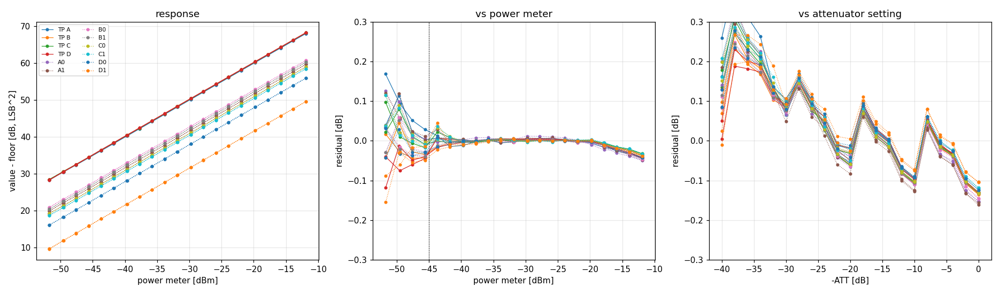
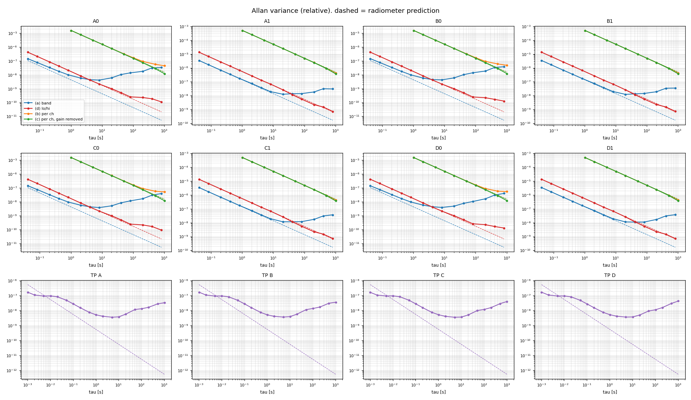
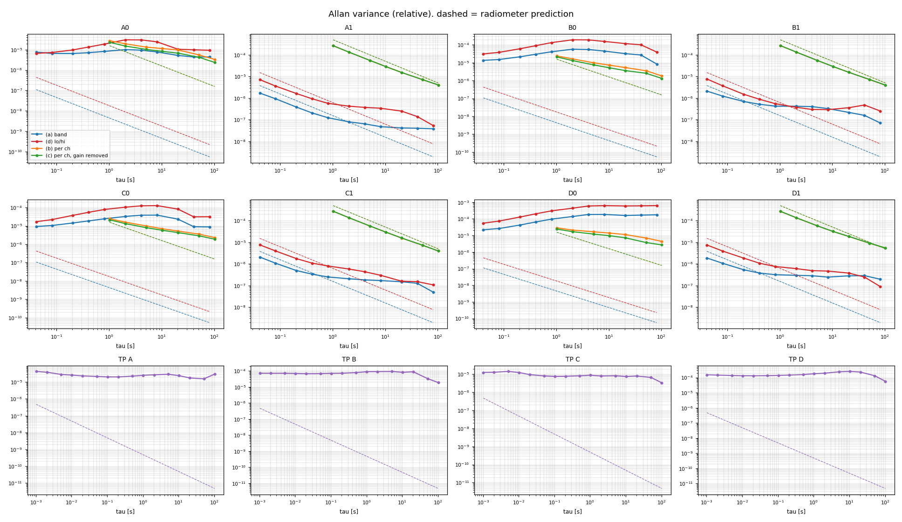

# proj019 — 強度の較正: 絶対強度の単位・雑音のリニアリティ・安定度（アラン分散）

日付: 2026-10-05（起こし）・2026-10-06（リニアリティ・アラン分散の道具）
状態: **進行中**（リニアリティ lin3〜lin5・TP の dBm の係数・アラン分散 allan2 を実機で。TP のアラン分散が予言より小さい件の切り分けが残る）

## 目的

**スペクトルの強度を入力の絶対電力に比例させ、比例係数を SHIFT にも窓幅にもよらず固定にする。**
proj018 のサーバーに `fmt=abs`（換算済みで送る）を足し、単位の模型が実機で成り立つことを確かめる。
単位の定義は 9 本の bit で共通の基準にする。RTL・bit は変えない（proj017 rev1）。

あわせて、**雑音を入れたときのリニアリティ**（パワーメーター・プログラムアッテネータを基準に、TP と 8 窓）と、
**長時間の安定度**（アラン分散、proj018 のサーバーで記録した .s45 から）を測る。`pynq/` は proj018 の追跡ファイルを複製し、
`instr.py`（パワーメーター N1913A ＋ E9300A・アッテネータ J7211C、LAN の SCPI）・`s45lin.py`・`s45allan.py` を足した。

## 着手の前に決めたこと（2026-10-06）

| | 決定 | 読み |
|---|---|---|
| TP と入力の電力の対応 | **表ではなく、ADC ごとの係数 1 つ（dBFS = PM [dBm] + C_adc）と、線形が成り立つ範囲・残差を残す**（VERSIONS.md に） | TP は生のサンプルの Σx² でデジタルは線形。ずれるのは ADC の上（振り切れ）と下（ADC 自身の雑音の床）とアナログの利得。線形なら表は係数 1 つと同じで、外れた所が分かることのほうが効く。用途: レベル合わせ（本番 −10 dBm ≒ −15.9 dBFS）・健全性（急な変化）・ログでの換算。観測の強度の較正はチョッパー（R − SKY）がするので、科学の値には要らない |
| リニアリティの基準 | **パワーメーター**（分光計と同じ分配器の出口を見る。ノイズソース・BPF の揺らぎが両方に乗る）。パワーメーターが読めない所（< −45 dBm 前後）は**アッテネータの設定値**。重なる所で 2 つを照らし合わせる | 分配の損失の差（パワーメーターの口と ADC の口）は定数なので比例の係数に入るだけ。床（アッテネータ 100 dB）を引く |
| 内部の照合 | **窓 / TP（同じ ADC）がレベルによらず一定**か（L-2）。パワーメーターを使わない | 窓の経路（PFB・DDC・FFT・SHIFT）が ADC の後ろで線形かを、測定器の誤差なしで見る |

## 配線とレベルの見積もり（2026-10-06）

ノイズソース（最大 +0 dBm）→ BPF 2100〜3900 MHz → J7211C（0〜100 dB）→ 分配器 A ─┬→ パワーメーター
                                                                              └→ 3 dB → 分配器 B → C → ADC_A・B / D → ADC_C・D

- ADC の入口 ≒ パワーメーターの値 − 3 dB − 分配 2 段（≒ 7 dB）≒ PM − 10 dB。ADC の 0 dBFS ≒ +5.9 dBm（3 GHz、proj010）
- ノイズソースの +0 dBm がどの帯域の値かで BPF の後が決まる（先にアッテネータ 0 dB で PM を読む）。**BPF の後が 0 dBm でも ADC は ≒ −16 dBFS**、
  分配の損失が見込みより大きければ本番のレベル（−15.9 dBFS）・ADC の上端（振り切れ）には届かない。上端まで見るなら増幅器を BPF の後に（PM が基準なので増幅器の揺らぎ・圧縮は効かない）
- パワーメーター（E9300A）は −60 dBm まで読めるが、−45 dBm より下は零点と雑音で精度が落ちる → 零点を取る（ノイズソースを切って `pm.zero()`）、下はアッテネータ基準
- 使わない分配器の口・線は 50 Ω で終端（proj013: 終端なしの分配器から 800 MHz 帯が入った）。BPF の外の混入は BPF が切る

## リニアリティ（`pynq/s45lin.py`）

段: 100 dB（床）→ 60 → 0 dB（2 dB 刻み）→ 100 dB → 1 → 59 dB → 100 dB（往復で時間の揺らぎと履歴を見る）。段ごとに アッテネータ → 1 秒 → PM → 25 ダンプ（≒ 1 s）→ PM。≒ 6 分。
量は単位（下）の LSB²: TP = Σx²/(フレーム数·8192) = σ_x²（tp_core は 14 bit の x の二乗）、窓 = 中央 90 % の ch の abs の和（偏り 2/3 を引く）。

| | 予言・合否 |
|---|---|
| L-1 | TP 4 本・窓 8 つとも、床を引いた値が PM に比例。残差 ±0.05 dB（PM ≧ −45 dBm・床の 10 倍以上・飽和と振り切れなし） |
| L-2 | 窓 / TP（同じ ADC）がレベルによらず一定 ±0.02 dB。値は窓の帯域が全帯域の電力に占める割合（BPF の形で決まる） |
| L-3 | アッテネータの設定値を基準にしても L-1 と同じ（低い所まで） |
| 表 | ADC ごとに dBFS = PM [dBm] + C_adc と床（dBFS）。4 本の C の差は分配と ADC の利得の差 |

偽の記録（線形 ＋ 1 本の ADC だけ圧縮 ＋ 1 窓だけ傾き）で、圧縮は TP と窓の両方で L-1 が NG・L-2 は OK（共通）、窓の傾きは L-1・L-2 とも NG になることを確かめた。

## アラン分散（`pynq/s45allan.py`）

入力を固定（ノイズソース → BPF → アッテネータ固定 → 分配 → ADC、本番に近いレベル）にし、specd で 1 時間（`START n=87890`）、
ダウンロード PC の specrecv で .s45 に書き、s45allan.py で解析する（記録は 1 度だけ頭から読み、ch ごとは 25 ダンプ ≒ 1 s ずつ束ねて持つ）。

| | 量 | 予言（白色雑音、ラジオメータ） |
|---|---|---|
| A-1 | (b) ch ごと・(c) 共通の利得を除いた ch ごと | 1 / (Δν·τ)、Δν = W / 4096（矩形窓・重ならないフレーム） |
| A-2 | (d) 分光の安定度（帯域の下半分 / 上半分） | 1/(M_lo·Δν·τ) + 1/(M_hi·Δν·τ)。観測でいちばん効く |
| A-3 | (a) 帯域の電力・TP（1.024 ms） | 1/(M·Δν·τ)・1/(B·τ)（B = BPF の幅）。アナログの利得の揺らぎがそのまま乗る |

アラン時間 = 予言の 2 倍を初めて越える τ。偽の記録（χ² の雑音 ＋ A0 だけ遅い共通の利得の揺れ ＋ 線の ch 1 本）で、最短の τ で予言の 0.97〜1.06 倍、
共通の揺れは (a) にだけ出て (c)・(d) では消え、線の ch は外れることを確かめた。proj014（W-9）・proj017 の winallan.py・tools/allan.py と同じ量。

## 設計の案

### 単位（案）

**1 ch の電力を、ADC 14 bit の LSB² で表す**（その ch が入力の分散 σ_x² に寄与する量）:

  abs[ch] = (Σp / N_ACC − 2/3) · 4^SHIFT · 4^(4 − G) / 2³¹

- 模型で確かめた関係: 白色雑音で E|Y|² = 256·W·σ_x²、CW（振幅 A）で |Y| = 32768·A（G = 4）。
  → 白色雑音の abs の和を 2048 MHz 全体でとると σ_x² になり、CW の abs は A²/2（その CW の電力）になる
- −2/3 は SHIFT の切り捨ての偏り（成分ごとに +1/3 LSB²）
- TP の abs も同じ単位: Σx² / (フレーム数 · 8192)（tp_core は 14 bit の x = ADC の 16 bit >>> 2 の二乗を足す。初版は /16 と誤記し、実機の L-2 で窓 / TP が 16 倍に出て見つかった）
- dBFS へは abs / (8192² / 2)、dBm へは 0 dBFS ≒ +5.9 dBm（3 GHz、proj010）
- **SHIFT にも窓幅にもよらない固定の係数**になる（アナログの利得を除いて）

- サーバー: `SET fmt=raw|abs`（いつでも。次に送る記録から）、SPEC の 4096 ch は abs で float64、TP も abs を足す

## 予言と判定（案）

| | 何を | 予言・合否 |
|---|---|---|
| P-2 | 絶対強度の単位 | 雑音源: 窓の中央 90 % の abs の和 / (TP_abs · W·0.9 / 2048) が帯域の傾きの範囲で 1。CW: 山の abs = 同じ CW の全帯域の dBFS（proj010 の方法）と ±0.1 dB |
| P-3 | SHIFT に依らない | 同じ入力で SHIFT 7・9・11 の abs の比が 1（ラジオメータの揺れの範囲）。**陽性対照: −2/3 の差し引きを外すと 8 MHz・SHIFT 11 で比が ≒ 0.16 % ずれて落ちる**（σ_q ≒ 14、揺れの 5e-5 より十分大きい） |

## 結果（実機、リニアリティ lin3、2026-10-06）

構成: ノイズソース → BPF 2100〜3900 MHz → J7211C → 分配器 A → PM（N1913A ＋ E9300A、較正係数 3000 MHz、平均 64）/ 3 dB → 分配 2 段 → ADC_A〜D。
窓は既定（各 ADC 256 MHz ＋ 8 MHz、IF 3000、SHIFT 9）。段: 床 → 60→0（偶数）→ 床 → 1→59（奇数）→ 床（初版の並び）、25 ダンプ / 段、10.7 分。記録 `runs/lin3.lin.jsonl`。
PM はアッテネータ 0 dB で **+8.1 dBm**（見込みより強い）→ ADC は **−7.4 dBFS** まで届いた（本番の −15.9 dBFS を越える）。

| | 結果 |
|---|---|
| **TP の単位の誤り（道具）** | 初版の s45lin は TP を 16 で割っていた（tp_core は 14 bit の x の二乗）。窓 / TP が 2.50（> 1）、dBFS = PM − 27.5 dB で見つかった。直すと **dBFS = PM − 15.3〜−15.5 dB**（見込み −15.9、分配の見積もりの精度で一致）、ADC の床 −58.7〜−60.1 dBFS |
| **単位が窓幅によらない（proj019 の本題）** | 窓 / TP = 0.156（256 MHz・中央 230 MHz）と 0.00497（8 MHz・中央 7.2 MHz）。**1 MHz あたりにすると 2 % 以内で一致**（幅 32 倍違う窓・SHIFT 同じ）。平らな BPF の見込み（230 / 1800）より 22 % 大きいのは 3000 MHz が帯域の平均より利得の高い所にあるためと読む |
| **L-2 広い窓 / TP（分光計の中）** | **256 MHz の窓: 4 ADC とも ≦ 0.006 dB（−7〜−37 dBFS の 30 dB）**。4 ADC に共通でない分 rms 0.0009 dB |
| L-2 狭い窓 / TP | 8 MHz の窓: 0.08〜0.12 dB。ただし **4 ADC で 0.001 dB まで同じ形**（ADC ごとの分 rms 0.0026 dB）で、アッテネータの設定でギザギザに変わる（7 dB: +0.007、8 dB: +0.039、9 dB: +0.011）→ **入力のスペクトルの形が段ごとに変わる**（アッテネータの段の周波数特性）。分光計のせいではないと読む。確かめは L-2b（狭い窓 / 広い窓の同じ IF の ch、.spec.npz を足した） |
| L-1 PM 基準 | **TP 4 本・256 MHz の窓は 最大 0.030〜0.042 dB で OK**（床の 100 倍以上・PM −13〜−7 dBm を除く）。8 MHz の窓は上の入力の形の分 0.14 dB で NG |
| PM の経路の切り替え | PM −13〜−7 dBm で、TP・窓の全部に同じ形の −0.04〜−0.10 dB（E9300A の 2 つの経路の切り替え −10 dBm 前後）→ 当てはめから外す（`pm_skip`） |
| アッテネータ基準（L-3） | ±0.15〜0.3 dB（段の誤差）。PM + ATT も 8.09〜9.07 dB と動く → **アッテネータは基準にならない**（参考だけに） |
| 低い所 | 床が 1 往復で数 %〜8 % 動き（TP_C +6.8 %、窓 B0 20 %）、床の 10 倍の所で 0.2〜1 dB の残差 → 床を 8 段ごとに測り、時刻で内挿する形に直した（次の測りから） |

## 結果（実機、リニアリティ lin4、2026-10-06）

構成は lin3 と同じで、**PM の前に 20 dB の固定減衰器**（PM を −13 dBm より下に置き、E9300A の経路の切り替えを避ける。ATT 0〜1 dB だけ −12 dBm 前後）。
**窓は 8 つとも 256 MHz で 2048〜4096 MHz を隙間なく並べた**（A0 2176・A1 2432・…・D1 3968 MHz 中心、4 ADC は同じ入力なので 8 窓で全帯域）。
段: 0〜40 dB を 2 dB 刻みで同じ設定を往復・床を 8 段ごと（49 段、≒ 9 分、直した s45lin）。記録 `runs/lin4.lin.jsonl`（ch ごとの `lin4.spec.npz` は大きいのでリポジトリに入れない）。

| | 結果 |
|---|---|
| **L-1 PM 基準** | **TP 4 本・8 窓とも最大 0.022〜0.039 dB・rms 0.008〜0.015 dB で OK**（ADC −7〜−40 dBFS 前後、床の 100 倍以上） |
| 同じ設定の往復 | 2 回の差 rms 0.005〜0.010 dB（時間の揺らぎ）・2 回の平均 rms 0.011〜0.018 dB（設定ごと: PM の直線性・アッテネータの段の周波数特性） |
| **L-2 窓 / TP** | 8 窓とも ≦ 0.019 dB。4 ADC に共通でない分 rms 0.002〜0.003 dB |
| **全帯域の和 = TP（パーセバル）** | 8 窓の中央 90 % の abs の和 / 自分の ADC の TP = **0.9076**（ATT ≦ 20 dB の 22 段で 0.9071〜0.9079）。各窓の端 5 % ずつを隣の ch の密度で埋めると **1.0046 ± 0.0007（+0.02 dB）**。**スペクトルの単位（abs の和）と TP が 0.5 % で一致し、レベルによらない** |
| TP と dBm | dBFS = PM + 4.67〜4.88 dB（20 dB を戻すと −15.33〜−15.12、lin3 の −15.48〜−15.24 と 0.1〜0.2 dB 内＝固定減衰器の誤差の範囲）。ADC の利得の差 B・C・D は A より +0.18〜+0.21 dB（分配と ADC） |
| 床 | **最初の床が高く、時間とともに下がった**（TP_A 64.8 → 36.0 LSB²、窓 D1 6.3 → 4.6）。前の測り（高いレベル）の後の落ち着き（温度・ADC の背景較正）の見当 → 測る前に数分待つか、最初の床を捨てる |

（`s45lin.analyze` の図。左: 床を引いた値と PM、中: PM 基準の残差（PM −13〜−7 dBm は当てはめの外）、右: アッテネータの設定値を基準にした残差（参考））

8 MHz の窓（lin3 の 0.08〜0.12 dB が入力の形の変化かどうか）は、この並べ方では L-2b が出ない（狭い窓が無い）→ 既定の窓（256 ＋ 8 MHz、同じ IF）でもう一度。

## 結果（実機、リニアリティ lin5、2026-10-06）

lin4 と同じ配線（PM の前に 20 dB）・同じ段（0〜40 dB の往復・床 8 段ごと）で、**窓を既定（各 ADC 256 MHz ＋ 8 MHz、どちらも IF 3000 MHz）**に戻した。記録 `runs/lin5.lin.jsonl`。

| | 結果 |
|---|---|
| **L-2b 8 MHz / 256 MHz の同じ IF（2996.4〜3003.6 MHz、広い窓の ch 115 個）** | **比 1.0012（4 ADC とも）・レベルによるずれ 最大 0.010〜0.014 dB（34 点）**。幅が 32 倍違う窓が同じ周波数の電力を 0.12 % で同じに出す（単位が窓幅によらないことを ch で確かめた）。狭い窓の経路も線形 |
| L-1 PM 基準 | TP 4 本・256 MHz の窓は最大 0.021〜0.034 dB で OK。**8 MHz の窓は 0.07〜0.09 dB で NG** |
| L-2 窓 / TP | 256 MHz の窓 ≦ 0.008 dB。8 MHz の窓 0.106〜0.108 dB（4 ADC に共通な分 0.1065 dB・ADC ごとの分 rms 0.0024 dB） |
| 同じ設定の往復 | 2 回の差 rms 0.002〜0.005 dB（時間の揺らぎは小さい）。8 MHz の窓だけ 2 回の平均 rms 0.04〜0.05 dB（**設定ごとのずれ**） |
| TP と dBm | dBFS = PM + 4.65〜4.89 dB（lin4 と 0.02 dB 内） |

**読み: 8 MHz の窓の L-1・L-2 の NG は、入力のスペクトルの形がアッテネータの段ごとに変わるため**（3000 MHz の 8 MHz 幅が帯域全体に占める割合が変わる）。
時間でなく設定で決まり（往復の差 0.003 dB・平均 0.04 dB）、4 ADC で同じ形で、同じ IF を見る 256 MHz の窓との比（L-2b）では消える。lin3 の見立てが当たった。
**分光計（TP・256 MHz・8 MHz の窓とも）は −7〜−40 dBFS の 33 dB で 0.01〜0.03 dB の線形**。8 MHz の窓の L-1・L-2 は、入力の形が段で変わる測り方では判定にならない（L-2b を判定にする）。

## 結果（実機、アラン分散 allan2、2026-10-06〜07）

構成: リニアリティと同じ配線（ノイズソース → BPF → J7211C（固定）→ 分配 → ADC_A〜D）、ADC の入口 ≒ −11 dBm（≒ −17 dBFS）。窓は既定（各 ADC 256 ＋ 8 MHz、IF 3000）。
specd で 1 時間（87,851 ダンプ連続、3598 s）を specrecv で `allan2.s45` に書き、`s45allan.py` で解析（ch は 25 ダンプ ≒ 1 s ずつ束ねる）。8 窓とも、4 ADC でほぼ同じ値。

| 量 | 最短の τ で 予言との比 | 予言の 2 倍を越える τ（アラン時間） |
|---|---|---|
| (b) ch ごと | **1.00**（8 窓とも） | 256 MHz: 1024 s（共通の利得の揺れ）・8 MHz: 測った範囲 1024 s まで越えない |
| (c) ch ごと・共通の利得を除く | **1.00** | **8 窓とも 1024 s まで越えない** |
| (d) 分光（下半分 / 上半分） | **1.00** | **256 MHz: 205 s**・8 MHz: 819 s まで越えない |
| (a) 帯域の電力 | 256 MHz: 1.37・8 MHz: 1.01 | 256 MHz: 2.05 s・8 MHz: 41 s |
| TP（1.024 ms） | **0.31**（B = 1800 MHz の予言に対して） | 0.020 s |

（`s45allan.py` の図。実線 = 測った相対のアラン分散、破線 = ラジオメータの予言。記録 `runs/allan2.allan.json`）

TP A の予言との比（τ）: 1.0 ms 0.31・2.0 ms 0.40・5.1 ms 0.87・10 ms 1.76・20 ms 3.07・51 ms 4.47・0.1 s 5.12・1 s 9.49。
白色なら比は τ によらず一定のはずが、2 ms から既に下がり方が 1/τ より緩い → **白色の分はさらに小さく（≲ 0.15 倍）、数 ms から揺れが勝つ**。

読み:
- **ch ごとの雑音はラジオメータの式どおり（1.00）**で、分光計が雑音を足していない。ch は 1 フレームで自由度 2 の χ² として独立（単位の模型・窓の作りの確かめにもなる）
- **分光の安定度（d）のアラン時間は 256 MHz の窓（下半分 / 上半分、中心の差 ≒ 115 MHz）で 205 s、8 MHz の窓で 800 s 以上**。ポジションスイッチの周期（10〜60 s）より十分長い
- (a)・TP は短い τ から予言を越える: 全帯域に共通の利得の揺れ（相対 ≒ 2e-4、4 ADC で同じ）が乗る。(c) では消えるので入力（ノイズソース・増幅器）の側と読む
- **TP の 0.31 倍は説明がつかない**: ガウス雑音なら Σx² の相対分散は 1/(B·τ) より小さくなれない（B は最大でも fs/2 = 2048 MHz → 0.88 倍まで）。
  入力がガウスでない（ノイズソースの中の増幅器の圧縮で振幅の揺れが小さい、など）か、TP の数え方の見立てが違う。→ **50 Ω 終端（ADC 自身の雑音、ガウス）で同じ解析をして、TP が 1 倍（B = 2048 MHz）に戻るかで切り分ける**

## 結果（実機、50 Ω 終端 term、2026-10-07）

構成: allan2 と同じ配線で J7211C を 100 dB・ノイズソースを切る（ADC が見るのはほぼ自分の雑音）。specd で 620 s、`python3 s45allan.py term.s45 --tp-bw 2048`。
記録 `runs/term.allan.json`。

| 量 | 結果 |
|---|---|
| TP（4 ADC） | **白くない**。相対のアラン分散が 1 ms から 100 s まで**ほぼ平ら**（A 2〜4e-5・B 7〜9e-5・C 1e-5・D 1.5〜2.5e-4 → 相対の揺れ 0.3〜1.5 %）。1 ms で予言の 26〜320 倍 |
| 256 MHz の窓 | 線で外した ch が 46〜210（allan2 は 0）。(a) 帯域・(d) 下/上は 1 ms から予言の 15〜200 倍で平ら。(b) ch ごとも 1 s で 1.5〜1.8 倍、100 s で 10〜28 倍 |
| 8 MHz の窓 | 線で外した ch 389〜414。(b) ch ごと **0.53〜0.55 倍**（予言より小さい） |

読み:
- **終端では TP の白い床を確かめられなかった**。無入力の ADC の出力は、白い雑音ではなく、τ によらない揺れ（1/f 型）が勝つ。
  無入力の電力は DC のずれ・k·fs/8 の線（インターリーブの不整合）の割合が大きく、それらを RFDC のバックグラウンド較正が追い続けて揺らす、と見立てる（未確認）。
  運転の入力（≒ −16 dBFS）ではこの電力は数十 dB 下なので、TP・(b) への寄与は小さいはず（`level` と TP の dBFS を出すようにしたので、取り直しの解析で量で確かめる）
- 8 MHz の窓の 0.53 倍は、無入力で ch の値が LSB に近く、**切り捨ての偏り（ch で +2/3 LSB²）を引かずに相対にしていた**ため（平均が膨らみ揺らぎが小さく見える。偏りが平均の 27 % で 0.53 倍）と見る。
  → `s45allan.py` で偏りを引くようにし、窓ごとに `level.bias_frac`（偏り / 平均）を出す。allan2（運転の入力）は偏りが無視できるので結果は変わらない
- 終端の線の多さ・揺れはそのままスプリアスの評価（V-0）の材料になる

**term の解析し直し（偏りを引いた s45allan、2026-10-07）**: 8 MHz の窓は 1 フレームの ch が 0.33〜0.34 LSB² で飛ばした。256 MHz の窓の (b) は 1.85〜2.16 倍・(c) 1.61〜1.84 倍
（1 フレームの ch が ≒ 5〜7 LSB² と量子化に近く、参考）。TP は 2 階差分で見た白い部分も予言の 21〜267 倍、**隣どうしの相関 ρ(1) = 0.51〜0.63**
（ms の時間で揺れる成分が勝つ）。無入力の TP（σ² ≒ 35 LSB²）のうち、3072 の線だけで 0.1〜1 %、それが 1 s で 20〜44 % 揺れる（s45spur）。
k·fs/8 の線と DC（インタリーブのオフセット）を背景較正が動かし続けている、という見立てに合う。

**allan2 の TP をあらためて（絶対のアラン分散）**: 1 ms 1.7e-7 → 2〜20 ms で 0.8〜1.1e-7 の**平らな肩** → 50 ms 以降は ≒ 1/τ で下がり 5 s で 3.6e-9 の底 → 漂い。
数 ms〜数十 ms の時間で揺れる成分（周期的なもの・電源など）があり、その外側では白く下がる形。**白い分は 1 ms の値から肩を引いて ≲ 0.15 倍（予言 = 2/N、N = 4,194,304 サンプル）**で、0.31 倍の謎は残る。

→ 切り分けは生サンプルで直にやる（`pynq/adcstat.py`）。proj009 の 4ch の取得（131072 サンプル × 20 回）で
尖度 κ・自己相関・「塊ごとの mean x² の分散」F を出す。TP の τ0 の比は F/2 になるはず。
F/2 ≒ 0.3 なら入力そのものがガウスより揺らがない（圧縮した雑音）で TP は正しい、F/2 ≒ 1 なら TP の積み方・解析の側を疑う。
合成データでの確かめ: 帯域を切ったガウス雑音で F/2 = 1.05〜1.20、±1σ で振り切った雑音で 0.29〜0.36。

## スプリアス（`pynq/s45spur.py`、2026-10-07）

狙い: 分光計そのものの線（スプリアス）がどこに・どの強さで立ち、入力のレベルにどう依り、時間でどう揺れるか。Ta* への効きで量る。

- **r = (S − base) / base**（線の ch の超過 / その ch の雑音の床）。線が一定なら Ta* がその ch で 1/(1+r) 倍に縮む（尺度の誤差）。
  線が δ 揺れると ON − OFF に **r·δ·Tsys** が残る。Tsys = 139 K のときの K 相当も出す
- **加算的な線は r ∝ 1/P_in**（入力を上げると薄まる）、**r ∝ 1/Δν**（同じ線でも 8 MHz の窓の ch では 256 MHz の 32 倍）
- 床（base）は両側 16 ch から自分と ±2 ch を除いた中央値。自分を含めた移動中央値は、長い積分で雑音が小さく床が単調に傾くと
  自分の値を返して r = 0 になる（allan2 の 1 時間で、ch の揺れが 0 に見えて 300〜460 本の偽の線が出た）
- `s45spur.py lin`（リニアリティの記録、V-0・V-1）/ `s45spur.py rec`（.s45、V-0・V-2: 束ねた区間ごとの線の揺れを、線の無い ch の組の揺れと比べる）

### 線の一覧（lin4: 256 MHz × 8 窓で 2048〜4096 MHz を敷き詰め / lin5: 既定の窓 IF 3000 / term: 無入力 60 s）

| IF [MHz] | 出どころ（見立て） | 床（無入力）の E [LSB²] | 時間の揺れ | −15.9 dBFS での r（256 MHz 窓、加算的として） |
|---|---|---|---|---|
| **n × 163.84**（n = 13〜24 の全部: 2129.92・2457.6・2621.44・2785.28・2949.12・3112.96・3276.8・3440.64・3604.48・3768.32・3932.16 …） | **fs/25 の櫛**（163.84 = 4096/25。LMX の 491.52 = 3 × 163.84 も含む。クロック系） | 0.002〜0.37（n と ADC で違う。強いのは 3768.32・2785.28 ≒ 0.3） | **安定**（床の段どうし 0〜6 %、term の 1 s 区間で 0.2〜3 %） | 3768.32: **2.6e-2（3.7 K）**・2785.28: 7.4e-3（1.0 K）・他は 1e-4〜2e-3 |
| **3072.000**（= 3fs/4） | RF-ADC の 8 並列インタリーブの不整合（proj009 の k·fs/8） | 0.02〜0.78（ADC で 1 桁違う） | **大きく揺れる**（床の段どうし 21〜61 %、term の 1 s 区間で 21〜44 %＝雑音の 10⁵〜10⁷ 倍の分散） | 2e-4〜3e-3（0.03〜0.45 K） |

- **入力があると 3072 の線は床（無入力）の 1/10〜1/50 に下がる**（lin5、−47〜−30 dBFS の段）。入力の中では加算的（傾き ≒ 0）。
  背景較正が入力のあるときによく効く、と読む。fs/25 の櫛は入力の有無によらない
- **どの線も −27 dBFS より上では 1 段（1 s）の検出限界（r ≒ 0.02）の下**。運転のレベル（−16 dBFS）での r は「検出できた一番高いレベルの E のまま」で延ばした見積もり。
  → **allan2.s45（1 時間・−17 dBFS）を `s45spur.py rec` で直に測る**（ch の揺れが 1 s の 1/60 になり r ≒ 3e-4 まで見える）
- ADC_D の 3112.96 は他の 15〜35 倍（term）。口の点検（ADC_D の SMA）と合わせて見る
- 8 MHz の窓は無入力で値が LSB に近く（1 フレームの ch が 0.3 LSB²）、線を探せない（`rec` は 3 LSB² 未満の窓を飛ばす）。入力のある段では 8 MHz の窓（IF 2996〜3004）に線は無い
- 窓の両端 5 % は見ていない（2048・2560・3584 の k·fs/8 は lin4 では窓の境に落ちて見えていない）

### 運転のレベルで直に（allan2.s45、−17 dBFS・1 時間、`s45spur.py rec --bin 25`）

ch の相対の揺れ（1 時間の平均）は 256 MHz の窓で 8.2e-5（ラジオメータ 6.7e-5）・8 MHz で 4.0e-4（3.8e-4）。判定 z > 8 → **r ≳ 6.5e-4（256 MHz）・3.2e-3（8 MHz）**まで見える。

| 窓 | 線 | r（−17 dBFS） | Tsys 139 K で | アラン分散 / 線の無い ch（1 s・10 s・100 s） |
|---|---|---|---|---|
| A0 | なし | < 6.5e-4 | < 0.09 K | − |
| B0 | 3072.000 | 6.7e-4 | 0.09 K | 0.81・0.89・0.67 |
| C0 | 3072.000 | 9.6e-4 | 0.13 K | 0.87・1.01・0.74 |
| D0 | 3072.000 | 1.7e-3 | 0.24 K | 0.85・0.93・0.74 |
| D0 | 2949.125 | 1.2e-3 | 0.17 K | 0.97・1.18・1.30 |
| A1〜D1（8 MHz、IF 2996〜3004） | なし | < 3.2e-3 | < 0.45 K | − |

- **lin からの見積もり（検出できた一番低いレベルの E を加算的に延ばす）と同じ桁**（D0 の 3072: 見積もり 3.2e-3 @ −15.9 dBFS ↔ 実測 1.7e-3 @ −17 dBFS。見積もりは 2 倍ほど安全側）
- **線の揺れは 100 s まで ch の雑音に埋もれる**（比 ≒ 1）。無入力では 1 s で雑音の 10⁵〜10⁷ 倍だった 3072 も、入力のある運転のレベルでは見えない。
  → ポジションスイッチ（10〜60 s）で残る r·δ·Tsys は、その ch のラジオメータ雑音より小さい
- 効きは**その ch の雑音が √(1+2r) ≒ 1.001 倍**になるだけ（チョッパーホイールの式なら一定の線は消える。下の spur3768 の節）。ただし同じ線を 8 MHz の窓（ch が 1/32）に入れると r ≒ 2〜5 %、
  さらに狭い窓ならその分大きい → **狭い窓は線（n × 163.84・k·fs/8）を避けて置く**、広い窓では線の ch を印にする
- lin4 で一番強かった 3768.32（D、見積もり r 2.6e-2 @ −15.9 dBFS）は allan2 の窓の外。運転のレベルで確かめるなら、その IF に窓を置いて同じ 1 時間を取る

### 3768.32 MHz（櫛の一番強い線）を運転のレベルで（spur3768、−17.3 dBFS・20 分、2026-10-07）

窓: 各 ADC の 0 = 256 MHz・IF 3712、1 = 8 MHz・IF 3770（線は中心から −1.68 MHz）。`runs/spur3768.*`。

| ADC | E [LSB²] | r（256 MHz） | r（8 MHz） | 8 MHz で Tsys 139 K 相当 | 8 MHz の揺れの比（1 s・10 s・100 s） | 予言 1 + 2r/5 |
|---|---|---|---|---|---|---|
| A | 0.048 | 5.3e-3 | 0.16 | 23 K | 1.11・0.99・0.79 | 1.07 |
| B | **0.36** | 4.3e-2 | **1.32** | 184 K | 1.63・1.30・0.90 | 1.53 |
| C | 0.12 | 1.3e-2 | 0.40 | 55 K | 1.17・1.21・0.85 | 1.16 |
| D | 0.22 | 2.7e-2 | 0.83 | 116 K | 1.35・1.48・1.27 | 1.33 |

- **E（線の電力）は同じ ADC の 2 つの窓で一致**（線は 1.95 kHz より細い CW）。r の比 8 MHz / 256 MHz = 31（ch の幅の比 32）。強さは ADC で 7 倍違う（B > D > C > A）
- 予言（lin4 の D0 から −15.9 dBFS へ延ばして 2.6e-2）↔ 実測 D0 2.7e-2 @ −17.3 dBFS。合う
- **揺れの比は「雑音と CW の掛け合わせ」の予言 1 + 2r/5（山 ±2 ch の 5 ch で）とそのまま一致**: |n + A|² の分散 = σ⁴ + 2A²σ²。
  → **線そのものは揺れていない**（20 分で検出できない）。256 MHz の窓では比 0.5〜0.65（1 以下、理由は未詳だが過大ではない）
- D0 の 3604.48: r 1.3e-3、揺れの比 1.6→3.2（100 s、点が 11 個で粗い）

**Ta* への効きの言い直し**（前の「1/(1+r) 倍に縮む」は Ta* = Tsys·(ON − OFF)/OFF の式のとき）:
- チョッパーホイール Ta* = T_amb·(ON − OFF)/(R − SKY) なら、**一定の加算的な線は分子・分母の両方の差で消える**（尺度の誤差も残らない）
- 残るのは**その ch の雑音の増え √(1 + 2r)**（ON・OFF の両方で |n + A|² の分散が 1 + 2r 倍）。B の 8 MHz で 1.9 倍、D で 1.6 倍、A で 1.15 倍
- 線が揺れれば r·δ·T_sys のベースライン（今回は揺れが見えない）
- r ∝ 1/P_in・∝ 1/Δν。入力を 3 dB 上げれば r は半分。狭い窓ほど効く → **狭い窓は n × 163.84 MHz を避けて置く、または線の ch を印にする**

### ここからの読み（暫定）

- **入力を上げる**: 加算的な線（櫛・3072）には効く（r ∝ 1/P）。上限は HOT の振り切れ（SKY −16 dBFS + 5 dB）で、余地は数 dB
- **窓の置き方**: 線は n × 163.84 と k·fs/8 の決まった IF に立つ。狭い窓（8 MHz 以下）はこれらを避けて置けば r はほぼ 0。広い窓では線の ch を印（マスク）にする
- **3072（インタリーブ）**は大きさが揺れるので ON − OFF で消えきらない（r·δ·Tsys）。背景較正の固定（CalFreeze）で揺れが止まるかを試す
- 櫛は安定なので ON − OFF ではほぼ消え、尺度の誤差 1/(1+r) だけが残る

### 決着: TP の 0.31 倍は入力（ノイズソース）の統計（adcstat、2026-10-07）

proj009 の 4ch の取得で生サンプルを 21 回 × 131072（2.75 M サンプル/ADC）、allan2 と同じ配線・ATT（−17.25 dBFS）。`runs/noise.adcstat.json`。

| ADC | dBFS | 尖度 κ（ガウス 3） | ρ(1) | ガウスなら F = 2Σρ² | **測った F**（L = 256〜8192） | **F/2 = TP の τ0 の予言との比** |
|---|---|---|---|---|---|---|
| A | −17.28 | **2.467** | −0.24 | 2.41 | 0.61〜0.62 | **0.31** |
| B | −17.28 | **2.483** | −0.27 | 2.44 | 0.64〜0.66 | **0.32〜0.33** |
| C | −17.04 | **2.476** | −0.24 | 2.39 | 0.59〜0.63 | **0.29〜0.32** |
| D | −17.25 | **2.491** | −0.27 | 2.44 | 0.63〜0.68 | **0.31〜0.34** |

- **生サンプルの x² の揺れ（F）が、そのまま TP の 0.31 倍を出す**。F は L によらない（取得の中で白い）。TP の積み方（tp_core）・単位・解析は正しい
- 原因は**入力がガウスでない**こと: 尖度 2.47〜2.49（ガウスより裾が軽い = 包絡線の揺れが小さい）。無入力（ADC 自身の雑音）は 2.92〜3.00 でガウス
  → ノイズソースの出力が圧縮（増幅器の飽和）されている、と読む。4 ADC で同じなので分配の後ではなく源の側
- **分光（ch ごと）には効かない**: FFT の ch は多数のサンプルの和でガウスに戻る（allan2 の (b)(c) は 1.00）。効くのは TP（Σx²）の揺れの大きさだけ
- 空の信号はガウスなので、**本番の TP の白い揺れは 1/(B·τ) どおりになるはず**。このノイズソースで TP の雑音の大きさを試験の基準にしない
- 取得ごとの電力のばらつき 0.24〜0.30 %（Overlay の読み直しをまたぐ）。allan2 の TP の 2〜20 ms の肩とは別の話（未解明のまま）

## Ta* のヌル試験（V-3、`pynq/s45tastar.py`、2026-10-07 準備）

Ta* = T_amb·(ON − OFF)/(R − SKY) を実験室で: SKY = OFF = ON = ノイズソース（ATT = a、**ON と OFF で ATT を動かさない** → 真の Ta* = 0）、
R = ATT a − 5 dB（Y ≒ 5 dB、Tsys ≒ 134 K 相当）。並びは R,（OFF, ON）× 5 を繰り返し、R の直後の OFF を SKY に。

| 判定 | 中身 | 予言 |
|---|---|---|
| T-0 | 1 サイクルの Ta* の揺れ / σ_Ta（= Tsys·√2/√(N_ACC·n)） | 1 |
| T-1 | 全サイクルの平均の rms / (σ_Ta/√N) | 1 |
| T-2 | N = 1, 2, 4 … サイクル平均の rms | 1/√N |
| T-3 | 64 ch 束ねた平均（ベースライン） | 1 |
| T-4 | 線の ch: Ta* の平均 0（分子・分母の差で消える）、揺れ √(1 + 2r) 倍 | 0・√(1+2r) |

レベルは SKY の ATT で 3 段（allan2 の ATT を中心に ±3 dB → SKY ≒ −20 / −17 / −14 dBFS、R ≒ −15 / −12 / −9 dBFS）。r ∝ 1/P を Ta* の雑音の増えで見る。
最上段の R は振り切れの手前（TP の FLAGS[4] を数える）。窓は spur3768 と同じ（256 MHz・IF 3712 / 8 MHz・IF 3770、線 3768.32 が 8 MHz で r ≒ 0.2〜1.3）。
合成データ（χ² の雑音 ＋ 一定の線）で T-0〜T-2 ≒ 0.97〜1.00、線の r がレベルに反比例することを確かめた。

### 結果（実機 ta1、2026-10-07）

SKY の ATT 13 / 10 / 7 dB → SKY −20.3 / −17.4 / −14.2 dBFS、R −15.2 / −12.3 / −9.3 dBFS、Y 5.1〜4.9 dB、Tsys 128〜140 K。30 サイクル × 10 s。窓は spur3768 と同じ。

| 窓 | T-0（1 サイクル） | T-1（平均） | T-2（N = 16） | T-3（64 ch） |
|---|---|---|---|---|
| 8 MHz（A1〜D1、3 段とも） | 0.99〜1.00 | 1.00〜1.01 | 0.99〜1.01 | 0.97〜1.48 |
| 256 MHz A0・C0 | 0.99〜1.00 | 1.01〜1.11 | 1.02〜1.08 | 1.5〜4.0 |
| 256 MHz B0・D0（段 0・1） | **1.21〜1.23** | 1.07〜1.21 | 1.12〜1.21 | **3.1〜5.5** |
| 256 MHz B0・D0（段 2） | 1.00 | 1.00 | 1.00〜1.01 | 1.5 |

- **8 MHz の窓は Ta* のヌルが雑音どおり**（1 サイクルも、30 サイクルの平均も、1/√N も）
- **3768.32 の線の ch の Ta* の平均は 0**（−1.4〜+0.8σ、3 段 × 4 ADC × 2 窓）。**チョッパーホイールの式で一定の線は消える**ことを観測の形で確かめた
- 線の ch の揺れ: 初版の解析は sig1（Tsys ∝ OFF、線の ch で (1+r) 倍）で割っていて √(1+2r)/(1+r) に見えた。(1+r) を掛けて戻すと
  B1: 2.3 / 1.7 / 1.4（予言 2.5 / 1.9 / 1.5）・D1: 1.9 / 1.9 / 1.5（2.1 / 1.65 / 1.36）で予言の近く（30 サイクルで ±13 %）→ 解析を直した（隣の ch の K と比べる）
- **256 MHz の窓に 64 ch 以上の形の揺れ（ベースライン）**: rms ≒ 0.02 K（Tsys の ≒ 1.4e-4）。B0・D0 は段 0・1（試験の前半 30 分）で
  **窓の中の傾き（3600 → 3780 MHz で ≒ −0.03 K）**と 1 サイクルの揺れ 1.2 倍、段 2 では消える。A0・C0 にはない → **B・D に共通の経路**（分配器・ケーブル）の形が時間で動いた、と読む
- 4 ADC は同じ源を見ているので、ラジオメータ雑音そのものは 4 本で同じ形（図で A0 と C0 がそっくり）。**ADC どうしの差 Ta*(X) − Ta*(Y) を取れば
  源の揺らぎが消え、分配の後と分光計に固有のものだけが残る**（T-5、予言は 1 本の σ の 1〜2 %）→ 解析に足した。ボードの ta1.ta.npz で解析し直す
- 最上段の R（−9.3 dBFS）で TP の振り切れ 2 区切り（各 ADC）→ **R は −10 dBFS 以下に**（SKY ≲ −15 dBFS）

**T-5 ADC どうしの差（ta1 の解析し直し）**: 4 ADC は 2 組に分かれる。

| 組 | 256 MHz: 64 ch 束ねの rms（Tsys 比）・傾き | 8 MHz: 64 ch 束ねの rms（Tsys 比） | 1 ch の比（/ 1 本の σ/√N） |
|---|---|---|---|
| **A − C、B − D（同じ組の中）** | **0.4〜2.1 mK（3e-6〜1.6e-5）**・傾き ≦ 0.25 mK | **1.7〜2.7 mK（1.2〜2.0e-5）** | 0.03〜0.07 |
| A・C − B・D（組をまたぐ） | 7.5〜22 mK（0.6〜1.7e-4）・傾き ±3.4〜9.8 mK（段で符号が変わる） | 8.8〜30 mK（0.7〜2.3e-4）・傾きなし | 0.06〜0.53 |

- **同じ組の中の差は、1 本の雑音の 3〜7 %**（予言の ADC 自身の雑音 1〜2 % の少し上）。**分光計そのもの（ADC・窓・FFT・積分・量子化・スプリアス）が 30 サイクルの
  Ta* に残すベースラインは Tsys の 2e-5 以下**（Tsys 130 K で ≦ 2.7 mK）
- 組をまたぐ差は 1 ch の rms と 64 ch 束ねの rms が同じ大きさ → **雑音ではなく滑らかな形**（8 MHz では平らなずれ、256 MHz では傾き）。
  最初の段（試験の前半 15 分）が一番大きい（1.7〜2.3e-4）→ **A・C の枝と B・D の枝の利得・形が時間で別々に動く**（分配器・ケーブル・パッドの温度、と読む）。
  分光計の外、分配の後のアナログの経路。本番では各 ADC に別の受信機の出力が入るので、この種の揺れは受信機側の話
- 1 本ずつの T-3（64 ch）が 1 を越えたのも同じ理由（源・経路の形の揺れ）
- 線の ch の揺れ（直した解析）: B1 2.27 / 1.68 / 1.43（予言 2.49 / 1.91 / 1.51）・D1 1.87 / 1.85 / 1.46（2.09 / 1.65 / 1.36）・C1 1.09 / 1.35 / 1.22（1.60 / 1.34 / 1.18）。予言どおり（30 サイクルで ±13 %）

## 櫛（n × 163.84 MHz）の出どころ（2026-10-07、見立てと試験の準備）

**見立て: LMX2594 の VCO（7864.32 MHz）とその分周の途中・高調波が、折り返して立つ。**

- クロックの設定（出荷時のレジスタファイル、`proj009/clocks/`）を読み解いた:
  - LMK04828: VCXO 160 MHz / PLL2_R 25 × N 192 × P 2 → **VCO 2457.6 MHz**（VCO0）。出力は ÷10 = 245.76・÷20 = 122.88、SYSREF ÷320 = 7.68
  - LMX2594: 245.76 / PLL_R 10 = 24.576 MHz × N 320 → **VCO 7864.32 MHz**、CHDIV 16 → 491.52 MHz（RFDC のタイル PLL の基準、OUTA・OUTB とも）
- 163.84 = 4096 / 25、491.52 = 3 × 163.84、7864.32 = 48 × 163.84、2457.6 = 15 × 163.84 → どれも折り返すと n × 163.84 に落ちる
- 位置の対応（第 2 ナイキストの見え方: x = f mod 4096、x < 2048 なら 4096 − x）:

| 線 [MHz] | n | LMX の VCO 系 | 強さ（lin4・spur3768 の E） |
|---|---|---|---|
| **3768.32** | 23 | **VCO 7864.32 − 4096** | 最強（0.05〜0.37） |
| **3932.16** | 24 | **VCO / 2** | 2 番目（0.17） |
| 3440.64 | 21 | 2·VCO − 3·4096（と 491.52 × 7） | 0.048 |
| 3112.96 | 19 | 3·VCO − 5·4096（と 491.52 × 2 の折り返し） | 0.002〜0.01 |
| 2129.92 | 13 | VCO / 4 = 1966.08 の折り返し（と 491.52 × 4） | 0.003 |
| 3604.48 | 22 | 491.52 の折り返し | 0.06 |
| 2457.6 | 15 | LMK の VCO そのもの（と 491.52 × 5） | 0.021 |
| 2785.28・2621.44・2949.12・3276.8 | 17・16・18・20 | 491.52 の高調波 × fs の混ざり | 0.003〜0.31 |

- 245.76（= 1.5 × 163.84）の奇数倍・VCXO 160 MHz の高調波は格子に乗らない位置に立つはずで、見えていない → LMK の出力・VCXO は主ではない

**試験（決め手）: LMX の VCO だけを動かす。** CHDIV 16 → 24、N 320 → 480 で VCO 11796.48 MHz、**出力 491.52 は同じ**（タイル・fs は変わらない）。
予言: VCO 系の線は 3768.32 → **3604.48**、VCO/2 の 3932.16 → **2293.76**（5898.24 の折り返し）、2·VCO は 3440.64 → 3112.96、3·VCO → 2621.44。
491.52 そのものの高調波（分周の後）は動かない。

- `extref.lmx_patch_chdiv / rewrite_lmx`: 出荷時の LMX のファイルの R34・R36（N）と R75（CHDIV）だけを差し替えて書き直す（VCO の較正は最後の R0 で走る）
- `specd.py --lmx-chdiv 24`: setup_clocks の後・Overlay() の前に書き直す。ID に `lmx_vco` を出す
- `s45spur.py rec --edge 0.02`: 窓の端に近い線も見る

**1 回目（comb16a / comb24a / comb16b、無入力 60 s ずつ）**: comb24a・comb16b は specd を起動し直した後の窓が既定（256 MHz・IF 3000、8 MHz・IF 3000）のままで、
敷き詰めは comb16a だけ（**specd を起動し直すと窓の設定は既定に戻る。起動のたびに SET と GET**）。
- comb16a（CHDIV 16、2080〜4096 MHz）で、櫛は n = 13〜24 の **全部**（2129.94・2293.75・2457.62・2621.44・2785.25・2949.12・3112.94・3276.81・3440.62・3604.50・3768.31・3932.19）。
  強い順に 3768.31（0.37）・2785.25（0.32）・3932.19（0.097）・3440.62（0.048）・2293.75（0.031）・2949.12（0.031）・2457.62（0.021）。
  窓の端まで見ると k·fs/8 も: **2560.000（0.043）・3072.000（0.23）・3584.000（0.13）**
- 2872〜3128 MHz だけの比較（24a ↔ 16b）: **2949.12（491.52 × 6）は CHDIV で変わらない**（4 ADC とも ±10 %）＝ 予言どおり。
  3112.94 は D で 0.0117（24）↔ 0.0012（16b）と 10 倍（3·VCO の予言の向き）、A・B・C は 0.0002〜0.0021 で混ざる。決め手の 3768.32 → 3604.48・3932.16 → 2293.76 は窓の外で見られず → 取り直し

**2 回目（comb24b、CHDIV 24 = VCO 11796.48 MHz、窓は comb16a と同じ）→ 見立て（LMX の VCO）は外れた**

| 線 [MHz] | n | 予言（CHDIV 24） | comb16a E | comb24b E |
|---|---|---|---|---|
| 3768.31 | 23 | ほぼ消える | 0.374 | **0.567（残る・強まる）** |
| 3932.19 | 24 | ほぼ消える | 0.097 | 0.090（変わらない） |
| 3440.62 | 21 | 下がる | 0.048 | 0.048（変わらない） |
| 2293.75 | 14 | 強まる | 0.031 | 0.027（変わらない） |
| **3604.50** | 22 | 強まる | 0.007 | **0.034（5 倍）** |
| 3276.81 | 20 | − | 0.004 | 0.008（2 倍） |
| 2785.25・2949.12・2621.44・3112.94・2129.94・2457.62 | | 動かない（491.52 系）| | ±25 % で同じ |
| 2560・3072・3584（k·fs/8、対照） | | − | 0.043・0.23・0.13 | 0.10・0.26・0.13 |

- **櫛の大半は LMX の VCO によらない**。VCO の折り返しの分は 3604.48 に現れた ≒ 0.027（と 3276.8 の ≒ 0.004）だけで、櫛の主ではない
- 残る候補は **周波数を変えなかったもの**: LMX の出力 491.52 MHz（タイルの基準。その高調波 m は 3m ≡ ±n (mod 25) で全部の n に落ちる）か、
  タイルの中の PLL（基準 491.52・VCO 12288 = 75 × 163.84）
- 弱い線（E ≒ 1e-4）は **245.76 の奇数倍（n + 0.5: 2703.38・2867.19・3686.38・3850.25）と 122.88 の倍（n + 0.25・0.75: 2744.31・2908.19・3891.19）**にも立つ
  → LMK の出力も漏れているが、1 桁以上弱い

**3 回目の試験: LMX の出力の強さだけを下げる**（`specd.py --lmx-pwr N`、OUTA・OUTB の PWR を 31 → 20 → 10、周波数は同じ）。
491.52 の出力（の配線・高調波）が出どころなら櫛は下がり、タイルの中の PLL なら（ロックしている限り）変わらない。k·fs/8 は対照

**3 回目（LMX の出力の強さ: comb16_p20・comb16_p10、無入力、窓は comb16a と同じ）→ 櫛の主は LMX の出力 491.52 MHz の経路**

| 線 [MHz] | n | PWR 31（16a） | 20 | 10 | 31 → 10 |
|---|---|---|---|---|---|
| 3768.31 | 23 | 0.374 | 0.171 | 0.074 | **−7.0 dB** |
| 2785.25 | 17 | 0.321 | 0.214 | 0.145 | −3.5 dB |
| 3932.19 | 24 | 0.097 | 0.114 | 0.057 | −2.3 dB |
| 3440.62 | 21 | 0.048 | 0.033 | 0.015 | −5.0 dB |
| 2949.12 | 18 | 0.031 | 0.027 | 0.010 | −4.7 dB |
| 2457.62 | 15 | 0.021 | 0.015 | 0.0056 | −5.7 dB |
| 2293.75 | 14 | 0.031 | 0.022 | 0.019 | −2.1 dB |
| 2621.44・3604.50 | 16・22 | 0.008・0.007 | 0.016・0.012 | 0.017・0.012 | +3 dB（逆） |
| 2560・3072・3584（k·fs/8、対照） | | 0.043・0.23・0.13 | 0.050・0.035・0.13 | 0.015・0.080・0.013 | 取得ごとにもともと大きく揺れる |

- **強い線はどれも PWR とともに単調に下がる**（2〜7 dB）。ふだんは取得の間で 0〜6 % しか動かない線なので、偶然ではない。
  2621.44・3604.48 だけは少し上がる（別の経路・VCO の折り返しの分）
- **無入力の床（1 フレームの ch の電力）は PWR で変わらない**（5.4〜8.2 LSB²、±10 %）。タイルは PWR 10 でもロック
- → 櫛は **LMX2594 の出力（491.52 MHz、タイルの基準）とその配線・タイルの基準の受け**から。VCO（comb24b）でも ADC の中（k·fs/8）でもない。
  配線から漏れるのか、タイルの基準の受けで高調波ができるのかは、この試験では分けられない
- **対策の候補: LMX の出力を下げる**（PWR 10 で一番強い 3768.32 が 7 dB 下がる → spur3768 の B1 の r 1.3 が ≒ 0.26 に）。
  代わりに気にすべきはタイル PLL の基準の余裕と位相雑音 → 運転のレベルで確かめる（下）

**ロックの余裕（lockcheck、lock1、2026-10-07）**: PWR 31・20・10・5・3・1・0 の **全部で 2 つのタイルとも起動直後にロック、20 s の見張りで一度も外れず**、4 本とも fs 4.096 GHz。
→ **ロックは PWR を決める理由にならない**（タイルの基準の受けの感度は十分）。PWR を決めるのは「櫛がどこまで下がるか」と「基準を弱めたときの位相雑音」:
- 櫛: PWR 3・0 でも無入力で 60 s 取り、PWR 10 からさらに下がるかを見る
- 位相雑音: SG の CW（10 MHz を共有）を入れ、線の裾を PWR 31 / 10 / 0 で比べる（8 MHz の窓で ±4 MHz、256 MHz の窓で ±128 MHz）→ `pynq/s45pn.py`（試験音 3000.25 MHz は両方の窓で ch の中心）

**位相雑音（s45pn、p31 / p10 / p0、SG 3000.25 MHz・TP −19.2 dBFS、10 s）→ PWR を下げても変わらない**

| 窓 | 離れ | PWR 31 | 10 | 0 |
|---|---|---|---|---|
| 8 MHz | 5–20 kHz | −93.2 | −93.1 | −93.1 dBc/Hz |
| | 20–100 kHz | −103.5 | −103.5 | −103.6 |
| | 0.1–1 MHz | −123.1 | −123.1 | −123.2 |
| | 1–3.5 MHz | −128.4 | −128.4 | −128.4 |
| 256 MHz | 0.2–1 MHz | −123.1 | −123.1 | −123.2 |
| | 1–10 MHz | −132.2 | −132.2 | −132.3 |
| | 10–100 MHz・床 | −134.9 | −134.9 | −135.0 |
| SFDR | 8 MHz / 256 MHz | −56.2 / −68.7 dBc | −56.1 / −68.6 | −56.2 / −68.7 |

- **どの離れでも PWR による差は 0.2 dB 以内**（4 ADC とも。表は A）。試験音の強さも ±0.5 % で同じ
- 4 ADC で裾がそろって同じ → 測れたのは**共通のもの（SG の位相雑音と、試験音と ch の中心のわずかなずれによる漏れ）**が上限。
  近い所（±1〜10 ch）は 1/k² で下がる漏れの形（±1 ch で −43 dBc → 試験音が ch の中心から ≒ 0.007 ch ≒ 14 Hz ずれている）。
  8 MHz の窓の SFDR −56 dBc（3000.2422 / 3000.2578 = ±4 ch）もこの漏れ
- → **基準を弱めたことによる位相雑音の悪化は、この試験の感度（SG と漏れの床）より下**。0.1 MHz より外で −123〜−135 dBc/Hz まで差なし

**櫛と PWR（無入力、窓は comb16a と同じ、comb16a / _p20 / _p10 / _p3 / _p0）**

| 線 [MHz] | n | ADC | 31 | 20 | 10 | 3 | 0 | 31 → 0 |
|---|---|---|---|---|---|---|---|---|
| 2785.25 | 17 | B | 0.321 | 0.214 | 0.145 | 0.063 | 0.037 | −9.4 dB |
| 3768.31 | 23 | D | 0.374 | 0.171 | **0.074** | 0.123 | 0.169 | −3.4 dB（10 で最小） |
| 3932.19 | 24 | D | 0.097 | 0.114 | 0.057 | 0.029 | 0.020 | −6.8 dB |
| 3440.62 | 21 | C | 0.048 | 0.033 | 0.015 | 0.007 | 0.0045 | −10.3 dB |
| 2293.75 | 14 | A | 0.031 | 0.022 | 0.019 | 0.008 | 0.0038 | −9.1 dB |
| 2949.12 | 18 | B | 0.031 | 0.027 | 0.010 | 0.006 | 0.0032 | −9.9 dB |
| 2457.62 | 15 | A | 0.021 | 0.015 | 0.0056 | 0.0028 | 0.0028 | −8.8 dB |
| 2621.44・3604.50・3276.81 | | | 0.008・0.007・0.004 | | | 0.013・0.003・0.004 | 0.014・0.009・0.003 | ≒ 変わらない |
| 櫛の和（12 本） | | | 0.97 | 0.62 | 0.36 | **0.26** | 0.27 | −5.7 dB |
| 一番強い線 | | | 0.374 | 0.214 | 0.145 | **0.123** | 0.169 | |

- 櫛の大半は PWR 0 まで下がり続ける（−7〜−10 dB）。**3768.32 だけは PWR 10 で最小**、それより下では戻る → 出力の経路とは別の成分（VCO 側など）が重なっていて、
  出力の分が下がると別の成分が見えてくる、と読む（CHDIV 24 で強まったこととも合う）
- 無入力の床は PWR で変わらない（5.3〜8.2 LSB²）。k·fs/8（2560・3072・3584）は取得ごとにもともと大きく揺れる（対照）
- **推奨: 既定の PWR を 3 に**（櫛の和 −5.7 dB、一番強い線 0.374 → 0.123 = −4.8 dB。ロック・位相雑音は PWR 0 まで問題なし）
- **決定（2026-10-07）: specd の `--lmx-pwr` の既定を 3 に**（出荷時に戻すなら `--lmx-pwr 31`。ID の `lmx_pwr` で記録に残る）

**運転のレベルで PWR 3（spur3768p3、−17 dBFS・20 分、窓は spur3768 と同じ）**

| ADC | E（PWR 31 → 3） | r 256 MHz | r 8 MHz（PWR 31 → 3） | 8 MHz で Tsys 139 K 相当 |
|---|---|---|---|---|
| A | 0.048 → 0.022（−3.3 dB） | 2.3e-3 | 0.16 → **0.067** | 9 K |
| B | 0.364 → 0.043（**−9.3 dB**） | 5.2e-3 | 1.32 → **0.157** | 22 K |
| C | 0.121 → 0.032（−5.8 dB） | 3.3e-3 | 0.40 → **0.097** | 13 K |
| D | 0.217 → 0.072（−4.8 dB） | 9.1e-3 | 0.83 → **0.277** | 38 K |

- **8 MHz の窓で r は 1/2.4〜1/8.4**。線の ch の雑音の増え √(1+2r) は B で 1.9 → 1.15 倍、D で 1.6 → 1.25 倍。線の揺れは雑音どおり（比 0.9〜1.1）
- 分光計の雑音は変わらない（ch ごと 1.00〜1.01・ch の揺れ 1.36〜1.38e-4 / 6.75e-4 は spur3768 と同じ）
- TP: A −17.36 → −17.10・B −17.38 → −17.24・C −17.11 → −17.01・D −17.32 → −17.18 dBFS（+0.10〜+0.26 dB）。日をまたいだ入力（ノイズソース・ATT）の差と区別できない。
  4 本がそろって動いているので入力の側が主と読むが、A だけ +0.12 dB 多い → tp_cal の確かさ（±0.03〜0.14 dB）の内。気になるならパワーメーターで 1 点
- **別件: B0・D0 の帯域の電力（band）が予言の 7.2 倍・下/上 1.77 倍**（spur3768 では 1.5・1.02）、B1・D1 も 1.38。共通利得を除くと 1.02 に戻る。
  ta1 で見た **B・D の枝の利得・形の揺れ**がまた出た（A・C には出ない）。LMX の設定とは別のアナログの経路の話として追う

## TP の dBm 換算（2026-10-06、方針と実装）

**係数はボード（specd）に置き、データは生の Σx² のまま流して受け側で換算する。**
係数はボードと ADC（入口のバラン・ケーブル）に付いた量なので、どの受け側でも同じ値を使い、`.s45` の記録だけで後から dBm に直せるようにする。
生の値を残すので、係数を測り直したら過去の記録も換算し直せる（時刻の較正 timebase.CAL と同じ考え）。

  dBm（ADC の入口、SMA）= 10·log10(σ_x²) + K_adc、σ_x² = Σx² / (フレーム数 · 8192)

| | |
|---|---|
| `pynq/tp_cal.json` | 較正ファイル（ADC ごとの K・線形の範囲・暫定かどうか・元の記録・日付・bit の ID）。specd の起動の場所に置く（`--tp-cal`） |
| `pynq/s45cal.py` | 読む・bit の ID を照らす（違えば使わない）・換算（specd と受け側の両方） |
| specd | 起動時に読み、取得の起動の後に bit の ID を照らす。**START の EVENT に係数を載せる**・`GET CAL`・STATUS に `tp_dbfs`・`tp_dbm`（直近の TP） |
| s45client | `d.tp_dbm("A")`・`d.tp_dbfs("A")`（START の EVENT の係数で）・`s.cal()` |
| s45lin | `make_cal(lin の記録)`（暫定の tp_cal.json）・`adc_port_cal(s, pm, "A")`（PM を ADC の口に付け替えて K を直に決め、その ADC を置き換える） |

**今の係数は暫定**: K = +5.9 − 75.27 = **−69.36 dB**（全 ADC 同じ。0 dBFS ≒ +5.9 dBm は 3 GHz の正弦波の実測 proj010 の値で、帯域の雑音には ±0.3 dB 級の見積もり）。
lin4 の対応では ADC の入口 ≒ PM（分配器 A の口、20 dB の前）+ 10.6（A）〜 10.8（B〜D）dB。見積もり（PM + 20 − 分配 9 dB = PM + 11）と 0.3 dB 内。
**PM を ADC の口に付け替えて `adc_port_cal` で 4 本を置き換える**（ADC ごとに数十秒）。

### 実機: PM を ADC の口で（adc_port_cal、1 回目、2026-10-06）

ATT を固定（ADC で −17 dBFS 前後）、PM を分配器 A の口 → ADC のケーブルの先 → 戻す、を ADC ごとに 1 回。

| ADC | 口の電力 | σ_x² | K [dB] | PM の監視の変化 | その ADC の TP の変化（1 → 3） |
|---|---|---|---|---|---|
| A | −11.268 dBm | 6.255e5（−17.30 dBFS） | **−69.231** | −0.016 dB | −0.045 dB |
| B | −11.290 dBm | 6.332e5（−17.24 dBFS） | **−69.306** | +0.001 dB | **−0.304 dB** |
| C | −11.306 dBm | 6.470e5（−17.15 dBFS） | **−69.415** | −0.061 dB | −0.026 dB |
| D | −11.274 dBm | 6.513e5（−17.12 dBFS） | **−69.412** | **−0.209 dB** | −0.102 dB |

- **4 本の平均 −69.34 dB は、暫定の見積もり −69.36 dB（0 dBFS = +5.9 dBm の正弦波）と 0.02 dB で一致**。ADC の間の差は ±0.1 dB（A が 0.18 dB 高い）
- 1 → 3 の変化の読み方を誤っていた（道具）: **PM の監視の値は PM を口から外してつなぎ直すので、入力の揺らぎではなく PM の口の再現性も入る**。
  その ADC の TP の変化も、ADC のケーブルのつなぎ直し（SMA の再現性）を含む。B の TP −0.30 dB（監視は +0.001）は ADC_B の口のつなぎ直し、
  D の監視 −0.21 dB は PM の口のつなぎ直しの見当 → B・D の K は ±0.15 dB 級の不確かさ
- → adc_port_cal を直した: 入力の揺らぎは**触っていない 3 本の ADC の TP**で見る（4 ADC は同じ入力）、その ADC の変化との差 = 口のつなぎ直し、
  K の不確かさ（k_unc_db）を出して tp_cal.json に残す、repeat 回くり返して平均

**測り直し（直した adc_port_cal、repeat 2）**: B −69.424・−69.287 → **−69.356 ± 0.09 dB**、D −69.069・−69.616 → **−69.343 ± 0.14 dB**。
**今の tp_cal.json: A −69.231（±0.03）・B −69.356（±0.09）・C −69.415（±0.04）・D −69.343（±0.14）、平均 −69.34 dB。**
D は 2 回で 0.55 dB 離れた。入力の揺らぎは他の 3 本の TP で除いているので、**ADC_D の口（SMA）のつなぎの再現性が悪い**と読む
（proj017 の F-2 でも ADC_D だけ振幅が 1 桁小さかった回があり、コネクタを疑っていた）→ ADC_D の SMA・ケーブルの点検

### 外れた判定・道具の誤り

- TP の単位（/16）。ADC の 16 bit の値の二乗だと思い込んだ（RTL の冒頭に 14 bit と書いてある）
- 段の並びが往きは偶数・帰りは奇数で、時間の揺らぎと設定ごとのずれを分けられなかった → 同じ設定の往復に
- L-2 で「狭い窓 / TP」は、入力のスペクトルの形が変わると分光計が正しくても動く（帯域の割合を見ているので）→ 4 ADC の共通・個別に分け、狭い窓 / 広い窓（同じ IF）を足した
- 判定の点を床の 10 倍以上にしていて、床の揺らぎの所を含めていた → 100 倍以上に

### 次にやること

- [x] lin4: PM の前に 20 dB、同じ設定の往復・床 8 段ごと → L-1・L-2 とも通過、全帯域の和 = TP が 0.5 % で一致
- [x] lin5: 既定の窓で L-2b（8 MHz / 256 MHz の同じ IF）比 1.0012・ずれ ≦ 0.014 dB。8 MHz の窓の NG は入力の形と確かめた
- [x] TP の dBm の係数を PM で ADC の口で決めた（A −69.231・B −69.356・C −69.415・D −69.343 dB）
- [ ] ADC_D の SMA・ケーブルの点検（口のつなぎの再現性 0.55 dB）
- [x] アラン分散 allan2（1 時間）: ch・分光はラジオメータの式どおり、分光のアラン時間 205 s（256 MHz）・> 800 s（8 MHz）
- [x] 50 Ω 終端 term（620 s）: TP は白くなく（無入力の ADC は 1/f 型の揺れが勝つ）、0.31 倍の切り分けにはならなかった
- [x] TP の 0.31 倍: 生サンプルで F/2 = 0.31〜0.34 → TP は正しく、ノイズソースの出力がガウスでない（尖度 2.48）
- [ ] term.s45 を直した s45allan で解析し直す（8 MHz の窓の偏り・水準）
- [x] スプリアスの一覧（lin4・lin5・term の頭 60 s）: n × 163.84 MHz の櫛（安定）と 3072（揺れる）
- [x] allan2.s45 を `s45spur.py rec` で: 3072 が r 0.7〜1.7e-3・2949.125（D）1.2e-3、揺れは 100 s まで雑音に埋もれる
- [x] 生サンプル（adcstat）をノイズを入れて取り直した（−17.25 dBFS）
- [ ] allan2 の TP の 2〜20 ms の肩（ms の時間で揺れる成分）の出どころ
- [x] V-3 ta1: 分光計が Ta* に残すベースラインは Tsys の 2e-5 以下（ADC どうしの差）、一定の線は消え、線の ch の雑音は √(1+2r) 倍
- [x] 櫛の出どころ: LMX の VCO ではなく、LMX の出力 491.52 MHz の経路（出力の強さで 2〜7 dB 下がる）
- [ ] LMX の出力を下げたときの副作用: (1) ~~タイルのロックの余裕~~ → PWR 0 までロック（lock1）(2) ~~位相雑音~~ → PWR 0 まで差なし（p31/p10/p0）(3) ~~PWR 0〜3 の櫛~~ → 櫛の和は PWR 3 で最小（−5.7 dB）。既定を 3 に決定
- [x] 運転のレベルで PWR 3: 3768.32 の r（8 MHz）が 1/2.4〜1/8.4
- [ ] B・D の枝の利得・形の揺れ（ta1・spur3768p3 で再現）の出どころ（分配器・ケーブル・温度）
- [ ] CalFreeze の試し（3072 の揺れ。運転のレベルでは揺れが見えないので後回し）
