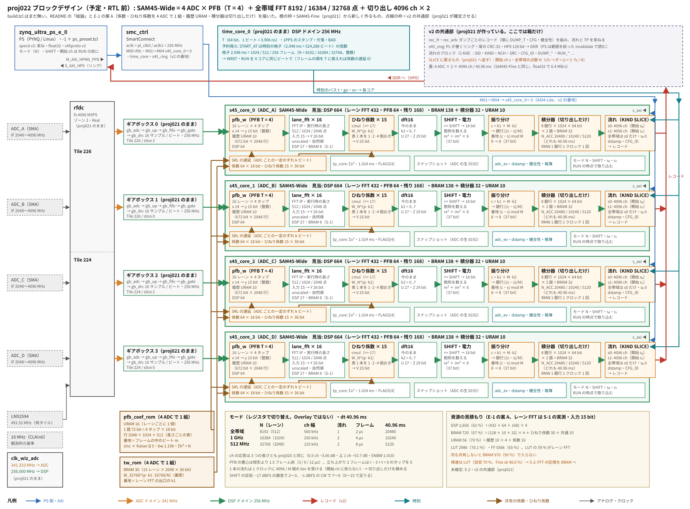

# proj022 — SAM45-Wide の模型と資源の見積もり（PFB T = 4 の全帯域 FFT を 8192 / 16384 / 32768 点に。RTL を書く前まで）

日付: 2026-10-09（起こし）
状態: 進行中（模型と見積もり）

## 目的

**SAM45-Wide（[BITS.md](../BITS.md) の 1 本目の行）を、RTL を書く前に numpy の模型と資源の見積もりで設計し切る。**
数字の上で入るか（DSP・BRAM・URAM・`-1`）と律速がどこかを先に決め、RTL（次の proj）を設計の迷いなしに書ける状態にする。

- 全帯域の FFT を、16 レーン × レーン FFT の実行時の長さ切り替え（512 / 1024 / 2048 点）で **8192 / 16384 / 32768 点**にする（proj014 の決定）
- **FFT の前に PFB（T = 4）を入れる**（2026-10-09 決定。下）。proj020 の窓の PFB と同じ原型の考え方を、実数・16 レーンの全帯域に当てる
- 1 GHz・512 MHz の窓は、全帯域の FFT の**連続した 4096 ch の切り出し**にする（INTERFACE.md 2.1 の KIND 2 = SLICE）

**範囲: 模型・見積もり・IP の survey（OOC 合成）まで。RTL は書かない。**
proj021 が spec_core（F0 を格子に寄せる、INTERFACE 8. の 8）とインターフェース v2 の共通部を作り替えている最中なので、
RTL は proj021 が終わった形を土台に次の proj で書く（下の「proj021 との関係」）。

経緯: 2026-10-09 の相談（proj021 と並行して進められる作業として起こした。1024 MHz × 2 と PFB T = 4 はこの相談で決めた）

## ブロックデザイン（予定・RTL 前）



（`docs/block_design.svg` は `docs/block_design.py` で描いた。**build.tcl はまだ無い**ので、下の「結論」の表と E-1 の案 A を描いた予定の図。
橙の枠が SAM45-Fine（proj021）から新しく作るもの、点線の枠が v2 の共通部（proj021 が確定させる）。RTL の proj で build.tcl ができたら、その配線から描き直す）

## SAM45-Wide の仕様（BITS.md から）

| モード | 流れ / ADC | 幅 | 全帯域の FFT | ch 幅 | 流れの ch | フレーム | 40.96 ms のフレーム数 | 格子 2.048 ms のフレーム数 | KIND |
|---|---|---|---|---|---|---|---|---|---|
| 全帯域 | 1 | 2048 MHz | 8192 点（レーン 512） | 500 kHz | 4096 | 2 µs | 20480 | 1024 | FULL |
| 1 GHz | **2** | 1024 MHz | 16384 点（レーン 1024） | 250 kHz | 4096 × 2 | 4 µs | 10240 | 512 | SLICE |
| 512 MHz | 2 | 512 MHz | 32768 点（レーン 2048） | 125 kHz | 4096 × 2 | 8 µs | 5120 | 256 | SLICE |

- ADC は 4 本。モードは bit の中のレジスタで切り替える（Overlay ではない）。dt = 40.96 ms
- 1 ADC の流れは最大 2 本（4096 ch × 2）なので、ADC あたり最大 8192 ch を出す
- ネットワーク: 4 ADC × 2 × 4096 ch、float32 で 6.4 MB/s（40.96 ms）。SAM45-Fine と同じ量（INTERFACE 1. の表）

## 決めたこと（2026-10-09）

| | 決定 | 理由・見送った案 |
|---|---|---|
| 1 GHz の流れの数 | **2**（BITS.md の 1 / 2 / 2 のとおり） | proj014 の表（1 GHz × 1）より BITS.md のほうが新しい。どちらも同じ 16384 点の FFT から切り出すので、増えるのは出す ch と読み出しだけ |
| ch の応答 | **PFB（T = 4）を入れる** | SAM45-Fine（proj020）と ch の応答をそろえる。今の spec_core は矩形の窓（サイドローブ −13 dB・半 ch −3.92 dB） |
| 作らないもの | RTL・build.tcl | proj021 の spec_core と v2 の共通部が固まってから作る（下） |

## proj021 との関係（出戻りを作らないための線引き）

| | proj022 で | 理由 |
|---|---|---|
| PFB・レーン FFT・ひねり係数・16 点 DFT・電力・積分の**数の上の設計**（式・語長・メモリの持ち方） | **扱う** | proj021 は FFT と積分の中身を変えない（変えるのは番地・F0・流れの帳簿・リング） |
| SLICE の流れの**中身**（ch の対応・開始 ch の自由度） | 扱う | ただし**流れのブロックのフィールド（INTERFACE 2.5）の番地は proj021 が確定させる**。足りないものが出たら proj021 側へ返す（INTERFACE.md の編集は proj021 の会話に一本化する） |
| 資源のうち v2 の共通部（s45_core・s45_ring・time_core・SmartConnect） | **仮の値**（proj021 2-1 の実測）で置き、proj021 の最後に差し替える | 数字の更新で済み、設計は変わらない |
| spec_core の RTL・F0 を格子に寄せる変更 | **扱わない** | proj021 の手順 2 の「同時にやること」に入っている。RTL の複製は proj021 の後 |
| Vivado サーバ | survey（OOC 合成、10〜20 分）だけ | proj021 のビルドの合間に回す |
| ボード | 使わない | |

## 模型で確かめること（判定）

| | 中身 | 合格 |
|---|---|---|
| **M-1 分解** | PFB → 16 レーン → レーン FFT → ひねり係数 → 16 点 DFT（k2 = 0..7）が、PFB の出力の `numpy.fft.rfft` と一致する（浮動小数点）。3 つの長さで | 相対誤差 ≦ 1e-9 |
| **M-2 ch の応答** | 原型 h[n] = sinc(1.198·(n − n₀)/N)·kaiser(4N, β 5)、Σh² = N。半 ch・−3 dB 幅・≧ 1 / 1.5 / 3 ch の最大・ENBW を 3 つの長さで | proj020 の窓の値（半 ch −3.00 dB・≧ 1.5 ch −58.0 dB・ENBW 1.010）と ±0.02 dB |
| **M-3 係数の持ち方** | (a) 長さごとの表 3 本 (b) 32768 点の表を 2・4 個おきに読む（中心 n₀ = (L−1)/2 では短い長さで中心がずれ、対称が崩れる）(c) 中心を n₀ = L/2 にした表（2・4 個おきが厳密に短い長さの表になる。対称の軸は 1 つずれる）。18 bit に量子化して M-2 の値を見る | 1 本の表で 3 つの長さが M-2 を満たすか |
| **M-4 語長** | PFB の出口（y）・レーン FFT の出口（Y）・ひねり後（V）・16 点 DFT（U・Z）の上限と、量子化の雑音（14 bit の ADC の量子化雑音に対する比）。SHIFT の範囲 | 各段の bit 数を決める。量子化の雑音の増分 ≦ 1e-3（ADC の量子化雑音に対して）→ **的外れだったので書き直した**（結果の M-4） |
| **M-5 SLICE** | ch c = k1 + M·k2 の対応、任意の開始 ch s（0 ≦ s ≦ N/2 − 4096）の切り出しが、全 ch を積んだものの部分と一致すること。積分器を「全 ch」と「切り出しだけ」で作ったときのメモリとポート | 方式を 1 つに決める |
| **M-6 時刻** | PFB の 3 フレームの立ち上がり（WRST の直後）と DUMP_T・F0 の約束（proj020 の窓と同じ型）。格子 2.048 ms がどの長さでもフレームの整数倍か | 約束を 1 つに決める |
| **E-1 資源** | DSP・BRAM・URAM・LUT・FF を部品ごとに。メモリの置き場（BRAM / URAM）の組み合わせを表に | `-1` で閉じる見込みのある組み合わせ（DSP ≦ 75 %・BRAM ≦ 80 %・URAM ≦ 90 %）が 1 つ以上ある |
| **S-1 survey** | レーン FFT 2048 点（実行時の長さ切り替えあり）を入力 16・18 bit で OOC 合成する（proj014 の survey の型。物差し = 512 点・14 bit で 21 DSP） | 物差しが一致し、E-1 の FFT の行を実測に置き換えられる |

## 予言（模型を走らせる前に書く、2026-10-09）

- **M-1**: 一致する（式の分解は proj011 以来の spec_core と同じで、長さが変わるだけ）
- **M-2**: 3 つの長さとも proj020 と同じ数字になる（ch の単位で見れば N に依らない）
- **M-3**: (b) の中心のずれは 4N = 131072 タップの窓に対して無視でき、主ローブ ±0.01 dB 以内・サイドローブの悪化 1 dB 以内。(c) は厳密に M-2 を満たす。**1 本の表で足りる**
- **M-4**: PFB の出口は 16 bit（Σ_t |c_t| ≦ 1.25 程度 × 2^13）。レーン FFT の入力が 14 → 16 bit、出口 Y は 16 + 11 + 1 = 28 bit（今は 24）。**V・U が DSP の A ポート 27 bit を越える** → ひねり係数の乗算の後で丸めて幅を戻す段が要る
- **M-5**: 任意の開始 ch のまま、**全 ch（N/2）を積む**方式に落ち着く（切り出しだけを積むと、1 本の流れが k2 の銀行 2〜3 本にまたがり、ポートの割り当てが開始 ch で変わる）
- **E-1**: DSP ≒ 2700〜3100（63〜73 %）で余裕がある。**律速は BRAM**: レーン FFT 7.5〜8.5 × 64 ≒ 480〜540 に、積分器（2 面 × 16384 ch × 64 bit = 2 Mbit / ADC）・PFB の遅延線（3 × 32768 × 14 bit ≒ 1.4 Mbit / ADC）・係数（≒ 1.2 Mbit、対称で半分）・ひねり係数（16 × 2048 × 36 bit）を足すと、全部を BRAM に置くと 1080 を越える。**積分器を URAM（2 面 × 8 銀行 = 16 個 / ADC、計 64 / 80）に出し、係数を 4 ADC で共有すれば BRAM ≒ 75〜90 %**
- **S-1**: 入力 16 bit で DSP 27 のまま、BRAM 7.5 → 8〜9

## 手順

1. README（目的・判定・予言）
2. `model/wide_model.py`: M-1〜M-6（`make model`）
3. `tools/estimate.py`: E-1 の表（`make estimate`）
4. `tools/ip_survey.tcl`: S-1（`make survey`、Vivado サーバ）→ E-1 を実測で更新（2026-10-09 済み）
4b. S-2（`make survey-s2`）: レーン FFT の中の記憶を LUT から BRAM へ移す段数を振る ← **次はここ**（S-1 で LUT が律速になったため）
5. 結果と結論を書く。RTL の proj（proj021 の後）への申し送りをまとめる。SLICE のフィールドで v2 に足りないものがあれば proj021 へ返す

## やったこと

- 2026-10-09: README を起こした（目的・範囲・判定・予言）
- 2026-10-09: `model/wide_model.py`（M-1〜M-6、陽性対照つき）と `tools/estimate.py`（E-1、64 通りの置き場の組み合わせ）を書いて走らせた。手元の numpy 2.x で全部 10 秒台
- 2026-10-09: `tools/ip_survey.tcl`（S-1）を proj014 の型で用意した。**まだ走らせていない**（Vivado サーバ）
- 2026-10-09: 予定のブロックデザインの図（`docs/block_design.py` → `docs/block_design.svg`）を描いた
- 2026-10-09: S-1（`make survey`、Vivado サーバ）。物差しと proj014 の再現が通った。E-1 を実測で引き直すと LUT が律速になったので、S-2 の変種（`SURVEY=s2`、出力は `build-survey-s2/`）を `ip_survey.tcl` に足した。E-1 の既定値を S-1 の入力 15 bit の行に替えた

## 結果

### 模型（`make model`、2026-10-09）

| 判定 | 結果 | 予言 | 読み |
|---|---|---|---|
| M-1 分解 | 3 つの長さとも相対誤差 1.4〜1.6e-15。PFB の出力の FFT = 窓を掛けた 4N 点の FFT の 4 本おき（3e-16）。陽性対照（ひねり係数の符号を逆に）は 1.4 で落ちる | 一致 | **当たり** |
| M-2 ch の応答 | 3 つの長さとも 0.5 ch −3.00・0.4 ch −1.20・−3 dB 幅 1.001 ch・≧ 1 ch −53.7・≧ 1.5 −58.0・≧ 3 −64.6 dB・和の波打ち 0.08 dB・ENBW 1.010。N = 4096 で proj020 の README の値を 0.06 dB 以内で再現（測り方の確かめ） | proj020 と同じ | **当たり**。SAM45-Wide と SAM45-Fine の ch の応答は ch の単位で同じ |
| M-3 応答 | (b)・(c)（32768 点の表を 2・4 個おき）とも (a) と小数 2 桁まで同じ、雑音の利得の差 0.0000 dB。(c) は短い長さの原型と 2e-16 で一致（厳密） | 1 本の表で足りる | 応答は**当たり** |
| M-3 ポート | 1 本の表を「レーン × タップ」の ROM に分けると、N = 16384 で 1 ROM に 2 読み、**N = 8192 で 4 読み**（レーン p が表のレーン 4p mod 16 を読む） | — | **予言が見ていなかった**。数の上では 1 本で足りるが、レーンの割り付けが長さで変わるので BRAM の ROM では 1 本にならない。**長さごとの表（a）を同じ記憶に積む**: 1 レーンの行は 2048 + 1024 + 512 = 3584 行。URAM なら 1 語 72 bit = 4 タップ × 18 bit で、**レーン 1 個 = URAM 1 個に 3 つの長さが全部入る** |
| M-4 上限 | \|y\| ≦ 11,507（15 bit）・\|Y\| ≦ 23,566,336（**26 bit**、N = 32768）。ひねり係数の cmul で 1 bit 落とす（D = 1）と V 25・U 27・Z 29 bit で、**今の spec_core（V 25・U 27・Z 29）と同じ幅** | y 16 bit・Y 28 bit・V・U が 27 bit を越えて丸めの段が要る | **外れ**（良い向き）。予言は IP の出口の宣言（入力 + log₂M + 1）で数え、Σ\|c\| の上限で数えていなかった。cmul の右シフトを 16 → 17 にするだけで、dft16 は今のまま使える |
| M-4 雑音 | 鎖の誤差 / 信号 = 2.5e-6（−30 dBFS）・1.3e-7（−17 dBFS）。**これは ADC の量子化雑音 / 信号とほぼ同じ**（y を整数に丸める雑音 1/12 LSB² が ADC の量子化と同じ大きさ）。D = 0・1・2 でほとんど変わらない。−1 dBFS の CW で y の飽和 0、Z 27 bit | 増分 ≦ 1e-3（ADC の量子化雑音に対して） | **書いた判定が的外れ**: y を入力と同じ目盛りの整数に丸める限り、増分は ADC の量子化雑音の ≒ 1 倍で、1e-3 にはならない。意味のある比べ方は信号（雑音の電力）に対してで、−30 dBFS で 2.5e-6。**判定を「信号に対して ≦ 1e-4（−30 dBFS）」に書き直して通過**。さらに **y に小数を 1 bit 残す（YF = 1）と 0.25 倍・y 16 bit・Y の上限 27 bit で cmul の A ポートにちょうど入る**（YF = 2 は 28 bit で入らない） |
| M-4 SHIFT | −17 dBFS の雑音で Z の rms 2^15.2〜2^16.2 → 18 bit に飽和させる前の SHIFT ≧ 2〜3（rms の 8 倍の余裕）。−1 dBFS の CW（ch の中心）では Z 2^23.8〜2^25.8 → SHIFT 7〜9 | — | SHIFT 4 bit（0〜15）で足りる。運転の既定は長さごとに PS が決める |
| M-5 SLICE | **切り出しだけを積む積分器が組める**: 8 銀行 × 1024 行 × 64 bit × 2 面（1 Mbit / ADC、3 つの長さで共通）。1 本の流れは 1 クロックに N = 16384 で 4 bin・32768 で 2 bin を受け（4096 / M 本、開始 ch に依らない）、銀行 b = ⌊(c − s)/M⌋・番地 (c − s) mod M。M = 2048 は番地の上の bit で 2 銀行に分ける。開始 ch 203 組で 1 銀行 1 クロック 1 書き込み・番地の重なり 0・全 ch を積んだものと 5e-15 で一致。陽性対照（上の bit を捨てる誤り）は重なりで落ちる | 全 ch（N/2）を積む | **外れ**。切り出しの長さ 4096 が M の倍数なので、どの k1 にも流れの bin がちょうど 4096 / M 個来る（開始 ch で変わらない）。全 ch を積む（N = 32768 で 2 Mbit / ADC）の半分 |
| M-6 時刻 | フレーム 2 / 4 / 8 µs（512 / 1024 / 2048 ビート）、40.96 ms = 20480 / 10240 / 5120 フレーム、2.048 ms の格子 = 1024 / 512 / 256 フレーム（どれも整数）。PFB の重心は最新のフレームの頭から 1.0000 フレーム前 = **矩形より 1.5 フレーム前**（3 / 6 / 12 µs）。立ち上がり 3 フレーム = 6 / 12 / 24 µs | — | proj020 の約束（r − 3 + t < 0 のタップを 0、出力の番号は最新の入力フレーム）がそのまま使える。重心の扱い（PS で引くか記録に残すか）は proj020 で未決のものと同じ問題 |

### 資源の見積もり（`make estimate`、2026-10-09。レーン FFT は proj014 の survey の入力 14 bit の値のまま）

置き場を選ばない部品（1 ADC）: DSP 664（レーン FFT 432・PFB の積和 64・鎖の残り 168）・BRAM 130（レーン FFT 120・スナップショット 8・TP 2）・LUT 67k・FF 127k。
置き場を選ぶ部品は 4 つ（PFB の係数・ひねり係数・PFB の履歴・積分器）× 2〜4 案 = 64 通り。**目安（DSP ≦ 75 %・BRAM ≦ 80 %・URAM ≦ 90 %・LUT ≦ 70 %）に入るのは 9 通り**:

| 組み合わせ | DSP | BRAM | URAM | LUT | FF |
|---|---|---|---|---|---|
| **A（推し）**: 係数 URAM・4 ADC で共有 / ひねり係数 BRAM・共有 / 履歴 URAM / 積分器 切り出しだけ・BRAM | 2,656（62 %） | 688（64 %） | 56（70 %） | 290k（68 %） | 540k（64 %） |
| B: 係数 BRAM・共有 / ひねり係数 BRAM・共有 / 履歴 URAM / 積分器 切り出しだけ・BRAM | 2,656（62 %） | 752（70 %） | 40（50 %） | 290k（68 %） | 540k（64 %） |
| C（係数を共有しない）: 係数 URAM・ADC ごと / ひねり係数 BRAM・共有 / 履歴 BRAM / 積分器 切り出しだけ・BRAM | 2,656（62 %） | 848（79 %） | 64（80 %） | 285k（67 %） | 540k（64 %） |
| 参考（**何も共有しない**ときの最良）: 係数 URAM・ADC ごと / ひねり係数 BRAM・ADC ごと / 履歴 BRAM / 積分器 切り出しだけ・BRAM | 2,656（62 %） | **938（87 %）** | 64（80 %） | 283k（67 %） | 540k（64 %） |

- **律速は BRAM と LUT**。DSP は 62 % で余裕がある（予言の 2700〜3100 より少し下。ひねり係数と 16 点 DFT の幅が増えなかったため）
- **何も共有しないと BRAM が 87 % で目安に入らない**。入れる鍵は、**係数とひねり係数を 4 ADC で 1 組にすること**。読む番地（フレームの中のビート m・レーン FFT の出口の k1）は 4 ADC で同じ形なので、ADC ごとのずれ（一定のビート数）を可変の遅延（SRL、係数 1152 bit・ひねり係数 540 bit / ADC、LUT ≒ 1.7k / ADC）で吸えば共有できる。**フレームの境目を 4 ADC で T の同じビートに揃えれば遅延も要らない**（下の申し送り）
- 予言との比べ: 律速が BRAM は**当たり**。手当ては**外れ**（予言は「積分器を URAM へ」。実際は積分器を切り出しだけにして半分にし、URAM は履歴（672 bit × 2048 行 → 10 個 / ADC）と係数（4 タップを 1 語に）に回すほうが釣り合う）
- LUT 68 % は Fine（48.6 %）より 20 ポイント高い。うち実行時の長さ切り替えの代償が 64 × 713 = 46k（proj014）。`-1` の見込みは LUT の側にも危うさがある → S-1 にバタフライを DSP に移す変種（`lane2048rtc_in16_res_dsp`）を入れた

### S-1 survey（`make survey`、Vivado サーバ、2026-10-09）

OOC 合成後、FFT IP 1 個（2048 点・実行時の長さ切り替え・realtime・unscaled・自然順・use_mults_resources）:

| 名前 | 入力 | バタフライ | DSP | LUT | FF | BRAM |
|---|---|---|---|---|---|---|
| ruler_lane512_res_lut（物差し、512 点・固定長） | 14 | LUT | **21** | 2,336 | 4,715 | 3 |
| lane2048rtc_in14_res_lut（proj014 の再現） | 14 | LUT | 27 | 3,773 | 7,186 | 7.5 |
| lane2048rtc_in15_res_lut（YF = 0） | 15 | LUT | 27 | 3,899 | 7,431 | 8 |
| lane2048rtc_in16_res_lut（YF = 1） | 16 | LUT | 28 | 4,021 | 7,486 | 8.5 |
| lane2048rtc_in18_res_lut | 18 | LUT | 30 | 4,409 | 8,246 | 9.5 |
| lane2048rtc_in16_res_dsp | 16 | DSP | 56 | 3,195 | 6,843 | 8.5 |

- 物差しが本番の 21 / 個と一致し、proj014 の行も数字まで再現した → この表を予言に使える
- 予言（入力 16 bit で DSP 27 のまま・BRAM 8〜9）: BRAM 8.5 は**当たり**、DSP は 28 で **1 個外れ**。LUT は入力 1 bit ごとに ≒ +100〜130 / 個
- バタフライを DSP に移すと LUT −826 / 個・DSP +28 / 個。64 個で LUT −53k（−12 ポイント）と引き換えに DSP +1,792 で、DSP が 105 % になり**使えない**

**E-1 を S-1 の実測で引き直した**（案 A = 係数 URAM・共有 / ひねり係数 BRAM・共有 / 履歴 URAM / 積分器 切り出しだけ・BRAM）:

| レーン FFT | DSP | BRAM | URAM | LUT | FF | 目安 |
|---|---|---|---|---|---|---|
| proj014 の値（入力 14 bit、S-1 の前） | 2,656（62 %） | 688（64 %） | 56（70 %） | 290k（68.2 %） | 540k（64 %） | ○ |
| S-1 入力 15 bit（YF = 0） | 2,656（62 %） | 720（67 %） | 56（70 %） | **298k（70.1 %）** | 556k（65 %） | LUT が目安の境 |
| S-1 入力 16 bit（YF = 1） | 2,720（64 %） | 752（70 %） | 56（70 %） | **306k（71.9 %）** | 559k（66 %） | × LUT |

- **メモリ（BRAM・URAM）は共有で片付いた。律速は LUT に移った**。LUT 298k のうちレーン FFT が 64 × 3,899 = 250k（全体の 84 %、デバイスの 59 %）
- 目安の 70 % は私が置いた見当（Fine は 48.6 % で、`-1` は戦略しだいで閉じる・閉じないが分かれた）。越えたら閉じないという根拠のある線ではないが、Fine より 20 ポイント以上高いのは確か
- **YF = 1（y に小数 1 bit）はやめて YF = 0（y 15 bit・整数）にする**: YF = 1 の得は y の丸めの雑音が ADC の量子化の 1.0 → 0.25 倍になること（どちらも −30 dBFS で信号の 1e-6 台で、分光に効かない）。代償は LUT 7.8k・BRAM 32・DSP 64
- 次の手: **FFT IP の中の記憶を LUT（分散 RAM）から BRAM へ移す**（`number_of_stages_using_block_ram_for_data_and_phase_factors`、S-1 の既定は 4）。BRAM には 3 割余裕がある → S-2

## 結論・次にやること

**結論（模型・見積もり・S-1 の段）: SAM45-Wide（PFB T = 4、1 GHz × 2）のメモリは「係数とひねり係数を 4 ADC で共有する」ことで入る（BRAM 67 %・URAM 70 %・DSP 62 %）。律速は LUT（70.1 %）で、S-2 で FFT の記憶を BRAM へ移して下げられるかを見る。**

決めたいこと（RTL の proj の設計の出発点。S-1 の後に確定する）:

| | 案 | 根拠 |
|---|---|---|
| 鎖の語長 | x 14 → **y 15 bit（YF = 0、整数）** → レーン FFT（入力 15 bit・unscaled）→ Y 26 bit → cmul（右シフト 17 = 16 + D 1）→ V 25 → dft16（今のまま U 27・Z 29）→ SHIFT → 18 bit → 電力 37 bit → 64 bit | M-4・S-1。DSP は今と同じ形。y の丸めの雑音は ADC の量子化と同じ大きさ（−30 dBFS で信号の 2.5e-6）。**S-1 の後に YF = 1 から替えた**（LUT 7.8k・BRAM 32 の節約） |
| 積分器 | **切り出しだけ**（8 銀行 × 1024 × 64 bit × 2 面、BRAM 32 / ADC）。全帯域モードは「s = 0 の切り出し」 | M-5。3 つのモードで同じ記憶・同じ番地の式 |
| PFB の係数 | 長さごとの表 3 本を、**レーンごとに URAM 1 個**（1 語 = 4 タップ）に積み、**4 ADC で 1 組**（URAM 16） | M-3・E-1 |
| ひねり係数 | 1 本の表（32768 点、15 レーン × 2048 × 36 bit）を 1・2・4 個おきに読む。4 ADC で 1 組 | W_N'^(pk1) = W_32768^(pk1·32768/N')（厳密）。レーンの割り付けは長さで変わらない |
| PFB の履歴 | **URAM**（16 レーン × 42 bit = 672 bit × 2048 行、10 個 / ADC）。読んで 1 フレームずらして書き戻す（A で読み B で書く） | E-1 |

proj021 へ返すこと（INTERFACE.md の編集は proj021 の会話で）:

1. **SLICE の流れのブロックに要るもの**: 切り出しの最初の ch（s）に加えて、**全帯域の FFT の点数 N（= モード）**。ch → IF の式が f = (s + i)·fs / N なので、NCH（4096）だけでは決まらない。N は 1 つのコアの 2 本の流れに共通（コアの共通部か、流れのブロックの KIND 固有の設定に）
2. **全帯域モードも KIND = SLICE（s = 0、N = 8192）で出すのがよいか**: モードを実行時に切り替えると、KIND が FULL ↔ SLICE で変わる。PS が KIND を Overlay の間は一定と仮定しているなら、SAM45-Wide では 3 モードとも SLICE にするほうが約束が単純
3. **フレームの境目を T の格子にビート単位で揃えるか**（INTERFACE 8. の 8「spec_core の F0 を格子に寄せる」の作り方）: F0（フレームの番号）だけでなく**フレームの頭のビート**を 4 ADC で同じ T に揃えておくと、SAM45-Wide で係数とひねり係数を共有するときの ADC ごとの遅延が要らない。揃えない場合でも、ADC ごとのずれ（ビート）をレジスタで読めれば遅延で吸える
4. 1 GHz × 2 で 1 コアの流れが 2 本（4096 ch × 2）。v2 のレコードの量は SAM45-Fine と同じ（4 ADC × 2 × 4096 ch / 40.96 ms）

次にやること:

- [x] **S-1**: 物差し・proj014 の再現が通過。入力 15 bit で DSP 27・LUT 3,899・FF 7,431・BRAM 8。バタフライを DSP に移すのは DSP が足りず使えない
- [ ] **S-2**: Vivado サーバで `make survey-s2`（10〜20 分）。入力 15 bit で BRAM を使う段数 4〜6。**1 回目（2026-10-09）は段数 7 を入れて設定の照合で止まった**: IP_Flow 19-3461「Valid values are 2, 3, 4, 5, 6」。IP は範囲外の値を黙って既定の 4 に戻す（Restoring to previous valid configuration）ので、照合が無ければ bs7 は bs4 と同じものを数えていた。7 を外した。→ `make estimate EST_ARGS="--fft-dsp … --fft-lut … --fft-ff … --fft-bram …"`
  予言（走らせる前に書く）: 段数を 1 つ増やすごとに LUT −150〜−300 / 個・BRAM +0.5〜1 / 個。上限の段数で LUT ≒ 3,300 / 個（64 個で −40k、LUT 61 % 前後）・BRAM ≒ 10 / 個（BRAM 77 % 前後）
- [ ] 上の 1〜3 を proj021 の会話へ渡す
- [ ] proj021 が終わったら、RTL の proj（proj023 の見込み）を proj021 の最後の形から起こす。模型（`model/wide_model.py` の `fixed_chain`）を sim の golden に使えるよう、FFT IP の出口の丸めを IP の C モデルに合わせるか、許容の幅で比べるかを決める

## 公開について

study-rfsoc は公開リポジトリ。commit・push の前に、公開前のスキャン（リポジトリ外の手順書）の全項目を機械的に行う。
**コミットメッセージに `Claude-Session:` の行や URL を入れない**（`Co-Authored-By` の行は可）。

## 再現手順

```bash
make model      # 模型（numpy だけ）。M-1〜M-6
make estimate   # 資源の見積もりの表
make survey     # Vivado サーバ: レーン FFT の OOC 合成（S-1）
```

環境は [`../VERSIONS.md`](../VERSIONS.md)。
